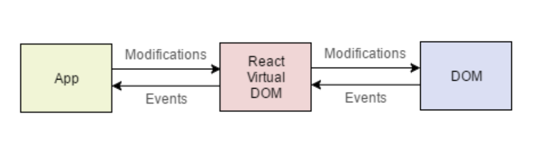

# Seamlessly Integrating React with Webpack for Modern Web Development



React has emerged as a pivotal tool for developers, significantly enhancing the process of crafting interactive user interfaces. By adopting a declarative approach and component-based architecture, React not only renders code more predictable and debuggable but also facilitates the construction of complex UIs through the encapsulation of state and behavior. This isolation not only streamlines the development process but also scales back direct DOM manipulation, promoting robust application scalability and maintainability.

Simultaneously, Webpack functions as a powerful module bundler, central to setting up contemporary web development environments. This article aims to bridge foundational webpack knowledge with the integration of React, creating a cohesive development workflow. For a primer on establishing a webpack server, delve into our detailed guide on [setting up a Webpack server](link-to-webpack-article).

With your webpack server up and running, it's time to incorporate React into our setup.

## Incorporating React Dependencies

The integration of `react` and `react-dom` into our project serves a foundational role. While `react` harbors the core React library essential for defining and managing component lifecycles, states, and contexts, `react-dom` functions as the liaison between React components and the browser's DOM. It's imperative that both packages are installed to their corresponding versions to ensure compatibility and functionality.

```sh
npm install react@18 react-dom@18
```

The latest version at the time of writing is React v18, which introduces significant improvements in performance and developer experience.

## Preparing the HTML Template

React applications hinge on a mount point within the HTML—a div element typically identified by a `root` id. This element serves as the cornerstone for our React code, acting as the container where our application will take shape.

```html
<!DOCTYPE html>
<html>
  <head>
    <meta charset="utf-8" />
    <title>React-Enhanced Application</title>
    <meta name="viewport" content="width=device-width, initial-scale=1" />
  </head>
  <body>
    <div id="root"><!-- React will mount here --></div>
  </body>
</html>
```

## Initializing React in Our Application

The entry point for React, `index.js`, is where we orchestrate the mounting of the React application to our designated `root` div:

```javascript
import React from "react";
import ReactDOM from "react-dom/client";
import App from "./App";

const root = ReactDOM.createRoot(document.getElementById("root"));
root.render(<App />);
```

Utilizing `ReactDOM.createRoot()`, we establish a seamless conduit between React components and the DOM, ensuring efficient updates in response to data changes.

## Crafting the First React Component

At the core of React's design paradigm are components—self-contained entities that encapsulate rendering logic and state management. These components can range from the simplicity of static HTML to dynamic constructs with intricate state and lifecycle methods.

Here's a foundational React component, `App`:

```javascript
import React from "react";

function App() {
  return <h1>Hello World</h1>;
}

export default App;
```

The presence of the `React` import, while seemingly extraneous, is quintessential for enabling the JSX to JavaScript transformation—a process expertly handled by Babel.

## Setting Up Babel for JSX and Modern JavaScript

Babel is a cornerstone of modern web development, adeptly transpiling JSX and cutting-edge JavaScript features into versions compatible with a broader range of browsers. Through transpilation, we ensure our application remains accessible to all users, regardless of their browser's capabilities.

The integration of Babel into our project begins with the addition of several key packages:

```sh
npm install --save-dev babel-loader @babel/core @babel/preset-env @babel/preset-react @babel/plugin-transform-runtime
```

Instructing Webpack to employ Babel for processing JavaScript files, we configure a rule in `webpack.config.js`:

```javascript
module.exports = {
  //...
  module: {
    rules: [
      {
        test: /\.js$/,
        exclude: /node_modules/,
        use: {
          loader: "babel-loader",
          options: {
            presets: ["@babel/preset-env", "@babel/preset-react"],
            plugins: ["@babel/plugin-transform-runtime"],
          },
        },
      },
    ],
  },
  //...
};
```

## Evaluating Our Implementation

With the configurations in place, it's time to witness the integration in action.

Run `npm run build` to compile your application and `npm run start` to launch it. What unfolds is a testament to the seamless unification of React and Webpack.


## Wrapping Up

This tutorial has guided you through fusing React with your Webpack-bundled applications, empowering your web development journey. The full source code is available

at [this GitHub repository](https://github.com/viktorvasylkovskyi/react-app-with-webpack), and you can view a [live demonstration](https://viktorvasylkovskyi.github.io/react-app-with-webpack/).

## Further Reading

- Dive into the React ecosystem: [React Documentation](https://reactjs.org/docs/getting-started.html)
- Master JavaScript transformation: [Babel Documentation](https://babeljs.io/docs/en/)
- Optimize module bundling: [Webpack Documentation](https://webpack.js.org/concepts/)
