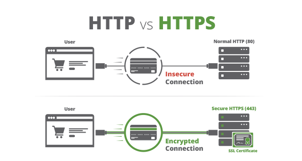
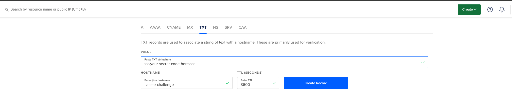

# Installing SSL and Moving to HTTPS on Our Website with Let's Encrypt



Secure Sockets Layer (SSL) forms the backbone of securing online communications. SSL ensures that sensitive data transferred between web servers and browsers remains private. A Certificate Authority (CA) plays a pivotal role in this process by issuing digital certificates that validate the identity of websites. Certbot, an open-source software tool, automates the process of obtaining a free SSL certificate from Let's Encrypt, a widely recognized CA. This automation not only simplifies SSL implementation but also enhances security by making encrypted connections easily accessible.

The recommended method for installing SSL is using Certbot. We will create a wildcard certificate, which covers all subdomains of `*.example.com`. For instance, it secures `banana.example.com` and any other subdomain with SSL.

## Install Certbot

Prior to proceeding, ensure the installation of Certbot on your system.

### On Linux:

1. Update your package manager: `sudo apt-get update`
2. Install Certbot: `sudo apt-get install certbot`
3. For specific instructions based on your Linux distribution, visit the Certbot website.

### On macOS:

1. Install Homebrew if not already installed: `/bin/bash -c "$(curl -fsSL https://raw.githubusercontent.com/Homebrew/install/HEAD/install.sh)"`
2. Install Certbot using Homebrew: `brew install certbot`
3. You may need to follow additional steps depending on your macOS version, detailed on the Certbot website.

## Generating a New Certificate

Begin the certificate creation process with the following command:

`sudo certbot certonly --manual --preferred-challenges dns -d '*.example.com'`

The CA requires completion of a DNS challenge to verify domain ownership. Execute the above command, and you will see instructions to deploy a DNS TXT record under `_acme-challenge.example.com` with a provided secret code. This step confirms your control over the `*.example.com` domain.

```sh
Saving debug log to /var/log/letsencrypt/letsencrypt.log
Requesting a certificate for *.example.com

- - - - - - - - - - - - - - - - - - - - - - - - - - - - - - - - - - - - - - - -
Please deploy a DNS TXT record under the name:

_acme-challenge.example.com.

with the following value:

<your-secret-code-here>

Before continuing, verify the TXT record has been deployed. Depending on the DNS
provider, this may take some time, from a few seconds to multiple minutes. You can
check if it has finished deploying with aid of online tools, such as the Google
Admin Toolbox: https://toolbox.googleapps.com/apps/dig/#TXT/_acme-challenge.example.com.
Look for one or more bolded line(s) below the line ';ANSWER'. It should show the
value(s) you've just added.

- - - - - - - - - - - - - - - - - - - - - - - - - - - - - - - - - - - - - - - -
Press Enter to Continue
```

## Adding \_acme-challenge.example.com on Digital Ocean

The subsequent steps apply to Digital Ocean's DNS provider but are similar for others. Create a new DNS record of type `TXT` and input the secret from the terminal message `<your-secret-code-here>`.



After adding the record, return to the terminal and confirm. Certbot will verify the domain, and upon successful validation, if everything went well, this is the message that you should receive:

```sh
Press Enter to Continue

Successfully received certificate.
Certificate is saved at: /etc/letsencrypt/live/example.com/fullchain.pem
Key is saved at:         /etc/letsencrypt/live/example.com/privkey.pem
This certificate expires on 2024-03-14.
These files will be updated when the certificate renews.

NEXT STEPS:
- This certificate will not be renewed automatically. Autorenewal of --manual certificates requires the use of an authentication hook script (--manual-auth-hook) but one was not provided. To renew this certificate, repeat this same certbot command before the certificate's expiry date.

- - - - - - - - - - - - - - - - - - - - - - - - - - - - - - - - - - - - - - - -
If you like Certbot, please consider supporting our work by:
 * Donating to ISRG / Let's Encrypt:   https://letsencrypt.org/donate
 * Donating to EFF:                    https://eff.org/donate-le
```

And that is it! Copy the certificate and the key into your project and enjoy using it!

```sh
sudo cp /etc/letsencrypt/live/example.com/fullchain.pem ./certs/example_com.pem
sudo cp /etc/letsencrypt/live/example.com/privkey.pem ./certs/example_com.key
```

## Permissions

To ensure file access, modify the permissions of the key file.

### Check Permissions

Verify current permissions with:

`ls -l certs/privkey.pem`

### Update Permissions

To change ownership:

`sudo chown [your-username] certs/privkey.pem`

## Conclusion

In this article, we have covered the basics of SSL, the role of Certificate Authorities, and the utility of Certbot in securing websites. We navigated through the process of installing Certbot on Linux and macOS, generating a new SSL certificate, and setting up domain validation for Let's Encrypt. By following these steps, you can enhance the security and credibility of your website, ensuring a safer experience for your users.
