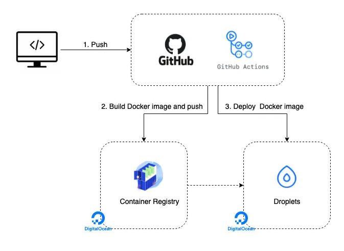
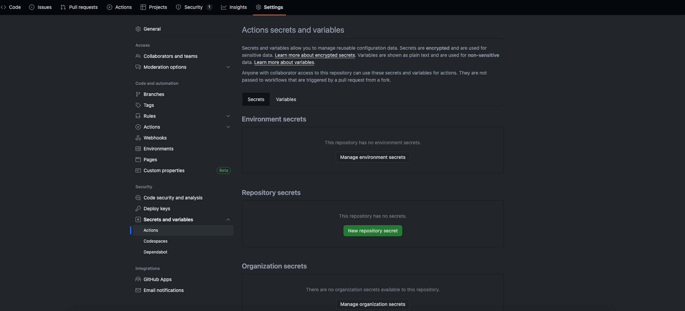

# Automating App Deployment to a Virtual Machine Using GitHub Actions, Dockerfiles, and Docker-Compose



Deploying applications is often a complex and time-consuming task, requiring careful coordination and execution. In this article, we will explore a streamlined approach to deploying applications to a Virtual Machine (VM) using the powerful combination of GitHub Actions, Dockerfiles, and Docker-Compose.

## The Deployment Objective

Our primary goal is to establish an automated deployment pipeline for our application. By leveraging GitHub Actions, a feature-rich automation tool integrated with GitHub repositories, we aim to simplify and expedite the deployment process. This workflow will ensure that every pull request triggers GitHub Actions to create a Docker image and push it to a Docker registry.

## Components of the Deployment Process

The deployment process involves several key components:

1. **GitHub Actions:** Our automation engine, GitHub Actions, will be responsible for orchestrating the entire deployment process. It will react to pull requests, build Docker images, and initiate subsequent steps.

2. **Dockerfiles:** These configuration files define the environment for our application within Docker containers. We will utilize Dockerfiles to build consistent and reproducible images of our application.

3. **Docker-Compose:** This tool simplifies the management of multi-container Docker applications. We will use Docker-Compose to define and run our application's services on the VM.

4. **Virtual Machine (VM):** Hosted on Digital Ocean, our VM will act as the deployment target. GitHub Actions will push the Docker image to a registry, and the VM will pull this image and restart the Docker containers, ensuring that the latest code changes are seamlessly integrated into the running application.

By implementing this automated deployment workflow, we aim to enhance efficiency, reduce manual intervention, and maintain a robust and reliable deployment process for our applications. The subsequent sections will guide you through each step of setting up and configuring this deployment pipeline, from generating SSH keys to creating GitHub Actions workflows and Docker containers.

## Introduction to Digital Ocean and GitHub Actions

Digital Ocean, a popular cloud service provider, allows users to deploy and manage applications effortlessly. GitHub Actions, on the other hand, is a powerful automation tool that integrates seamlessly with repositories on GitHub, providing a platform for continuous integration and deployment.

The objective of this article is to establish an automatic deployment workflow using GitHub Actions and Docker containers. Upon every pull request, GitHub Actions will generate a Docker image and push it to a Docker registry. Subsequently, on Digital Ocean, our virtual machine (VM) will fetch the image, restarting the server and automatically implementing the latest code changes.

## Setting up SSH Keys

To ensure secure access to our Digital Ocean server via SSH, it is imperative to store SSH keys in GitHub secrets. Let's delve into the process of creating and deploying SSH keys.

### Creating SSH Private/Public Key Pair

SSH keys operate on the principles of asymmetric encryption. On Linux systems, these keys are stored in the `~/.ssh/` folder. To generate a new key, execute the following command:

```sh
ssh-keygen
```

During the interactive key creation process, consider providing a distinct name, such as `deploy-key-ssh`. Upon completion, two files will be generated:

- `deploy-key-ssh` - the private key
- `deploy-key-ssh.pub` - the public key

#### Adding Private SSH Key to Digital Ocean Host

To transfer these keys to your virtual private server, utilize the following command:

```sh
ssh-copy-id -i deploy-key-ssh <username>@<ip-addr>
```

#### Whitelisting Public Key on Digital Ocean

Ensure the Digital Ocean VPS has the public SSH key whitelisted by navigating to `Settings -> Security -> Add SSH Key`. This step adds the key to the `~/.ssh/authorized_keys` file on the remote server, allowing authentication from the GitHub Actions workflow.


## Setting up GitHub Secrets


Now, incorporate the private SSH key into the GitHub Actions agent for subsequent connection to the remote server via SSH. In the GitHub Actions settings **/settings/secrets/actions**, add the following secrets:

- **HOST**: Your SSH host (Droplet's IPv4)
- **REMOTE_SSH_ACCESS_STRING**: Connection path to SSH, e.g., `root@<ip-of-your-remote-server>`
- **SSHKEY**: Content of the SSH private key (raw content of `~/.ssh/id_rsa`)

Additionally, as Docker Hub is a public registry, publishing Docker images requires a username and password. Create two more secrets:

- **DOCKER_USERNAME**: Your Docker Hub username
- **DOCKER_PASSWORD**: Your Docker Hub password

## Creating a YAML Workflow File

Begin the process of creating the GitHub Actions workflow script by establishing the necessary directory structure:

```sh
mkdir -p .github/workflows
```

Create a `.yml` file in the newly created directory, e.g., `deploy.yml`. Populate it with steps for deploying the app:

1. Checkout Git Repository
2. Log in to Docker Hub
3. Build Server Container Image
4. Push Server Container Image
5. Add SSH Keys
6. Move Docker-Compose to Remote Host with SCP
7. Log in to Docker on Remote Host with SSH
8. Pull Docker Images on Remote Host
9. Restart Docker Images

### Deploy on Changes to the Main Branch

Configure the GitHub Action to trigger on a push to the main branch and enable manual triggering from the Actions tab:

```yml
# .github/workflows/deploy.yml
name: CI

on:
  push:
    branches: [main]
  workflow_dispatch:
    inputs:
      version:
        description: "Deploy App"
        required: true

jobs:
  build_and_push_and_deploy:
    runs-on: ubuntu-latest
    steps:
```

### Workflow Steps

#### Checkout Git Repository

```yml
- name: Check out the repo
  uses: actions/checkout@v4
```

#### Log in to Docker Hub

```yml
- name: Log in to Docker Hub
  uses: docker/login-action@f4ef78c080cd8ba55a85445d5b36e214a81df20a
  with:
    username: ${{ secrets.DOCKER_USERNAME }}
    password: ${{ secrets.DOCKER_PASSWORD }}
```

#### Build Server Container Image

```yml
- name: Build Server Container Image
  run: |
    docker build -f Dockerfile.server -t ${{ secrets.DOCKER_USERNAME }}/<your-image-name> --platform linux/amd64 .
```

#### Push Server Container Image

```yml
- name: Push Server Container Image
  run: |
    docker push ${{ secrets.DOCKER_USERNAME }}/<your-image-name>
```

#### Add SSH Keys

```yml
- name: Add SSH Keys
  run: |
    mkdir -p ~/.ssh
    echo "${{ secrets.SSHKEY }}" > ~/.ssh/id_rsa
    chmod 600 ~/.ssh/id_rsa
```

#### Move Docker-Compose to Remote Host with SCP

```yml
- name: Move Docker-Compose to Remote Host
  run: |
    scp -o StrictHostKeyChecking=no ./docker-compose.yml ${{ secrets.REMOTE_SSH_ACCESS_STRING }}:/root/docker-compose.yml
```

#### Log in to Docker on Remote Host with SSH

```yml
- name: Log in to Docker on Remote Host
  run: |
    ssh -o StrictHostKeyChecking=no ${{ secrets.REMOTE_SSH_ACCESS_STRING }} << 'ENDSSH'
    docker login -u ${{ secrets.DOCKER_USERNAME }} -p ${{ secrets.DOCKER_PASSWORD }}
    ENDSSH
```

#### Pull Docker Images on Remote Host

```yml
- name: Pull Docker Images
  run: |
    ssh -o StrictHostKeyChecking=no ${{ secrets.REMOTE_SSH_ACCESS_STRING }} << 'ENDSSH'
    docker pull ${{ secrets.DOCKER_USERNAME }}/<your-image-name>
    ENDSSH
```

#### Restart Docker Images

```yml
- name: Restart Docker Images
  run: |
    ssh -o StrictHostKeyChecking=no ${{ secrets.REMOTE_SSH_ACCESS_STRING }} << 'ENDSSH'
    docker stop $(docker ps -q)
    docker rm $(docker ps -aq)
    docker-compose up -d
    ENDSSH
```

### Full Workflow YAML

```yml
# .github/workflows/deploy.yml
name: CI

on:
  push:
    branches: [main]
  workflow_dispatch:
    inputs:
      version:
        description: "Deploy App"
        required: true

jobs:
  build_and_push_and_deploy:
    runs-on: ubuntu-latest
    steps:
      - name: Check out the repo
        uses: actions/checkout@v4

      - name: Log in to Docker Hub
        uses: docker/login-action@f

4ef78c080cd8ba55a85445d5b36e214a81df20a
        with:
          username: ${{ secrets.DOCKER_USERNAME }}
          password: ${{ secrets.DOCKER_PASSWORD }}

      - name: Build Server Container Image
        run: |
          docker build -f Dockerfile.server -t ${{ secrets.DOCKER_USERNAME }}/<your-image-name> --platform linux/amd64 .

      - name: Push Server Container Image
        run: |
          docker push ${{ secrets.DOCKER_USERNAME }}/<your-image-name>

      - name: Add SSH Keys
        run: |
          mkdir -p ~/.ssh
          echo "${{ secrets.SSHKEY }}" > ~/.ssh/id_rsa
          chmod 600 ~/.ssh/id_rsa

      - name: Move Docker-Compose to Remote Host
        run: |
          scp -o StrictHostKeyChecking=no ./docker-compose.yml ${{ secrets.REMOTE_SSH_ACCESS_STRING }}:/root/docker-compose.yml

      - name: Log in to Docker on Remote Host
        run: |
          ssh -o StrictHostKeyChecking=no ${{ secrets.REMOTE_SSH_ACCESS_STRING }} << 'ENDSSH'
          docker login -u ${{ secrets.DOCKER_USERNAME }} -p ${{ secrets.DOCKER_PASSWORD }}
          ENDSSH

      - name: Pull Docker Images
        run: |
          ssh -o StrictHostKeyChecking=no ${{ secrets.REMOTE_SSH_ACCESS_STRING }} << 'ENDSSH'
          docker pull ${{ secrets.DOCKER_USERNAME }}/<your-image-name>
          ENDSSH

      - name: Restart Docker Images
        run: |
          ssh -o StrictHostKeyChecking=no ${{ secrets.REMOTE_SSH_ACCESS_STRING }} << 'ENDSSH'
          docker stop $(docker ps -q)
          docker rm $(docker ps -aq)
          docker-compose up -d
          ENDSSH
```

## Conclusion

In conclusion, this article has guided you through the process of automating the deployment of your application using GitHub Actions, Dockerfiles, and Docker-Compose on a VPS. By integrating these technologies, you can ensure a streamlined and efficient deployment process for your projects, ultimately enhancing your development workflow.
