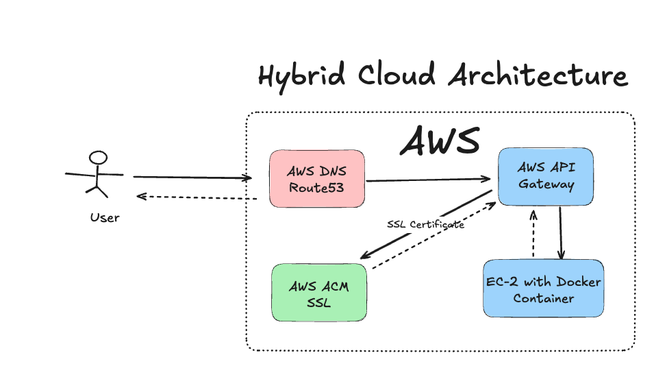
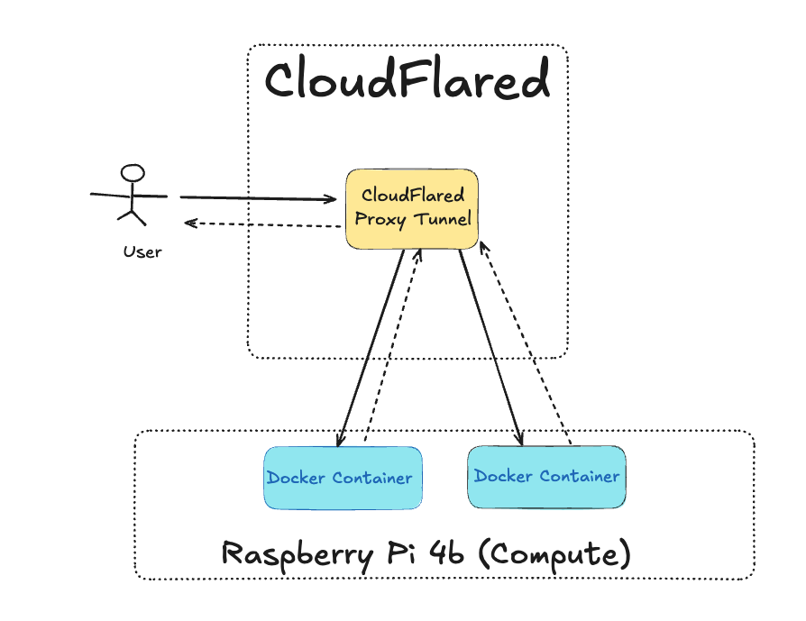

# Hybdrid Infrastructure - Cloud on AWS on Compute on Premisses with Raspberry pi

I have been using full AWS infrastructure which has served great, however I have observed that for my pet projects, the AWS infra incurred more costs than necessary. In particular, when having full EC-2 + Load Balancer setup I have been paying around 50-80$ per month. Further to reduce the costs, I have moved to API Gateway + EC-2 which reduced my bill considerably to 15-20$ where most of the costs where impacted by EC-2 compute.



Today, I am moving towards hybrid approach, where my raspberry pi 4b will replace EC-2 compute. This device have been in my room with no job, so it seems like a natural replacer of my ec-2 instances and reduce another 15$ of cloud costs.

## Overall setup



Here is the setup:

1. The Raspberry pi in my home network doesn't have a public API and is behind CGNAT router meaning that it shares the IP with other devices. To identify the raspberry pi on the network, we will establish the cloudflared proxy tunnel - which is a free reverse proxy.
2. The Raspberry pi becomes a host for docker containers, running all the servers we need.
3. Since cloudflared tunnel handles the proxying between domain name and the service running on raspberry pi, we are going to define the DNS records to tunnel mapping.
4. Cloudflared tunnel handles creation of https certificate for us OOTB

With this setup we do not need AWS at all, thus setup becomes essentially free.

### Automation on CI/CD + Device Configuration

For such setup to work, we need to ensure the following:

1. The raspberry pi device runs the docker services
2. Ensure the continuos delivery - i.e., deploy new version of the services on the raspberry pi. We are going to use Github Actions for that.

Now here is the catch, raspberry pi run ARM64 which is different architecture from usual EC-2 instances. This means building docker images must be done on ARM64 base. One of the way to achieve this is to use the raspberry pi to actually build its own docker image, which we will cover later in CI/CD setup.

### Deploying Docker image on Raspberry pi

Before moving into the cloudflared side of challenges, lets focus on deploying docker images on our device. As we mentioned above, they have to be built for ARM64 CPU architecture. Github Actions allow to use our self-hosted runners to run the actions. This is great for us, because we can turn our raspberry pi device into github actions runner, thus ensuring the docker image is going to build for the ARM64 architecture, since the device building is the device that will be running the images.

The code for such a `.github/workflows` is like following:

```yaml
name: CI

on:
  push:
    branches: [main]
  workflow_dispatch:
    inputs:
      version:
        description: 'Deploy Services'
        required: true

jobs:
  backend_api_build_and_push:
    runs-on: [self-hosted, ARM64]
    outputs:
      tag: ${{ steps.set_tag.outputs.tag }}
    steps:
      - name: Check out the repo
        uses: actions/checkout@v4

      - name: Log in to Docker Hub
        uses: docker/login-action@v3
        with:
          username: ${{ secrets.DOCKER_USERNAME }}
          password: ${{ secrets.DOCKER_PASSWORD }}

      - name: Build and Push Container Image
        run: |
          TAG=${{ github.sha }}
          echo "Using tag: $TAG"
          docker build -f ./Dockerfile -t ${{ secrets.DOCKER_USERNAME }}/backend-api:$TAG .
          docker push ${{ secrets.DOCKER_USERNAME }}/backend-api:$TAG

      - name: Set output tag
        id: set_tag
        run: echo "tag=${{ github.sha }}" >> "$GITHUB_OUTPUT"

start_docker_image:
  runs-on: [self-hosted, ARM64]
  needs:
    - backend_api_build_and_push
  steps:
    - name: Log in to Docker Hub
      uses: docker/login-action@v3
      with:
        username: ${{ secrets.DOCKER_USERNAME }}
        password: ${{ secrets.DOCKER_PASSWORD }}

    - name: Pull and Run Backend API Container
      run: |
        TAG=${{ needs.backend_api_build_and_push.outputs.tag }}
        echo "Using tag: $TAG"
        docker run -d --env-file /etc/raspberrypi.env --name backend-api \
            -p 4000:4000 \
            docker-username/backend-api:$TAG
```

Note that we are using directive `runs-on: [self-hosted, ARM64]` which tells the github actions to choose self-hosted runner. To promote your raspberry pi to be a github runner, read my notes [https://www.viktorvasylkovskyi.com/posts/configuring-rpi-as-github-runner](Setting Up a Raspberry Pi 4B as a GitHub Actions Self-Hosted Runner).

In this script we are building docker image, and then running it. Note that our runner is same device as the "compute" on premisses device. So we can simply run with `docker run`. This script also assumes that the secrets exist in `--env-file /etc/raspberrypi.env` which we will provision using ansible configurations.

## Configuring device with Ansible

Now that we can deploy or compute, next step is to configure device. I like to use ansible for configurations because it is intuitive and good to provide idempotency.

We need to configure the following:

- Make sure device has the necessary secrets for the docker containers, as well as docker installed
- Setup cloudflared tunnel to our DNS

### Inject Secrets into device

Our docker container assumes the secrets are in `/etc/raspberrypi.env`. It is fairly easy to setup a role in ansible that will create a `etc/raspberrypi.env` with our secrets:

```yaml
- name: Create environment file for Raspberry Pi Device app
  copy:
    dest: /etc/raspberrypi.env
    content: |
      MY_API_KEY={{ api_key }}
    owner: 'user'
    group: 'user'
    mode: '0600'
```

Run the playbook with the ansible task above and the secrets are created.

### Cloudflared Tunnel with Ansible

Connecting to cloudflared tunnel correctly requires quite a few steps:

- Install cloudflared dist
- Create cloudflared tunnel
- Create cloudflared DNS routes that maps tunnel to the services running on our device
- Build a configuration file that maps services to tunnel
- Create systemd that will start cloudflared on device boot.

Gladly we can automate them with ansible. If you are curious about how to run these steps manually, refer to the following notes: [Expose Your Raspberry Pi to the Internet with Cloudflare Tunnel](https://www.viktorvasylkovskyi.com/posts/expose-rpi-to-public-network-using-cloudfare-tunnel).

Here is a full ansible tasks script that runs ensures the steps above

```yaml
- name: Configure Cloudflared Tunnel with Multiple Services
  hosts: raspberrypi
  become: yes

  vars:
    cloudflare_user: 'user'
    tunnel_name: 'my-tunnel'
    domains:
      - hostname: 'api.example.com'
        service_port: 4000
      - hostname: 'api-2.example.com'
        service_port: 4001

  tasks:
    - name: Download cloudflared binary
      ansible.builtin.get_url:
        url: https://github.com/cloudflare/cloudflared/releases/latest/download/cloudflared-linux-arm64
        dest: /usr/local/bin/cloudflared
        mode: '0755'

    - name: Verify cloudflared is executable
      ansible.builtin.command: cloudflared --version

    - name: Create .cloudflared directory
      ansible.builtin.file:
        path: '/home/{{ cloudflare_user }}/.cloudflared'
        state: directory
        owner: '{{ cloudflare_user }}'
        group: '{{ cloudflare_user }}'
        mode: '0700'

    - name: Get list of existing Cloudflare tunnels
      ansible.builtin.command: cloudflared tunnel list --output json
      register: tunnel_list
      failed_when: false
      changed_when: false
      become_user: '{{ cloudflare_user }}'

    - name: Create Cloudflare tunnel if not exists
      ansible.builtin.command: >
        cloudflared tunnel create {{ tunnel_name }}
      args:
        chdir: '/home/{{ cloudflare_user }}/.cloudflared'
      become_user: '{{ cloudflare_user }}'
      when: '''"name": "'' + tunnel_name + ''"'' not in tunnel_list.stdout'

    - name: Refresh tunnel list and get tunnel ID in JSON
      ansible.builtin.command: cloudflared tunnel list --output json
      register: tunnel_list_json
      changed_when: false
      become_user: '{{ cloudflare_user }}'

    - name: Extract tunnel ID safely
      ansible.builtin.set_fact:
        tunnel_id: "{{ (tunnel_list_json.stdout | from_json) | selectattr('name','equalto', tunnel_name) | map(attribute='id') | first }}"

    - name: Create Cloudflare DNS routes for each service
      ansible.builtin.command: >
        cloudflared tunnel route dns {{ tunnel_name }} {{ item.hostname }}
      args:
        chdir: '/home/{{ cloudflare_user }}/.cloudflared'
      become_user: '{{ cloudflare_user }}'
      loop: '{{ domains }}'
      when: tunnel_id is defined and tunnel_id | length > 0

    - name: Build ingress configuration for all services
      ansible.builtin.set_fact:
        ingress_config: |
          
            - hostname: {{ domain.hostname }}
              service: http://localhost:{{ domain.service_port }}
          
            - service: http_status:404

    - name: Create Cloudflared config.yml
      ansible.builtin.copy:
        dest: '/home/{{ cloudflare_user }}/.cloudflared/config.yml'
        content: |
          tunnel: {{ tunnel_name }}
          credentials-file: /home/{{ cloudflare_user }}/.cloudflared/{{ tunnel_id }}.json

          ingress:
          {{ ingress_config | indent(2, true) }}
        owner: '{{ cloudflare_user }}'
        group: '{{ cloudflare_user }}'
        mode: '0600'

    - name: Create systemd service file for Cloudflared
      ansible.builtin.copy:
        dest: /etc/systemd/system/cloudflared.service
        content: |
          [Unit]
          Description=Cloudflare Tunnel Service
          After=network.target

          [Service]
          Type=simple
          User={{ cloudflare_user }}
          ExecStart=/usr/local/bin/cloudflared --config /home/{{ cloudflare_user }}/.cloudflared/config.yml tunnel run {{ tunnel_name }}
          Restart=always
          RestartSec=5s
          LimitNOFILE=1048576

          [Install]
          WantedBy=multi-user.target
      notify: Restart cloudflared

    - name: Enable and start Cloudflared service
      ansible.builtin.systemd:
        name: cloudflared
        daemon_reload: yes
        enabled: yes
        state: started

  handlers:
    - name: Restart cloudflared
      ansible.builtin.systemd:
        name: cloudflared
        state: restarted
```

## Conclusion

And with that setup we have reduced our AWS costs and we can now run our apps/services on raspberry pi. This is great for personal projects.

## Previous Reads

### AWS Cloud - API Gateway

I recommend reading [https://www.viktorvasylkovskyi.com/posts/provisioning-api-gateway-as-ssl-termination-and-ec2](Provisioning API Gateway and connecting it to Ec-2 instance using Terraform) to get up to speed on setting up an API Gateway using terraform. The rest of the document here will assume that the AWS setup has been completed as it has been covered enough in the previous notes

### Setting up Cloudflared tunnel for service running on Rpi

One of the common ways to expose local devices into the internet and bypass the CGNAT problem stated above is to use the device on the cloud and turn it into a reverse proxy. We are going to do that with Cloudflared tunnel which is free.

I have attempted to document how to achieve that here: [Expose Your Raspberry Pi to the Internet with Cloudflare Tunnel](https://www.viktorvasylkovskyi.com/posts/expose-rpi-to-public-network-using-cloudfare-tunnel). Feel free to follow those notes.
