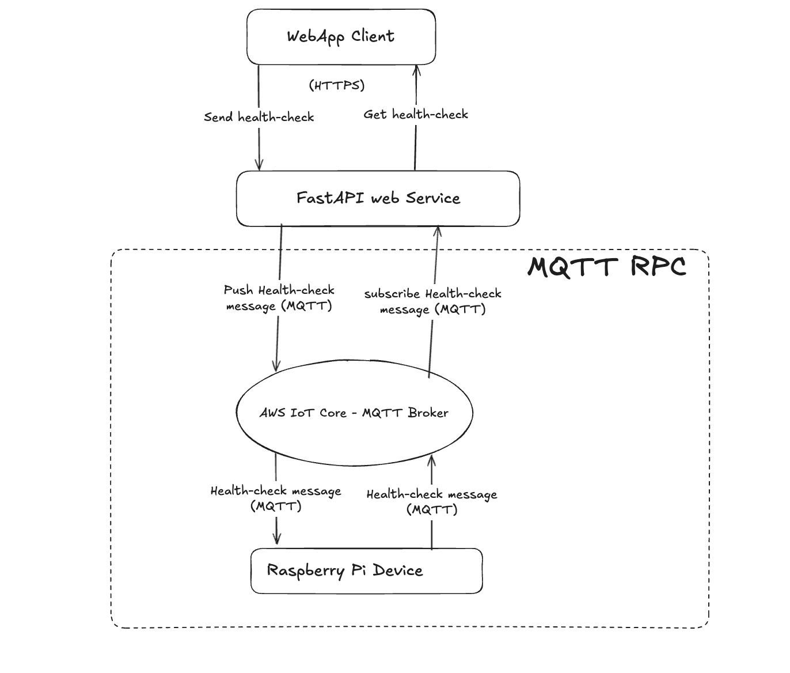

# AWS IoT Core - Implementing Advanced MQTT RPC pattern




This notes is a continuation of the series on mastery of IoT with AWS IoT Core. If you are starting at MQTT from zero, feel free to read my previous notes about how to setup AWS IoT Core and MQTT in Python. Otherwise feel free to continue reading.

- [Provisioning AWS IoT Core Certificates for Ec-2 instance - MQTT Subscriber with Terraform](https://www.viktorvasylkovskyi.com/posts/provisioning-aws-iot-core-for-ec-2)
- [Provisioning AWS IoT Core Certificates for Raspberry Pi for MQTT Broker with Terraform](https://www.viktorvasylkovskyi.com/posts/provisioning-aws-iot-core-for-raspberry-pi)
- [AWS IoT Core - Implementing Publisher and Subscriber for MQTT in Python](https://www.viktorvasylkovskyi.com/posts/provisioning-aws-iot-core-python-implementation)

## Why MQTT RPC?

We have established that a good pattern is to have communicate from client all the way to the device using MQTT publish/subscribe. For most of your raspberry pi applications simply publishing a message and hoping it will reach raspberry pi is enough. You can also subscribe to your raspberry pi on your web service and asynchronously receive the updates. 

I have noticed a use case where this pattern has a limitation, for example, when we need reply from raspberry pi immediately before proceeding (as if it was a synchronous call). Example of this is the [WebRTC communication I documented](https://www.viktorvasylkovskyi.com/posts/real-time-streaming-with-picamera2-raspberry-pi). In WebRTC the client sends connection offer, and awaits for the offer response before starting the connection. Would have been great to give guarantees that the offer response will arrive before proceeding right? This idea motivated me to abstract a complex pattern which is called MQTT RPC (Remote Procedure Call). The goal here is for web service to be able to do something like follows: 


```py
result: dict = await mqtt_rpc_client.call(MQTTTopics.DEVICE_CONTROL.value, event.json())
```

Note, we are publishing to the topic, and receive reply before sending HTTP response to the client. 

## Implementing MQTT RPC

The basic idea is to wrap the MQTT publish/subscribe calls into an "RPC" inspired from https://github.com/rse/mqtt-json-rpc.

### Naive Approach

The naive approach of MQTT RPC is by publishing the message and waiting for x time for the response. If the response doesn't arrive assume error happened and timeout. Let's implement that first. We are going to encapsulate this logic in `MqttRpcClient`

```python
import json
import asyncio
from shared.clients.aws_mqtt_client import AwsMQTTClient
from shared.mqtt.mqtt_clients import MQTTClients

class MqttRpcClient:
    def __init__(self):
        self.mqtt_client = AwsMQTTClient(MQTTClients.WEB_SERVICE.value)

    async def call(self, request_topic: str, payload: str, timeout: int = 10) -> dict:
            reply_topic = f"{request_topic}/response"

            # Future that will be set once response arrives
            future = asyncio.get_event_loop().create_future()

            # Callback to handle incoming response message
            def on_response(topic, payload, **kwargs):
                try:
                    data = json.loads(payload.decode())
                    if not future.done():
                        future.set_result(data)
                except Exception as e:
                    if not future.done():
                        future.set_exception(e)

            # Subscribe to the reply topic
            await self.mqtt_client.subscribe(reply_topic, on_response)

            # Publish the request
            self.mqtt_client.publish(request_topic, payload)

            # Wait for response or timeout
            response = await asyncio.wait_for(future, timeout=timeout)

            return response
```

Note you can refer to [AWS IoT Core - Implementing Publisher and Subscriber for MQTT in Python](https://www.viktorvasylkovskyi.com/posts/provisioning-aws-iot-core-python-implementation) to find the details of implementation of `AwsMQTTClient`. 

We can test it by running something like: 

```python
device_id = "rpi-camera-device"

event = DeviceControlRequestEvent(
    action=DeviceControlAction.GET_HEALTH_CHECK.value,
)
result: dict = await mqtt_rpc_client.call("{device_id}/device/control/set", event.json())
```

This works well but there are couple of edge cases that may happen when used extensively:

  - If response is not received, there is no error handling - no clean timeout handling
  - When the response is received, the subscribed topic remains piling up in the service memory - no unsubscribe logic
  - Multiple clients may be using same topic and getting arbitrary responses.

Let's resolve these issues: 

### Adding Unsubscription to prevent memory leaks

Adding the following snippet prevents memory leaks in the future by removing unnecessary subscriptions: 

```python
try:
    # Subscribe to the reply topic
    await self.mqtt_client.subscribe(reply_topic, on_response)

    # Publish the request
    self.mqtt_client.publish(request_topic, payload)

    # Wait for response or timeout
    return await asyncio.wait_for(future, timeout=timeout)

except asyncio.TimeoutError:
    raise TimeoutError(f"MQTT call timed out after {timeout}s for topic '{request_topic}'")

finally:
    # Always unsubscribe to avoid leaks
    await self.mqtt_client.unsubscribe(reply_topic)
```

### Prevent Race conditions by adding request_id

Each client's request needs to be identified with unique id so that there are no multiple clients reacting to the responses they do not expect. We will do this by adding `request_id` to the device's payload so that it can respond to the right topic: 

```python
async def call(self, request_topic: str, payload: str, timeout: int = 10) -> dict:
    request_id = str(uuid.uuid4())
    reply_topic = f"{request_topic}/response/{request_id}"
    # Assume payload is a JSON string; inject request_id manually
    payload_dict = json.loads(payload)
    payload_dict["request_id"] = request_id
    encoded_payload = json.dumps(payload_dict)

    # ... rest of the code ...


    def on_response(topic, raw_payload, **kwargs):
        try:
            data = json.loads(raw_payload.decode())
            if data.get("request_id") == request_id and not future.done():
                future.set_result(data)
        except Exception as e:
            if not future.done():
                future.set_exception(e)

    # ... rest of the code ... 
```

Final expected MQTT flow becomes: 

1. Web service publishes to `{device_id}/device/control/set` with payload:

```json
{ "action": "GET_HEALTH_CHECK", "request_id": "<uuid>" }
```

2. Web service subscribes for response at `{device_id}/device/control/set/response/<uuid>`, and response payload is: 

```json
{ "request_id": "<same uuid>", "result": { ... } }
```

## Full code

The full code of such `MqttRpcClient`

```python
import json
import uuid
import asyncio
from shared.clients.aws_mqtt_client import AwsMQTTClient
from shared.mqtt.mqtt_clients import MQTTClients

class MqttRpcClient:
    def __init__(self):
        self.mqtt_client = AwsMQTTClient(MQTTClients.WEB_SERVICE.value)

    async def call(self, request_topic: str, payload: str, timeout: int = 10) -> dict:
            request_id = str(uuid.uuid4())
            reply_topic = f"{request_topic}/response/{request_id}"
            
            payload_dict = json.loads(payload)
            payload_dict["request_id"] = request_id
            encoded_payload = json.dumps(payload_dict)
            
            # Future that will be set once response arrives
            future = asyncio.get_event_loop().create_future()

            # Callback to handle incoming response message
            def on_response(topic, payload, **kwargs):
                try:
                    data = json.loads(payload.decode())
                    if not future.done():
                        future.set_result(data)
                except Exception as e:
                    if not future.done():
                        future.set_exception(e)

            try:
                # Subscribe to the reply topic
                await self.mqtt_client.subscribe(reply_topic, on_response)

                # Publish the request
                self.mqtt_client.publish(request_topic, encoded_payload)

                # Wait for response or timeout
                return await asyncio.wait_for(future, timeout=timeout)

            except asyncio.TimeoutError:
                raise TimeoutError(f"MQTT call timed out after {timeout}s for topic '{request_topic}'")

            finally:
                # Always unsubscribe to avoid leaks
                await self.mqtt_client.unsubscribe(reply_topic)
  
```

And the usage as: 

```python
device_id = "rpi-camera-device"
event = DeviceControlRequestEvent(
    action=DeviceControlAction.GET_HEALTH_CHECK.value,
)

result: dict = await mqtt_rpc_client.call("{device_id}/device/control/set", event.json())
```

# Conclusion

In this notes we have explored how asynchronous MQTT can be turned into synchronous with good memory handling and prevention of race conditions. Such a service is a solid foundation for internal MQTT calls. This is a basic production example, however there are many more important topics needed to be covered here such as batch calls, sync fallback, or add retry logic. I hope this example will help you in what you are building. 