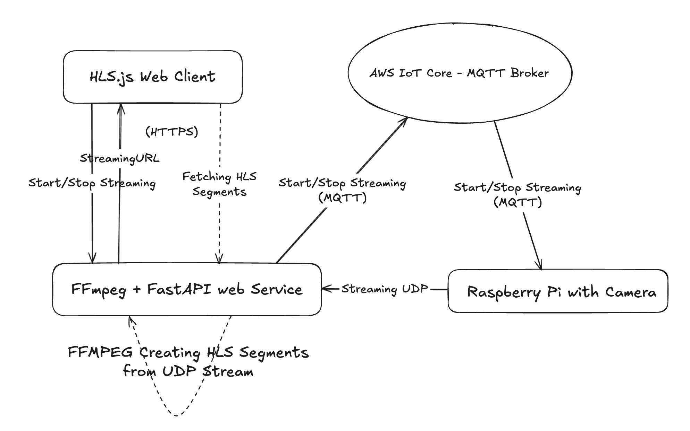

# Live Streaming - Raspberry pi streaming with Picamera2

I have been building my raspberry pi camera for some time now and one of my most desired features is the live streaming since it allows lots of cool robotics abilities, like we could stream video to multiple people at the same time or remotely see what the robot sees in real time. Turns out live streaming is quite a complex architecture involving, and lots of streaming protocols: 

- HLS, DASH for stream, MJPEG
- [WebRTC](https://developer.mozilla.org/en-US/docs/Web/API/WebRTC_API) - for real time streaming 

My goal is to build a real time camera with almost no latency, so that I can remotely access and control my robot. 
I have been working on raspberry pi with camera module working on `Picamera2` software in python. Originally I attempted to do the streaming using multipart jpeg streaming at [Live Camera Streaming from Raspberry Pi with Camera Module and Picamera2 - the easy way](https://www.viktorvasylkovskyi.com/posts/raspberry-pi-live-camera-streaming). The problem with this approach is that while simple to do I noticed lack of compatibility on mobile devices, and problem with shutting down the open streaming connection, which was crashing my RPI. Besides it uses direct access to the device instead of MQTT which is not practical for production. 

My next attempt is this note, implementing HLS. It is much more effective and production ready. Unfortunately after having implemented this, I was confronted with latency of approx. 5-10 seconds. While negligible for most use cases, it is impractical for real time remote control. If you are need remote control and almost zero latency you should consider [WebRTC](https://developer.mozilla.org/en-US/docs/Web/API/WebRTC_API). I implemented WebRTC in my notes: [WebRTC - Zero latency streaming with Raspberry pi streaming with Picamera2](https://www.viktorvasylkovskyi.com/posts/real-time-streaming-with-picamera2-raspberry-pi). 

Consider well what technology is best for your use case. If it is Streaming at scale, them keep reading below!

## Github Code

Full code available on https://github.com/vvasylkovskyi/rpi-camera. 

## Live Streaming with HLS



Full End-to-End HLS requires the following steps: 

- Streaming the binary data from raspberry pi camera to some IP
- Converting the binary into live streaming protocols such as HLS or DASH
- Saving segments and manifest on web server and exposing them for consumption by web clients
- Cleaning up these segments after live streaming is shut down
- Optionally converting the live streaming to VOD on shutdown
- Optionally, all of this could be turned on and off via event from the client to the MQTT broker.

In this notes we will walk through how to do that locally., i.e. on the `localhost`. Deploying all the things is the matter for another note: 

## Overview

The system for live streaming is comprised by four actors: 

 - Rapsberry pi with camera streaming
 - Web server listening to stream and converting it into streaming protocol in real time. All while exposing the web api for clients to consume
 - Web client requesting the segments in HLS streaming protocol and playing them in web player
 - AWS IoT Core MQTT Broker for communication between web server and raspberry pi


## Preparing Raspberry pi with camera streaming

So here we are going to try out the streaming using Ffmpeg. According to the official Picamera2 documentation this is the code we need: 

```python
output = PyavOutput("udp://<your-server-ip>:1234", format="mpegts")
```

The output will tell camera where to stream. We will wrap it in actual turning on of the camera.

```python
from picamera2 import Picamera2
self.camera = Picamera2()
configuration = self.camera.create_video_configuration(
    main={"size": (640, 480)}
)
self.camera.configure(configuration)
output = PyavOutput("udp://localhost:9999", format="mpegts")
encoder = H264Encoder(bitrate=2_000_000)
self.camera.start_recording(encoder, output)
```

### A note on UDP

UDP is connectionless meaning raspberry pi will start sending packets into the void if there is no service on the other end listening. That is why we should ensure that the web service has ffmpeg UDP server running before sending packets. 

## Starting ffmpeg UDP service on video web service

So now we have the raspberry pi camera streaming, it is time to build the web service that will listen to that stream and then build HLS segments and manifest. 

### Installing Ffmpeg on the system

In production we need to install FFmpeg in our docker container. But for this demo we are testing things locally, so I will install ffmpeg using brew for my mac: 

```sh
brew install ffmpeg
```

### Adding python dependency ffmpeg-python

To add some syntactic sugar in our python scripts, we will add a PyPi package to interact with system `ffmpeg`. I am using poetry for my dependencies management, so this is how I add this dependency: 

```toml
[tool.poetry.dependencies]
ffmpeg-python = "^0.2.0"
```

### Starting UDP Listener with Ffmpeg

Now that we have all the necessary packages, next step is to start the actual service. We are going to write a python script that takes the ffmpeg, starts listening, and converts stream into `hls` on the spot, all in the same script: 

```python
    logger.info("Received request to start video streaming service")
    hls_output_dir = "./hls"
    stream_name = "stream"
    os.makedirs(hls_output_dir, exist_ok=True)
    output_path = os.path.join(hls_output_dir, f"{stream_name}.m3u8")
    udp_port = 1234  # Example UDP port for input
    segment_time = 2
    playlist_size = 5

    (
        ffmpeg.input(f"udp://localhost:{udp_port}", format="mpegts", timeout=5000000)
        .output(
            output_path,
            format="hls",
            hls_time=segment_time,
            hls_list_size=playlist_size,
            hls_flags="delete_segments",
            hls_segment_filename=os.path.join(hls_output_dir, f"{stream_name}_%03d.ts"),
        )
        .global_args("-loglevel", "info")  # Optional: remove or change to 'quiet'
        .run_async(pipe_stdin=True)
    )
```

once you start both of your devices running the streaming to UDP and listening to them, the FFMPEG will magically start creating `.ts` segments and `.m3u8` manifest file. Next step is to test the playback of it in web actually. But first, we need a FastAPI service that will serve these files

### Adding FastAPI endpoint to serve the segments

The segments will be accessed by the client by directly reading them from the filesystem of the web server, so first, let's expose those. All we need to do is

```python
from fastapi.staticfiles import StaticFiles

app.mount("/hls", StaticFiles(directory="hls"), name="hls")
```

This will make files under `./hls` accessible via: 

```sh
http://<your-server>/hls/stream.m3u8
```

We cab go further, and create and endpoint that will start UDP connection, and return the URL to the client. This means essentially wrapping the ffmpeg udp service start into fastAPI: 

```python
@videos_router.post("/start-streaming-service")
async def start_streaming_service():
    logger.info("Received request to start video streaming service")

    os.makedirs(HLS_DIR, exist_ok=True)
    output_manifest = os.path.join(HLS_DIR, f"{STREAM_NAME}.m3u8")
    segment_pattern = os.path.join(HLS_DIR, f"{STREAM_NAME}_%03d.ts")

    (
        ffmpeg.input(f"udp://localhost:{UDP_PORT}", format="mpegts", timeout=5000000)
        .output(
            output_manifest,
            format="hls",
            hls_time=SEGMENT_TIME,
            hls_list_size=PLAYLIST_SIZE,
            hls_flags="delete_segments",
            hls_segment_filename=segment_pattern,
        )
        .global_args("-loglevel", "info")
        .run_async(pipe_stdin=True)
    )

    # This assumes the client can access /hls on your server
    stream_url = f"/hls/{STREAM_NAME}.m3u8"
    return {
        "status": "Video streaming service started successfully",
        "stream_url": stream_url,
    }
```

### Encapsulating FFmpeg service 

I will attempt to keep FFmpeg process running continuously as a service at my FastAPI app start. Having a single FFmpeg may not be too heavy for the machine in terms on CPU and Memory, especially when idle - i.e., no streaming sent from raspberry pi. 

So, instead of my `/start-streaming-service` starting FFmpeg process, we will actually start or stop streaming on raspberry pi. While the process will always be active. So first, let us create `ffmpeg_service.py` which will be a singleton class running our ffmpeg transcoder: 


```python
import ffmpeg
import os
import signal
from subprocess import Popen
from video_service_web.logger.logger import Logger

logger = Logger("FFmpegStreamingService")


class FFmpegStreamingService:
    _instance = None

    HLS_DIR = "/Users/vvasylkovskyi/git/rpi-camera/video-service-web/hls"
    STREAM_NAME = "stream"
    UDP_PORT = 1234
    UDP_URL = "localhost"
    SEGMENT_TIME = 2
    PLAYLIST_SIZE = 5

    def __new__(cls):
        if cls._instance is None:
            cls._instance = super(FFmpegStreamingService, cls).__new__(cls)
            cls._instance.process = None
        return cls._instance

    def start(self):
        if self.process:
            logger.warning("FFmpeg process already running.")
            return

        os.makedirs(self.HLS_DIR, exist_ok=True)

        output_manifest = os.path.join(self.HLS_DIR, f"{self.STREAM_NAME}.m3u8")
        segment_pattern = os.path.join(self.HLS_DIR, f"{self.STREAM_NAME}_%03d.ts")

        try:
            self.process: Popen = (
                ffmpeg.input(
                    f"udp://{self.UDP_URL}:{self.UDP_PORT}",
                    format="mpegts",
                    timeout=5000000,
                )
                .output(
                    output_manifest,
                    format="hls",
                    hls_time=self.SEGMENT_TIME,
                    hls_list_size=self.PLAYLIST_SIZE,
                    hls_flags="delete_segments",
                    hls_segment_filename=segment_pattern,
                )
                .global_args("-loglevel", "info")
                .run_async(pipe_stdin=True)
            )
            logger.success("FFmpeg streaming process started.")
        except Exception as e:
            logger.error(f"Failed to start FFmpeg: {e}")
            self.process = None

    def stop(self):
        if not self.process:
            logger.info("FFmpeg process is not running.")
            return

        try:
            self.process.send_signal(signal.SIGINT)
            self.process.wait(timeout=5)
            logger.success("FFmpeg process stopped successfully.")
        except Exception as e:
            logger.error(f"Failed to stop FFmpeg: {e}")
        finally:
            self.process = None
```

And now, we will start it and stop it during FastAPI events: 

```python
app = FastAPI(title="Video Service Web API")
app.add_middleware(
    CORSMiddleware,
    allow_origins=["*"],
    allow_credentials=True,
    allow_methods=["*"],
    allow_headers=["*"],
)

app.include_router(create_router())
ffmpeg_service = FFmpegStreamingService()
app.mount(
    "/api/v1/video/hls",
    StaticFiles(directory=ffmpeg_service.HLS_DIR),
    name="hls",
)

@app.on_event("startup")
async def startup_event():
    logger.info("Starting up application...")
    # Start FFmpeg HLS stream
    ffmpeg_service.start()
    logger.info("FFmpeg streaming service started.")


@app.on_event("shutdown")
async def shutdown_event():
    logger.info("Shutting down application...")
    ffmpeg_service.stop()
    logger.info("FFmpeg streaming service stopped.")
```

### Adding MQTT for managing Raspberry Pi Turn on and off the streaming

Our `/start-streaming-service` and `/stop-streaming-service` will simple send messages via MQTT to the MQTT broker. We will assume that raspberry pi is subscribed to these messages and will be able to call `start_recording` and `stop_recording` on the `Picamera2`. 

I will not dive deep into this in this article, but if you are curious feel free to visit my series on setting up MQTT for raspberry pi: 

- [Provisioning AWS IoT Core Certificates for Ec-2 instance - MQTT Subscriber with Terraform](https://www.viktorvasylkovskyi.com/posts/provisioning-aws-iot-core-for-ec-2)
- [Provisioning AWS IoT Core Certificates for Raspberry Pi for MQTT Broker with Terraform](https://www.viktorvasylkovskyi.com/posts/provisioning-aws-iot-core-for-raspberry-pi)
- [AWS IoT Core - Implementing Publisher and Subscriber for MQTT in Python](https://www.viktorvasylkovskyi.com/posts/provisioning-aws-iot-core-python-implementation)


For completeness though, I will leave my code here so you can see how everything can be orchestrated from web service, at least it works for me: 

```python

@videos_router.get("/start-streaming-service")
async def start_streaming_service():
    ffmpeg_service = FFmpegStreamingService()
    ffmpeg_service.start()
    stream_url = f"/hls/{ffmpeg_service.STREAM_NAME}.m3u8"
    mqtt_client = AwsMQTTClient(MQTTClients.WEB_SERVICE.value)
    event = CameraControlEvent(action=CameraAction.START_LIVE_STREAM)
    mqtt_client.publish(MQTTTopics.CAMERA_CONTROL.value, event.json())

    return {
        "status": "Video streaming service started successfully",
        "stream_url": stream_url,
    }


@videos_router.get("/stop-streaming-service")
async def stop_streaming_service():
    mqtt_client = AwsMQTTClient(MQTTClients.WEB_SERVICE.value)
    ffmpeg_service = FFmpegStreamingService()
    ffmpeg_service.stop()
    event = CameraControlEvent(action=CameraAction.STOP_LIVE_STREAM)
    mqtt_client.publish(MQTTTopics.CAMERA_CONTROL.value, event.json())
    return {
        "status": "Video streaming service stopped successfully",
    }

```

### Adding Wait for stream to start

The code above has an issue at `start-streaming-service`, it assumes that the communication to raspberry pi and streaming is instantaneous and returns the URL to the client. This may cause bugs where client tries to fetch the manifest that doesn't exist yet. So let's add the waiting function, we will wait in the FastAPI endpoint until FFmpeg generates first segments - this way we can ensure the client that they can start playback without any issues: 

```python
@videos_router.get("/start-streaming-service")
async def start_streaming_service():
    ffmpeg_service = FFmpegStreamingService()
    stream_url = f"/hls/{ffmpeg_service.STREAM_NAME}.m3u8"
    mqtt_client = AwsMQTTClient(MQTTClients.WEB_SERVICE.value)

    event = CameraControlEvent(action=CameraAction.START_LIVE_STREAM)
    mqtt_client.publish(MQTTTopics.CAMERA_CONTROL.value, event.json())

    ffmpeg_service.start()
    # Wait for 10 seconds to ensure the stream is available
    success = await ffmpeg_service.start_and_wait(10)

    if not success:
        return {
            "status": "error",
            "message": "Stream failed to become available in time",
        }

    return {
        "status": "Video streaming service started successfully",
        "stream_url": stream_url,
    }
```

Now let's implement the `start_and_wait` on Ffmpeg service: 

```python
    async def start_and_wait(
        self, timeout_seconds: float = 5.0, poll_interval: float = 0.2
    ) -> bool:
        if not self.process:
            self.start()
        else:
            logger.info("FFmpeg process already running, skipping start.")

        manifest_path = os.path.join(self.HLS_DIR, f"{self.STREAM_NAME}.m3u8")

        waited = 0.0
        while not os.path.exists(manifest_path) and waited < timeout_seconds:
            await asyncio.sleep(poll_interval)
            waited += poll_interval

        if os.path.exists(manifest_path):
            logger.success("Stream manifest is now available.")
            return True
        else:
            logger.error("Timed out waiting for manifest to appear.")
            return False
```

We are basically putting our process to `sleep` and when using `asyncio` coroutine until the file appears in the desired location. Using `asyncio` allows us to await in a non-blocking manner. So Ffmpeg is waiting for the raspberry pi to start streaming data into it's UDP service and once it receives data ffmpeg will create first segments. That is when we will return the URL to the client.

### Clean the segments on stop streaming 

Now, the last piece of the backend puzzle is to ensure that when start streaming begins, the "old live" view doesn't show up. This is accomplished by cleaning up the segments from the folder essentially. Let's write this function in ffmpeg service: 

```python
    def cleanup(self):
        """Remove the manifest and all segment files."""
        manifest_path = os.path.join(self.HLS_DIR, f"{self.STREAM_NAME}.m3u8")
        segment_pattern = os.path.join(self.HLS_DIR, f"{self.STREAM_NAME}_*.ts")

        try:
            # Remove manifest file
            if os.path.exists(manifest_path):
                os.remove(manifest_path)
                logger.info(f"Removed manifest file: {manifest_path}")

            # Remove segment files
            segments = glob.glob(segment_pattern)
            for segment_file in segments:
                os.remove(segment_file)
            logger.info(f"Removed {len(segments)} segment files.")
        except Exception as e:
            logger.error(f"Failed to cleanup HLS files: {e}")
```

Now we have to just invoke it on stop-streaming: 

```python
@videos_router.get("/stop-streaming-service")
async def stop_streaming_service():
    ...
    ffmpeg_service.cleanup()
    ...
    return {
        "status": "Video streaming service stopped successfully",
    }
```


## Building Javascript Web Client 

Now the client has to do the following: 

1. start streaming by calling `/start-streaming-service`
2. Fetch segments by using `stream_url`. 

All we need is a very little JS to orchestrate these API calls. I will leave you do it. The last piece will be to put the segments into the `<video>` HTML element. Natively, only Safari and iOS support HLS, so for best compatibility across all the browsers I am using `hls.js` which essentially polyfills the browsers that don't support it. This way the live stream can be played across all of the browsers. I am using a simple video element for such playback.

```javascript
"use client";

import { FC, useEffect, useRef } from "react";
import Hls from 'hls.js';

type CameraRpiClientProps = {
    streamUrl: string;
};

export const CameraRpiClientLive: FC<CameraRpiClientProps> = ({ streamUrl }) => {
    const videoRef = useRef<HTMLVideoElement | null>(null);

    useEffect(() => {
        const video = videoRef.current;
        if (!video) {
            return;
        }

        if (Hls.isSupported()) {
            const hls = new Hls();
            hls.loadSource(streamUrl);
            hls.attachMedia(video);
            hls.on(Hls.Events.ERROR, (event, data) => {
                console.error("HLS.js error:", data);
            });
        } else if (video.canPlayType('application/vnd.apple.mpegurl')) {
            // For Safari
            video.src = streamUrl;
        } else {
            console.error("HLS not supported in this browser.");
        }
    }, [streamUrl]);

    return (
        <div className="camera__layout-wrapper">
            <div className="player-component-wrapper">
                <video
                    ref={videoRef}
                    controls
                    autoPlay
                    muted
                    playsInline
                    style={{ width: '100%' }}
                />
            </div>
        </div>
    );
};
```