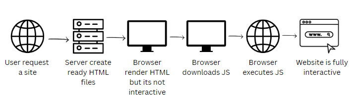
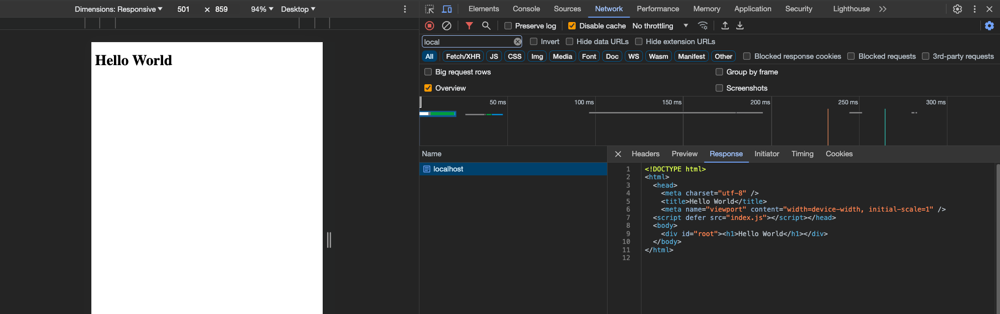

# Optimizing Client-Side Rendered React Applications with Server-Side Rendering Using Express.js



Server-Side Rendering (SSR) offers a significant enhancement to the traditional client-side rendering approach by generating the application pages on the server before sending them to the client. This method provides faster initial page loads, improved search engine optimization (SEO) because web crawlers can index the content more effectively, and a better overall user experience.

## Prerequisites

Before proceeding, ensure that you have a solid understanding of React applications and webpack bundlers. For those who might need a refresher, I recommend reading my previous article on setting up a simple React application with webpack, available [here](insert-link). Additionally, you can find a basic setup of a React app [here](https://github.com/viktorvasylkovskyi/react-app-with-webpack). This project utilizes React 18, which is the most up-to-date version at the time of writing this article.

## Creating an Express Server

Server-side rendering entails having a server that can process and serve rendered pages to the client. The first step in this transition is establishing an Express server. Express is a lightweight web application framework for Node.js, designed to build web applications and APIs with ease. It is built on top of Node.js, inheriting its performance benefits and non-blocking I/O model, which is ideal for real-time applications. For further information on Express, you can visit the official [Express documentation](https://expressjs.com/).

To initiate our server setup, begin by installing the necessary dependencies:

```sh
npm install express
```

Next, let's create a directory for our server files:

```sh
mkdir server
```

And within it, an `index.js` file will serve as our server's entry point:

```sh
cd server
touch index.js
```

The following code outlines the creation of an Express server that listens on port 3006:

```javascript
import path from "path";
import fs from "fs";
import express from "express";

const PORT = process.env.PORT || 3006;
const app = express();

app.listen(PORT, () => {
  console.log(`Server is now listening on port ${PORT}`);
});
```

However, this server is not yet configured with routes to serve our React application—that will be our next step.

## Serving Client Bundle from Node Express

Instead of letting webpack serve our `index.html`, we shift this responsibility to our Node.js server. This approach leverages the server's computational power to improve the user experience, particularly on less powerful devices such as smartphones.

To serve our `index.html`, we will establish a `GET` route in our Express server:

```javascript
app.get("/", (req, res) => {
  const indexFile = path.resolve("./dist/index.html");

  fs.readFile(indexFile, "utf8", (err, data) => {
    if (err) {
      console.error("An error occurred:", err);
      return res.status(500).send("An error occurred, please try again later.");
    }

    return res.send(data);
  });
});
```

Our server is programmed to locate the `index.html` file within the `dist` directory and deliver it to the client.

## Implementing React Server-Side Rendering

We will utilize the `ReactDOMServer.renderToString()` function to render our React application to a string on the server side. This method enables us to convert our React components into HTML strings which can then be directly injected into our `index.html` file. For a more comprehensive understanding, please consult the [React documentation on renderToString](https://reactjs.org/docs/react-dom-server.html#rendertostring).

The following adjustment to our server's route integrates server-side rendering:

```javascript
import React from "react";
import ReactDOMServer from "react-dom/server";
// Additional imports will follow

app.get("/", (req, res) => {
  const indexFile = path.resolve("./dist/index.html");
  const appString = ReactDOMServer.renderToString(<App />);

  fs.readFile(indexFile, "utf8", (err, htmlData) => {
    // Error handling remains the same

    return res.send(
      htmlData.replace(
        '<div id="root"></div>',
        `<div id="root">${appString}</div>`
      )
    );
  });
});
```

## Hydrating the React Application on the Client-Side

The concept of hydration pertains to the process where the client-side React app attaches event listeners to the server-rendered markup, thereby becoming interactive. For more information on hydration in React, refer to the official [React documentation on hydration](https://reactjs.org/docs/react-dom.html#hydrate).

Our client-side `index.js` will be modified to employ `hydrateRoot` instead of `createRoot`:

```javascript
import React from "react";
import ReactDOM from "react-dom/client";
import App from "./App";

ReactDOM.hydrateRoot(document.getElementById("root"), <App />);
```

Subsequently, we will refine our build scripts and webpack configuration to accommodate our Express server.

## Adjusting Webpack Configuration for Express Server

Webpack is not only beneficial for client-side code but also for server-side scripts. We will define a separate webpack configuration for our server code. Let's create a new webpack config: `webpack.server.js`

```javascript
const path = require("path");
const nodeExternals = require("webpack-node-externals");

module.exports = {
  mode: "development", // Sets the mode to development (as opposed to production)
  entry: "./server/index.js",
  target: "node",
  externals: [nodeExternals()],
  output: {
    path: path.resolve("server-dist"),
    filename: "index.js",
  },
  module: {
    rules: [
      {
        test: /\.js$/, // This regex will match .js files
        exclude: /node_modules/, // It's recommended to exclude the node_modules directory
        use: {
          loader: "babel-loader",
          options: {
            presets: ["@babel/preset-env", "@babel/preset-react"], // Presets used for transpiling
          },
        },
      },
    ],
  },
};
```

We have defined the entry point as `./server/index.js` and output into `./server-dist/index.js`, and we have added a babel loader to transpile our javascript code and allow the imports to be bundled. Notice the `externals: [nodeExternals()]` is the instruction to webpack to avoid bundling the `node_modules` into output. We must install those as a dependency.

```sh
npm install webpack-node-externals --save-dev
```

## Script Additions

We'll incorporate new npm scripts to facilitate the building and running of our server:

```json
"scripts": {
  "build:client": "webpack --config webpack.config.js",
  "build:server": "NODE_ENV=development webpack --config webpack.server.js",
  "start:server": "node ./server-dist/index.js"
},
```

## Testing the Implementation

To validate our setup, we'll employ the newly added npm scripts to build and start the server, which will in turn serve the React application:

```sh
npm run build:client && npm run build:server && npm run start:server
```

Upon successful execution, you should see the server running. An effective method to confirm server-side rendering is by inspecting the network tab for your local server call, ensuring the complete `index.html` with the React application's markup is present.



## Conclusion

Server-Side Rendering offers numerous benefits such as improved SEO, faster performance on initial page load, and an enhanced user experience due to the pre-rendered content. However, it is also important to consider the potential drawbacks, such as increased resource consumption on the server side. These factors must be balanced according to the specific needs of your application.

You can find the complete source code in [this GitHub repository](https://github.com/viktorvasylkovskyi/react-express-SSR) and view a live demo [here](https://viktorvasylkovskyi.github.io/react-express-SSR/). Happy coding!
