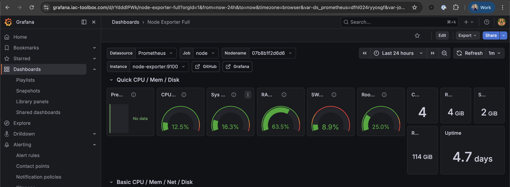

# Open Claw Setup

Yesterday I finished setting up my Raspberry pi device with metrics, alerting, domain access and secrets and I feel like has become a pretty neat device that does nothing. I got intrigued by OpenClaw, a bot with access to LLM, could be sitting on my raspberry pi and do some work for me. Naturally since I don't have much time to build the projects myself, this idea sound very exciting. So here I am, with no time for building project, going to dedicate some time experimenting setting up the Open Claw myself on my device, and see if it can indeed build code for me. https://x.com/elvissun/status/2025920521871716562

I am a Software Engineer myself, and have good understanding of power of such tools. So first thing I want to ensure that my Open Claw does exactly what I ask, and doesn't become a security nightmare, spend my tokens with LLM ruining me, or leak my secrets into the wild.

## Setting Up Securely

First thing I want to figure out is what the security that I would like to have? We mentioned few things already:

- No secrets access
- No spending too much tokens that cost money

At the same time, it should do something useful:

- Write code into a Github Repository.

### Protecting Folder Access

To prevent Open Claw from accessing my whole device, I will scope it to one folder - a github project. The best guarantee is to run Open Claw in docker. If OpenClaw is inside a container that only mounts `~/workspace/myproject`, it physically cannot access your system keys regardless of what the LLM decides to do.

```sh
 Docker container          ← OpenClaw can't see the host at all
    └── allowed_paths     ← within the container, scoped to one folder
        └── GitHub PAT    ← one repo, no delete permissions
            └── Spending cap ← on Anthropic console
```

### Github PAT

I would like to see what it did on Github UI, and not have to come back into the device and git comming things myself. For that I will create GitHub token — fine-grained PAT:

- Go to GitHub → Settings → Developer Settings → Fine-grained tokens
- Scope it to one specific repository only
- Permissions: Contents: Read & Write, nothing else

This means it literally cannot touch other repos, cannot delete the repo, cannot modify settings. For regular commits, My prompt is like follows:

```sh
"Commit after every meaningful change with a descriptive message"
```

### 3. API costs — this is the real risk

To protect ourselves from leaving a bot in overspending, Anthropic has spending controls

- `console.anthropic.com` → Billing → Usage limits and set:A monthly spending cap (e.g. $30), A low balance alert at e.g. $20

When the cap hits, API calls simply fail — OpenClaw stops. I won't wake up to a $1000 bill. Realistically, a night of coding with Claude Sonnet is roughly $2–8 for a typical project, not hundreds, unless you're feeding it massive context repeatedly. But set the cap anyway.

### Prepare API Keys

Anthropic API Key:

```sh
ANTHROPIC_API_KEY=""
```

Also, add spending limits (screenshot)

## Installing Open Claw

### Install Node.js 22+

First things, install Install Node.js 22+:

```sh
curl -fsSL https://deb.nodesource.com/setup_22.x | sudo -E bash -
sudo apt install -y nodejs
node --version  # should be v22+
```

### Installing Open Claw

```sh
curl -fsSL https://openclaw.ai/install.sh | bash

  🦞 OpenClaw Installer
  It's not "failing," it's "discovering new ways to configure the same thing wrong."

✓ Detected: linux

Install plan
OS: linux
Install method: npm
Requested version: latest

[1/3] Preparing environment
✓ Node.js v22.22.2 found
· Active Node.js: v22.22.2 (/usr/bin/node)
· Active npm: 10.9.7 (/usr/bin/npm)

[2/3] Installing OpenClaw
✓ Git already installed
· Configuring npm for user-local installs
✓ npm configured for user installs
· Installing OpenClaw v2026.4.2
✓ OpenClaw npm package installed
✓ OpenClaw installed

[3/3] Finalizing setup

! PATH missing npm global bin dir: /home/vvasylkovskyi/.npm-global/bin
  This can make openclaw show as "command not found" in new terminals.
  Fix (zsh: ~/.zshrc, bash: ~/.bashrc):
    export PATH="/home/vvasylkovskyi/.npm-global/bin:$PATH"

🦞 OpenClaw installed successfully (OpenClaw 2026.4.2 (d74a122))!
Settled in. Time to automate your life whether you're ready or not.

· Starting setup


```

## Setting up

```sh
openclaw onboard --install-daemon
```

## Adding Discord Channel

Follow the onboarding daemon. When reaching the channels part, add discord

```sh
◇  Discord bot token ───────────────────────────────────────────────────────────────────────╮
│                                                                                           │
│  1) Discord Developer Portal -> Applications -> New Application                           │
│  2) Bot -> Add Bot -> Reset Token -> copy token                                           │
│  3) OAuth2 -> URL Generator -> scope 'bot' -> invite to your server                       │
│  Tip: enable Message Content Intent if you need message text. (Bot -> Privileged Gateway  │
│  Intents -> Message Content Intent)                                                       │
│  Docs: discord                                │
│                                                                                           │
├───────────────────────────────────────────────────────────────────────────────────────────╯
```

Setup on UI and test.

when I checked on CLI, I also received the following error:

```sh
vvasylkovskyi@raspberry-4b:~ $ openclaw status

🦞 OpenClaw 2026.4.2 (d74a122) — Easter: I found your missing environment variable—consider it a tiny CLI egg hunt with fewer jellybeans.


14:11:04+01:00 [plugins] discord failed to load from /home/vvasylkovskyi/.npm-global/lib/node_modules/openclaw/dist/extensions/discord/index.js: Error: Cannot find module '@buape/carbon'
Require stack:
- /home/vvasylkovskyi/.npm-global/lib/node_modules/openclaw/dist/ui-Cvzn7c_3.js
[openclaw] Failed to start CLI: PluginLoadFailureError: plugin load failed: discord: Error: Cannot find module '@buape/carbon'
Require stack:
- /home/vvasylkovskyi/.npm-global/lib/node_modules/openclaw/dist/ui-Cvzn7c_3.js
    at maybeThrowOnPluginLoadError (file:///home/vvasylkovskyi/.npm-global/lib/node_modules/openclaw/dist/loader-BkOjign1.js:1575:8)
    at loadOpenClawPlugins (file:///home/vvasylkovskyi/.npm-global/lib/node_modules/openclaw/dist/loader-BkOjign1.js:2182:2)
    at ensurePluginRegistryLoaded (file:///home/vvasylkovskyi/.npm-global/lib/node_modules/openclaw/dist/plugin-registry-BF68Jsx5.js:54:2)
    at prepareRoutedCommand (file:///home/vvasylkovskyi/.npm-global/lib/node_modules/openclaw/dist/run-main-Dn5_pwmb.js:281:4)
    at async tryRouteCli (file:///home/vvasylkovskyi/.npm-global/lib/node_modules/openclaw/dist/run-main-Dn5_pwmb.js:294:2)
    at async runCli (file:///home/vvasylkovskyi/.npm-global/lib/node_modules/openclaw/dist/run-main-Dn5_pwmb.js:374:7)
```

Which means that the Discord plugin dependency `@buape/carbon` is missing. Install it by running:

```sh
npm install -g @buape/carbon
```

After this, it worked:

```sh
vvasylkovskyi@raspberry-4b:~ $ openclaw status

🦞 OpenClaw 2026.4.2 (d74a122) — I speak fluent bash, mild sarcasm, and aggressive tab-completion energy.

│
◇
│
◇
OpenClaw status

Overview
┌──────────────────────┬────────────────────────────────────────────────────────────────────────────────────────────────────────────────────────────────────────────────────────────────────────────────────────────┐
│ Item                 │ Value                                                                                                                                                                                      │
├──────────────────────┼────────────────────────────────────────────────────────────────────────────────────────────────────────────────────────────────────────────────────────────────────────────────────────────┤
│ Dashboard            │ http://127.0.0.1:18789/                                                                                                                                                                    │
│ OS                   │ linux 6.12.75+rpt-rpi-v8 (arm64) · node 22.22.2                                                                                                                                            │
│ Tailscale            │ off                                                                                                                                                                                        │
│ Channel              │ stable (default)                                                                                                                                                                           │
│ Update               │ pnpm · up to date · npm latest 2026.4.2                                                                                                                                                    │
│ Gateway              │ local · ws://127.0.0.1:18789 (local loopback) · reachable 422ms · auth token · raspberry-4b (192.168.2.121) app 2026.4.2 linux 6.12.75+rpt-rpi-v8                                          │
│ Gateway service      │ systemd installed · enabled · running (pid 2060494, state active)                                                                                                                          │
│ Node service         │ systemd not installed                                                                                                                                                                      │
│ Agents               │ 1 · 1 bootstrap file present · sessions 0 · default main active unknown                                                                                                                    │
│ Memory               │ enabled (plugin memory-core) · unavailable                                                                                                                                                 │
│ Plugin compatibility │ none                                                                                                                                                                                       │
│ Probes               │ skipped (use --deep)                                                                                                                                                                       │
│ Events               │ none                                                                                                                                                                                       │
│ Tasks                │ none                                                                                                                                                                                       │
│ Heartbeat            │ 30m (main)                                                                                                                                                                                 │
│ Sessions             │ 0 active · default claude-sonnet-4-6 (200k ctx) · ~/.openclaw/agents/main/sessions/sessions.json                                                                                           │
└──────────────────────┴────────────────────────────────────────────────────────────────────────────────────────────────────────────────────────────────────────────────────────────────────────────────────────────┘

Security audit
Summary: 0 critical · 4 warn · 1 info
  WARN Reverse proxy headers are not trusted
    gateway.bind is loopback and gateway.trustedProxies is empty. If you expose the Control UI through a reverse proxy, configure trusted proxies so local-client c…
    Fix: Set gateway.trustedProxies to your proxy IPs or keep the Control UI local-only.
  WARN Control UI insecure auth toggle enabled
    gateway.controlUi.allowInsecureAuth=true does not bypass secure context or device identity checks; only dangerouslyDisableDeviceAuth disables Control UI device…
    Fix: Disable it or switch to HTTPS (Tailscale Serve) or localhost.
  WARN Insecure or dangerous config flags enabled
    Detected 1 enabled flag(s): gateway.controlUi.allowInsecureAuth=true.
    Fix: Disable these flags when not actively debugging, or keep deployment scoped to trusted/local-only networks.
  WARN Some gateway.nodes.denyCommands entries are ineffective
    gateway.nodes.denyCommands uses exact node command-name matching only (for example `system.run`), not shell-text filtering inside a command payload. - Unknown …
    Fix: Use exact command names (for example: canvas.present, canvas.hide, canvas.navigate, canvas.eval, canvas.snapshot, canvas.a2ui.push, canvas.a2ui.pushJSONL, canvas.a2ui.reset). If you need broader restrictions, remove risky command IDs from allowCommands/default workflows and tighten tools.exec policy.
Full report: openclaw security audit
Deep probe: openclaw security audit --deep

Channels
┌──────────┬─────────┬────────┬─────────────────────────────────────────────────────────────────────────────────────────────────────────────────────────────────────────────────────────────────────────────────────┐
│ Channel  │ Enabled │ State  │ Detail                                                                                                                                                                              │
├──────────┼─────────┼────────┼─────────────────────────────────────────────────────────────────────────────────────────────────────────────────────────────────────────────────────────────────────────────────────┤
│ Discord  │ ON      │ OK     │ token config (MTQ5…kDhA · len 72) · accounts 1/1                                                                                                                                    │
└──────────┴─────────┴────────┴─────────────────────────────────────────────────────────────────────────────────────────────────────────────────────────────────────────────────────────────────────────────────────┘

Sessions
┌──────────────────────────────────────────────────────────────────────────────────────────────────────────────────────────────────────────────────────────────────┬──────┬─────────┬──────────────┬────────────────┐
│ Key                                                                                                                                                              │ Kind │ Age     │ Model        │ Tokens         │
├──────────────────────────────────────────────────────────────────────────────────────────────────────────────────────────────────────────────────────────────────┼──────┼─────────┼──────────────┼────────────────┤
│ no sessions yet                                                                                                                                                  │      │         │              │                │
└──────────────────────────────────────────────────────────────────────────────────────────────────────────────────────────────────────────────────────────────────┴──────┴─────────┴──────────────┴────────────────┘

FAQ: https://docs.openclaw.ai/faq
Troubleshooting: https://docs.openclaw.ai/troubleshooting

Next steps:
  Need to share?      openclaw status --all
  Need to debug live? openclaw logs --follow
  Need to test channels? openclaw status --deep
```

I still couldn't get the answer from the bot in Discord. Make sure to give the right permissions to the bot. The bot needs to be in a server you share, even for DMs to work. If you haven't added it to a server yet:

- Generate an invite link in Discord Developer Portal → OAuth2 → URL Generator
- Scopes: bot
- Permissions: Send Messages, Read Message History, Read Messages

After setting them ok, I got the success message on Discord setup.

```sh
vvasylkovskyi@raspberry-4b:~ $ openclaw channels list

🦞 OpenClaw 2026.4.2 (d74a122) — Claws out, commit in—let's ship something mildly responsible.

Chat channels:
- Discord default: configured, token=config, enabled

Auth providers (OAuth + API keys):
- anthropic:default (api_key)
```

However, I did have the logs working:

```sh
vvasylkovskyi@raspberry-4b:~ $ openclaw logs --follow

🦞 OpenClaw 2026.4.2 (d74a122) — I read logs so you can keep pretending you don't have to.

gateway connect failed: GatewayClientRequestError: pairing required
Gateway not reachable. Is it running and accessible?
Gateway target: ws://127.0.0.1:18789
Source: local loopback
Config: /home/vvasylkovskyi/.openclaw/openclaw.json
Bind: loopback
Hint: run openclaw doctor.
```

Checking the gateway service:

```sh
vvasylkovskyi@raspberry-4b:~ $ systemctl --user status openclaw-gateway.service
● openclaw-gateway.service - OpenClaw Gateway (v2026.4.2)
     Loaded: loaded (/home/vvasylkovskyi/.config/systemd/user/openclaw-gateway.service; enabled; preset: enabled)
     Active: active (running) since Sun 2026-04-05 14:05:29 WEST; 23min ago
   Main PID: 2060494 (openclaw-gatewa)
      Tasks: 11 (limit: 3920)
     Memory: 241.1M
        CPU: 59.399s
     CGroup: /user.slice/user-1000.slice/user@1000.service/app.slice/openclaw-gateway.service
             └─2060494 openclaw-gateway

Apr 05 14:06:26 raspberry-4b node[2060494]: 2026-04-05T14:06:26.923+01:00 [plugins] discord failed to load from /home/vvasylkovskyi/.npm-global/lib/node_modules/openclaw/dist/extensions/discord/index.js: Error: C>
Apr 05 14:06:26 raspberry-4b node[2060494]: Require stack:
Apr 05 14:06:26 raspberry-4b node[2060494]: - /home/vvasylkovskyi/.npm-global/lib/node_modules/openclaw/dist/ui-Cvzn7c_3.js
Apr 05 14:06:28 raspberry-4b node[2060494]: 2026-04-05T14:06:28.981+01:00 [bonjour] restarting advertiser (service stuck in announcing for 12470ms (gateway fqdn=raspberry-4b (OpenClaw)._openclaw-gw._tcp.local. ho>
Apr 05 14:13:36 raspberry-4b node[2060494]: 2026-04-05T14:13:36.162+01:00 [gateway] device pairing auto-approved device=0b5e2d26d9befcf2ee9322be08ea490d70d1eb4e2fd11e10aea2e7b8d2902591 role=operator
Apr 05 14:16:13 raspberry-4b node[2060494]: 2026-04-05T14:16:13.663+01:00 [gateway] security audit: device access upgrade requested reason=scope-upgrade device=0b5e2d26d9befcf2ee9322be08ea490d70d1eb4e2fd11e10aea2>
Apr 05 14:16:13 raspberry-4b node[2060494]: 2026-04-05T14:16:13.853+01:00 [ws] closed before connect conn=1a8ab0ce-3473-40b3-b945-99815e08b995 remote=127.0.0.1 fwd=n/a origin=n/a host=127.0.0.1:18789 ua=n/a code=>
Apr 05 14:25:05 raspberry-4b node[2060494]: 2026-04-05T14:25:05.040+01:00 [gateway] security audit: device access upgrade requested reason=scope-upgrade device=0b5e2d26d9befcf2ee9322be08ea490d70d1eb4e2fd11e10aea2>
Apr 05 14:25:05 raspberry-4b node[2060494]: 2026-04-05T14:25:05.156+01:00 [ws] closed before connect conn=c48f51cb-1c79-48eb-a859-38ce9f1765c2 remote=127.0.0.1 fwd=n/a origin=n/a host=127.0.0.1:18789 ua=n/a code=>
Apr 05 14:26:23 raspberry-4b node[2060494]: 2026-04-05T14:26:23.261+01:00 [ws] ⇄ res ✓ doctor.memory.status 2480ms conn=eeeb1242…87f5 id=c8b8bb88…fd74
```

## Accessing OpenClaw UI from Pi

On computer, get a dashboard URL from the Pi:

```sh
ssh -L 18789:127.0.0.1:18789 vvasylkovskyi@raspberry-4b.local -N
## Now, access to http://127.0.0.1:18789 in the browser
```

The dashboard needs a token to authenticate. Here's how to get it:

```sh
ssh vvasylkovskyi@raspberry-4b.local
cat ~/.openclaw/openclaw.json | grep token
```

After inserting token, I tested chatting with bot on the UI, and it is responding well. So the bot is working, now we need to debug further the Discord connection.

## Discord

Set configs:

```sh
export DISCORD_BOT_TOKEN="..."
openclaw config set channels.discord.token --ref-provider default --ref-source env --ref-id DISCORD_BOT_TOKEN --dry-run

🦞 OpenClaw 2026.4.2 (d74a122) — Claws out, commit in—let's ship something mildly responsible.

Dry run successful: 1 update(s) validated against ~/.openclaw/openclaw.json.
```

Now, set the token

```sh
openclaw config set channels.discord.token --ref-provider default --ref-source env --ref-id DISCORD_BOT_TOKEN

🦞 OpenClaw 2026.4.2 (d74a122) — Making 'I'll automate that later' happen now.

Config overwrite: /home/vvasylkovskyi/.openclaw/openclaw.json (sha256 411f314029ef7c497c173ede99249f0abdf0e4316c8ac0f5838dd15438b43219 -> 9bf43cd1eee8acf5ab3e879ad08205a8558ccb03395ef5cbe67cd4254f4cdae3, backup=/home/vvasylkovskyi/.openclaw/openclaw.json.bak)
Updated channels.discord.token. Restart the gateway to apply.
```

Now, enable discord:

```sh
openclaw config set channels.discord.enabled true --strict-json


🦞 OpenClaw 2026.4.2 (d74a122) — I don't just autocomplete—I auto-commit (emotionally), then ask you to review (logically).

Config overwrite: /home/vvasylkovskyi/.openclaw/openclaw.json (sha256 9bf43cd1eee8acf5ab3e879ad08205a8558ccb03395ef5cbe67cd4254f4cdae3 -> 84395f6549e91a088db65c77701715ecec057ff7b66b60bc98bed4b5a31f75ff, backup=/home/vvasylkovskyi/.openclaw/openclaw.json.bak)
Updated channels.discord.enabled. Restart the gateway to apply.
```

Finally, restart the gateway:

```sh
openclaw gateway stop
openclaw gateway
```

I see the logs flowing:

```sh
vvasylkovskyi@raspberry-4b:~ $ openclaw gateway

🦞 OpenClaw 2026.4.2 (d74a122) — I keep secrets like a vault... unless you print them in debug logs again.

14:51:25+01:00 [canvas] host mounted at http://127.0.0.1:18789/__openclaw__/canvas/ (root /home/vvasylkovskyi/.openclaw/canvas)
14:51:26+01:00 [heartbeat] started
14:51:26+01:00 [health-monitor] started (interval: 300s, startup-grace: 60s, channel-connect-grace: 120s)
14:51:26+01:00 [gateway] agent model: anthropic/claude-sonnet-4-6
14:51:26+01:00 [gateway] listening on ws://127.0.0.1:18789, ws://[::1]:18789 (PID 2081917)
14:51:26+01:00 [gateway] log file: /tmp/openclaw/openclaw-2026-04-05.log
14:51:26+01:00 [gateway] security warning: dangerous config flags enabled: gateway.controlUi.allowInsecureAuth=true. Run `openclaw security audit`.
14:51:27+01:00 [hooks] loaded 4 internal hook handlers
14:51:44+01:00 [browser/server] Browser control listening on http://127.0.0.1:18791/ (auth=token)
14:51:45+01:00 [ws] webchat connected conn=cc84c45b-f5f8-4acd-94ff-a440a81afaaf remote=127.0.0.1 client=openclaw-control-ui webchat vcontrol-ui
14:51:46+01:00 [ws] ⇄ res ✓ config.schema 666ms conn=cc84c45b…faaf id=e3fdff46…9cf7
14:51:46+01:00 [ws] ⇄ res ✓ node.list 730ms conn=cc84c45b…faaf id=adaf00e6…851a
14:51:46+01:00 [ws] ⇄ res ✓ device.pair.list 734ms conn=cc84c45b…faaf id=a347bc00…9c67
14:51:46+01:00 [ws] ⇄ res ✓ health 750ms conn=cc84c45b…faaf id=8fe145ff…5d1d
14:51:46+01:00 [discord] [default] Discord Message Content Intent is limited; bots under 100 servers can use it without verification.
14:51:46+01:00 [discord] [default] starting provider (@AI)
14:51:48+01:00 [ws] ⇄ res ✓ config.get 2011ms conn=cc84c45b…faaf id=018ac054…f301
14:51:48+01:00 [ws] ⇄ res ✓ channels.status 3293ms conn=cc84c45b…faaf id=2352f7f2…7e8d
14:51:49+01:00 [discord] logged in to discord as 1490334905945821204 (AI)

```

### Talking to it in DM first time

Very important, first message has to be always a DM to a bot. It will reply with pairing code:

```sh
AI
APP
 — 15:07
OpenClaw: access not configured.

Your Discord user id: ...
Pairing code:
...


Ask the bot owner to approve with:
openclaw pairing approve discord ...
openclaw pairing approve discord ...
```

Then we pair in our device:

```sh
vvasylkovskyi@raspberry-4b:~/.openclaw $ openclaw pairing approve discord ...

🦞 OpenClaw 2026.4.2 (d74a122) — I'm like tmux: confusing at first, then suddenly you can't live without me.

Approved discord sender .....
```

## Testing

Check if the service is running:

```sh
systemctl --user status openclaw
```

## OpenClaw crashed silently

After using it for couple of hours, my open claw failed to respond on discord. This is kind of situation that warants couple of questions:

1. What did we miss to make OpenClaw persistent and auto-restart?
2. How do we do to react to a failure and get notified?

### DISCORD_BOT_TOKEN empty

This time, it was my discord bot token that got lost from the env variable. Although not secure, I simply replaced the env var by placing the bot token as plaintext in `~/.openclaw/openclaw.json`

```json
"channels": {
  "discord": {
    "enabled": true,
    "token": "YOUR_ACTUAL_DISCORD_BOT_TOKEN",
    ...
  }
}
```

## Adding Raspberry Pi SWAP Memory

From my Grafana, the insight I get is my SWAP is at 99.9% usage. With 4GB RAM, my Pi is heavily memory-pressured — everything in RAM is actively needed, and it's spilling everything else to disk. This causes significant slowdowns.

### What is Swap?

Swap is virtual memory on disk — when Pi runs out of physical RAM, the OS moves less-used memory pages to a swap file on the SD card/SSD to free up real RAM. It's much slower than RAM but prevents out-of-memory crashes.

### Check current SWAP file

Raspberry pi usually allocates swap by default, let's inspect where it is.

```sh
vvasylkovskyi@raspberry-4b:~ $ swapon --show
NAME      TYPE SIZE   USED PRIO
/var/swap file 200M 199.8M   -2
```

### Allocating swap and reducing swappiness

The following script will achieve this (taken from OpenClaw)

```sh
sudo fallocate -l 2G /swapfile
sudo chmod 600 /swapfile
sudo mkswap /swapfile
sudo swapon /swapfile
echo '/swapfile none swap sw 0 0' | sudo tee -a /etc/fstab

# Reduce swappiness for low-RAM devices
echo 'vm.swappiness=10' | sudo tee -a /etc/sysctl.conf
sudo sysctl -p
```

**Explanation**:

- `sudo fallocate -l 2G /swapfile` - Allocates a 2GB file on disk instantly (without actually writing zeros). This becomes your swap space.
- `sudo chmod 600 /swapfile` - Restricts the file to root-only read/write. Required by Linux — mkswap will refuse to use a swap file that other users can read (security risk: memory contents would be exposed).
- `sudo mkswap /swapfile` - Formats the file with swap metadata so the kernel knows it's a swap area, not just random data.
- `sudo swapon /swapfile` - Activates the swap file immediately for the current session.
- `echo '/swapfile none swap sw 0 0' | sudo tee -a /etc/fstab` - Makes the swap persistent across reboots by adding it to /etc/fstab (the filesystem mount table). Without this, the swap disappears on restart.
- `echo 'vm.swappiness=10' | sudo tee -a /etc/sysctl.conf` - Sets swappiness to 10 (default is 60). This tells the kernel to prefer keeping things in RAM and only spill to swap when really necessary — important on a Pi because SD card I/O is slow and has limited write cycles.
- `sudo sysctl -p - Reloads /etc/sysctl.conf` to apply the swappiness change immediately without rebooting.

### Applying the script

Let's run the script, and then validate the swap

```sh
vvasylkovskyi@raspberry-4b:~ $ swapon --show
NAME      TYPE SIZE USED PRIO
/var/swap file 200M 200M   -2
/swapfile file   2G   0B   -3
```

Check the grafana, and the swap storage is much better now



### Swap priority problem

Having two swap files creates a priority issue. The Pi is ignoring the big 2GB swapfile and hammering the tiny 200MB one instead. That's a priority problem — `/var/swap` has priority -2 (higher) and `/swapfile` has -3 (lower), so the system fills the small one first and never touches the big one.

To fix — we can either swap the priorities or just disable the small one entirely since the 2GB one is sufficient:

**Swap Priorities**

```sh
sudo swapoff /var/swap
sudo swapon -p 1 /swapfile
```

**Disable small one**

```sh
sudo swapoff /var/swap
```

The big one is good enough so we will just disable the small one.

### Increasing Open Claw Timeout

I have been having lots of timeouts especially when asking claw to run commands on device. To avoid the issue, we should increase timeout. Error messages in chat flow like follows:

```sh
Request timed out before a response was generated. Please try again, or increase agents.defaults.timeoutSeconds in your config.
```

So I updated it in the config: `sudo nano ~/.openclaw/openclaw.json`.

**Restart Gateway to apply config**

```sh
openclaw gateway stop
openclaw gateway > /dev/null 2>&1 &
```

## Adding Github API Key

Best way is to store it directly on the Pi. Quickest way is to store credentials using `gh`:

```sh
gh auth login
```

Follow through prompts. Make sure to create a token here https://github.com/settings/tokens

### Github Key Permissions

- `admin:public_key` - Full control of user public keys (for clonning repo with ssh)
- `read:org` - Read org and team membership, read org projects
- `repo` - Full control of private repositories
- `workflow` - Update Github Actions (useful for bot to be able to build pipelines)

### Ensure Github SSH

The working repository should always be in ssh. It is more reliable in headless mode. To check if it is at ssh, check with `git remote -v`

I got:

```sh
git remote -v
origin	https://github.com/IaC-Toolbox/iac-toolbox-cli (fetch)
origin	https://github.com/IaC-Toolbox/iac-toolbox-cli (push)
```

So, those are now ssh. To change them, use SSH key

```sh
ssh-keygen -t ed25519 -C "your_email@example.com"
eval "$(ssh-agent -s)"
ssh-add ~/.ssh/id_ed25519
cat ~/.ssh/id_ed25519.pub
# add key to GitHub
ssh -T git@github.com
git remote set-url origin git@github.com:OWNER/REPO.git
```

## Moving to Codex

Unfortunately, Antropic forces use of API key when using OpenClaw which is way too expensive. As of now I prefer to use OpenAI's subscription and in browser login. To setup codex, I did run `openclaw onboard` and chose codex in the editor.

## Configuring OpenClaw

The next thing is to configure open claw, more specifically its files. At this point I am comfortable speaking with my bot, so most of the changes I need can be asked directly to the bot to change.

The files that need configuring are `.md` files that sit at

```sh
~/.openclaw/workspace/AGENTS.md
~/.openclaw/workspace/HEARTBEAT.md
~/.openclaw/workspace/IDENTITY.md
~/.openclaw/workspace/SOUL.md
~/.openclaw/workspace/TOOLS.md
~/.openclaw/workspace/USER.md
```

## Installing Codex harness

We have established that Codex and Claude Code likes are agents especialized in writing code, so while OpenClaw is great at talking to us, the coding will be delegated to Codex in this case. The protocol to delegate from OpenClaw to Codex is `ACP` [(Agent Communication Protocol)](https://agentcommunicationprotocol.dev/introduction/welcome). In this protocol, OpenClaw acts as coordinator, and delegates to Codex coding tasks via ACP. Codex will run as a background task and assynchronously will send message back to OpenClaw once finished.

Let's set this up step by step:

### Make sure ACP is enabled

```sh
openclaw config set acp.enabled true
openclaw config set acp.backend acpx
openclaw config set acp.defaultAgent codex
```

### Make sure acpx plugin is enabled

`acpx` is the ACP runtime backend plugin. It lets OpenClaw launch external coding agents.

### Allow Codex

```sh
openclaw config set acp.allowedAgents '["codex"]'
```

### Set permissions for headless coding

Because ACP sessions are non-interactive, we must enable these:

```sh
openclaw config set plugins.entries.acpx.config.permissionMode approve-all
openclaw config set plugins.entries.acpx.config.nonInteractivePermissions deny
```

For fully autonomous coding sessions, approve-all is the practical choice.

### Install Codex runtime

First, let's install the actual codex:

```sh
npm i -g @openai/codex
```

### Login into Codex

After that, make sure to login to codex:

```sh
codex
### Follow through prompts. Choose Device Code for Auth
```

Now we want to check whether the Codex harness is actually available to acpx. The cleanest way is usually:

```sh
# Restart first
openclaw gateway stop
openclaw gateway > /dev/null 2>&1 &

# Check ACP

openclaw plugins list | grep -A2 acpx

│ ACPX Runtime │ acpx     │ openclaw │ loaded   │ stock:acpx/index.js                                       │ 2026.4.2 │
│              │          │          │          │ ACP runtime backend powered by acpx with configurable     │          │
│              │          │          │          │ command path and version policy.                          │          │
│ @openclaw/   │ amazon-  │ openclaw │ loaded   │ stock:amazon-bedrock/index.js                             │ 2026.4.2 │
```

Also, using the ACP:

```sh
vvasylkovskyi@raspberry-4b:~/.openclaw/workspace $ openclaw acp

🦞 OpenClaw 2026.4.2 (d74a122) — Automation with claws: minimal fuss, maximal pinch.

gateway connect failed: GatewayClientRequestError: pairing required
GatewayClientRequestError: pairing required
```

### Approving Pairing Device

The last error `gateway connect failed: GatewayClientRequestError: pairing required` usually means the local OpenClaw CLI/device has not been approved by the gateway yet. That first-run approval step is called out in recent OpenClaw issue/docs threads, and the usual fix is `openclaw devices approve --latest`

```sh
openclaw devices approve --latest

🦞 OpenClaw 2026.4.2 (d74a122) — Finally, a use for that always-on Mac Mini under your desk.

│
gateway connect failed: GatewayClientRequestError: pairing required
◇
Direct scope access failed; using local fallback.
│
gateway connect failed: GatewayClientRequestError: pairing required
◇
Direct scope access failed; using local fallback.
Approved 0b5e2d26d9befcf2ee9322be08ea490d70d1eb4e2fd11e10aea2e7b8d2902591 (c82bead8-c3ff-4a10-b4eb-99ee4dcdd78c)
```

Now, let's check ACP again. We will ask agent directly. Ask it: "start a Codex ACP session and say hello". If your bot answers, it all worked!

### ACP is getting further, but now it fails at Codex session initialization:

- ACP session init failed
- neither sessions ensure nor sessions new returned valid session identifiers

OpenClaw can now reach the ACP backend, but the Codex harness itself is not starting cleanly. So progress:

- ✅ gateway pairing/auth path fixed
- ❌ Codex ACP runtime still not healthy

**Troubleshooting ACP with acpx**

Let's run the `acpx` directly:

```sh
npm install -g acpx@latest # if not installed
acpx config show
acpx codex sessions list
>>> No sessions

acpx codex sessions new
>>> ACP agent exited before initialize completed (exit=1, signal=null): Error resolving package: Error [ERR_MODULE_NOT_FOUND]: Cannot find package '@zed-industries/codex-acp-linux-arm64' imported from /home/vvasylkovskyi/.npm/_npx/d285e17b0418cc35/node_modules/@zed-industries/codex-acp/bin/codex-acp.js Failed to locate @zed-industries/codex-acp-linux-arm64 binary. This usually means the optional dependency was not installed. Platform: linux, Architecture: arm64
```

Ah ha! There is the culprit. `@zed-industries/codex-acp-linux-arm64` not found. The Codex ACP package uses platform-specific binaries, and there is a Linux ARM64 package published separately. So this is not an OpenClaw config problem anymore. It is an ACP adapter install/resolution problem on Raspberry Pi / arm64. Let's resolve it:

```sh
# 1) clear the broken npx cache for this package
rm -rf ~/.npm/_npx
npm cache clean --force

# 2) install the adapter explicitly, including the arm64 binary package
npm install -g @zed-industries/codex-acp @zed-industries/codex-acp-linux-arm64

# 3) verify the adapter starts
npx @zed-industries/codex-acp --help

## Output
CLI option that captures arbitrary configuration overrides specified as `-c key=value`. It intentionally keeps both halves **unparsed** so that the calling code can
decide how to interpret the right-hand side

Usage: codex-acp [OPTIONS]

Options:
  -c, --config <key=value>
          Override a configuration value that would otherwise be loaded from `~/.codex/config.toml`. Use a dotted path (`foo.bar.baz`) to override nested values. The
          `value` portion is parsed as TOML. If it fails to parse as TOML, the raw string is used as a literal.

          Examples: - `-c model="o3"` - `-c 'sandbox_permissions=["disk-full-read-access"]'` - `-c shell_environment_policy.inherit=all`

  -h, --help
          Print help (see a summary with '-h')
```

Finally, let's try again to run `acpx codex sessions new`

```sh
vvasylkovskyi@raspberry-4b:~/.openclaw/workspace/git/iac-toolbox-cli $ acpx codex sessions new
[acpx] created session cwd (019d686b-1243-73a0-8bd8-83ba98b4cec3)
[acpx] agent: codex
[acpx] cwd: /home/vvasylkovskyi/.openclaw/workspace/git/iac-toolbox-cli
019d686b-1243-73a0-8bd8-83ba98b4cec3
```

Yey! Looks like we have solved it. Let's try to ask a bot now to test end to end acp.

## Can’t do the thread-bound Codex ACP session from Discord right now: thread ACP spawns are disabled for this account.

New Error:

```sh
Discord thread-bound ACP spawns are disabled for this account (set channels.discord.threadBindings.spawnAcpSessions=true to enable).
```

Since ACP is agents working asynchronously, they need to know where to post answers when finishing. By enabling this config, we allow binding discord thread with acp session. I basically asked AI to enabled it, but in short these are the configs that need to be enabled:

```sh
session.threadBindings.enabled = true
channels.discord.threadBindings.enabled = true
channels.discord.threadBindings.spawnAcpSessions = true
```

Notice, that Discord DMs are not the right place for this. To handle thread bindings we should try chatting in the server. But I haven't configured any guild in openclaw discord config, so effectively bot cannot talk in servers.

### Configure Discord Guild

Now that I asked the bot to configure it, it succeeded. For the record, it did this:

```sh
"channels": {
  "discord": {
    "enabled": true,
    "groupPolicy": "allowlist",
    "guilds": {
      # Bot added this
      "1490...": {}
    },
    "threadBindings": {
      "enabled": true,
      "spawnAcpSessions": true
    }
  }
},
```

### Final Test of ACP

Now, in my guild, in the channel I do the final test: "start a Codex ACP session and say hello"


And it worked. Notably:

- AI created a thread where ACP lifecycle is handled.
- Got me an answer

I will ask it to code something to see the difference.

### Codex Sandbox Setting - Approval Policy

In Codex, approval policy and sandbox mode are separate. `approve-all` / `--ask-for-approval` never only removes prompts; it does not itself grant write access.

One good tip is to test locally:

```sh
codex

# Ask AI to write something
```

In my case, codex could write well. I asked the bot to check again, If Codex works directly but not through OpenClaw, then OpenClaw is probably constraining the session via ACP. Let's check the config... It suddenly started working. Unexpected...

## Failing Overnight - Improving Reliability

Once again, my bot has died overnight. I didn't have no logs no anything because it essentially runs via `openclaw` cmd which means that the logs are stored in stout - so no way to have them available unless we have terminal session always running.

This prompted me to reconsider my setup. It was fun to get to know OpenClaw from the start, and tweak some basic configurations, but now it is the time to harden the setup.

### Running with Grafana Loki

I have Grafana Loki configured with Grafana Alloy logs collection, and I can see my `systemd` logs which is handy for system level, and also my `docker` logs.


### The System Load Overload

Once I ran the Codex, my system basically overload. Why is that? I asked my bot, it didn't know, and I had no longs. Turns out metrics are only one piece of it.


