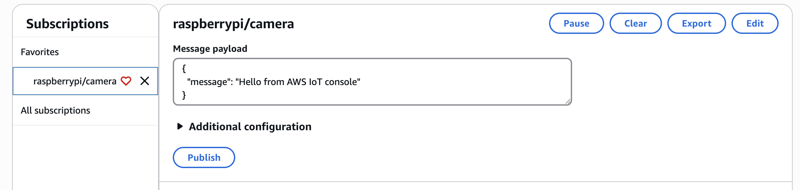

# AWS IoT Core - Implementing Publisher and Subscriber for MQTT in Python

This notes is a continuation of the series on mastery of IoT with AWS IoT Core. We are diving into how to make our Raspberry pi a real IoT citizen, enabling bi-directional communication with the web servers to allow our device publish data. In this notes we will dive into the real python code, and how to setup the AWS IoT Core on both Raspberry Pi and Web Server, wherein our pi is a publisher to MQTT Broker, and the web server is his subscriber.

If you found this notes and didn't follow the previous ones, I am going to have to break for you that there is some infrastructure work involved in enabling this tech. Luckily, we have covered that in the previous notes, so you are welcome to get familiar with all infra needed before jumping into this Python implementation: 

  - [Provisioning AWS IoT Core Certificates for Raspberry Pi for MQTT Broker with Terraform](https://www.viktorvasylkovskyi.com/posts/provisioning-aws-iot-core-for-raspberry-pi)
  - [Provisioning AWS IoT Core Certificates for Ec-2 instance - MQTT Subscriber with Terraform](https://www.viktorvasylkovskyi.com/posts/provisioning-aws-iot-core-for-ec-2)

All Infrastructure being set, now it is time to do some python!

## Install AWS IoT Device SDK and adding connection using Python

Now that we have all infrastructure in place, the next step is to add the capability for the device to actually connect to that infrastructure. We will be adding AWS IOT SDK to our python apps. This SDK is meant to run on both the Rpi and web service.

### Adding dependencies

First we need to add dependencies

```sh
pip install awsiotsdk
```

Or another method that you prefer, I have added it using `poetry` in my `pyproject.toml`:

```sh
[tool.poetry.dependencies]
awsiotsdk = "1.24.0"
```

The official place to get it is here in PyPi - https://pypi.org/project/awsiotsdk/.

## Writing a generic MQTT Client with Python

We are going to define a Python MQTT client that securely connects our Raspberry Pi to AWS IoT Core using mutual TLS authentication. Once connected, it can:
  - Subscribe to MQTT topics
  - Publish messages
  - Subscribe to messages 
  - Gracefully disconnect


We are using AWS IoT Device SDK v2, specifically the `awscrt` and `awsiot` libraries. Now we are going to write an actual script that connects all this: `aws_mqtt_client.py`. Note, I will write an MQTT Client that can be reused by both raspberry pi or web service. The only difference between both of them is the implementation of the MQTT client, which we will cover later. 

Let's jump right into the juice of it: 

```python
# aws_mqtt_client.py
import os
import asyncio
import traceback
from awscrt import io, mqtt
from awsiot import mqtt_connection_builder
from video_service_web.logger.logger import Logger
from video_service_web.utils.base64 import Base64
from video_service_web.mqtt_topics.mqtt_topics_manager import MqttTopicManager


class AwsMQTTClient:
    _instance = None
    logger = Logger("AwsMQTTClient")
    topic_manager = MqttTopicManager()

    def __new__(cls):
        if cls._instance is None:
            cls._instance = super().__new__(cls)

            cls._instance.ENDPOINT = os.environ["AWS_IOT_CORE_ENDPOINT"]
            cls._instance.CLIENT_ID = os.environ.get("AWS_IOT_CLIENT_ID")
            cls._instance.PATH_TO_CERT = os.environ["AWS_IOT_PATH_TO_CERT"]
            cls._instance.PATH_TO_KEY = os.environ["AWS_IOT_PATH_TO_KEY"]
            cls._instance.PATH_TO_ROOT = os.environ["AWS_IOT_PATH_TO_ROOT_CERT"]
            cls._instance.TOPIC = os.environ.get("AWS_IOT_MQTT_TOPIC")

            Base64.write_if_missing(cls._instance.PATH_TO_CERT, "AWS_IOT_CERT_BASE64")
            Base64.write_if_missing(cls._instance.PATH_TO_KEY, "AWS_IOT_KEY_BASE64")
            Base64.write_if_missing(
                cls._instance.PATH_TO_ROOT, "AWS_IOT_ROOT_CERT_BASE64"
            )

            cls._instance.event_loop_group = io.EventLoopGroup(1)
            cls._instance.host_resolver = io.DefaultHostResolver(
                cls._instance.event_loop_group
            )
            cls._instance.client_bootstrap = io.ClientBootstrap(
                cls._instance.event_loop_group, cls._instance.host_resolver
            )

            cls._instance.mqtt_connection = mqtt_connection_builder.mtls_from_path(
                endpoint=cls._instance.ENDPOINT,
                cert_filepath=cls._instance.PATH_TO_CERT,
                pri_key_filepath=cls._instance.PATH_TO_KEY,
                client_bootstrap=cls._instance.client_bootstrap,
                ca_filepath=cls._instance.PATH_TO_ROOT,
                client_id=cls._instance.CLIENT_ID,
                clean_session=False,
                keep_alive_secs=30,
            )

        return cls._instance

    def get_device_id(self):
        return self.CLIENT_ID

    async def connect(self):
        self.logger.info(
            f"Connecting to {self.ENDPOINT} with client ID '{self.CLIENT_ID}'..."
        )
        try:
            connect_future = self.mqtt_connection.connect()
            await asyncio.wrap_future(connect_future)
            self.logger.success("Connected!")
        except Exception as e:
            self.logger.error(f"Failed to connect: {e}")
            self.logger.debug(traceback.format_exc())
            raise

    async def publish(self, message: str):
        self.logger.info(f"Publishing message to topic '{self.TOPIC}': {message}")

        try:
            publish_future, packet_id = self.mqtt_connection.publish(
                topic=self.TOPIC, payload=message, qos=mqtt.QoS.AT_LEAST_ONCE
            )

            # This will not block the event loop
            loop = asyncio.get_running_loop()
            await loop.run_in_executor(None, publish_future.result)
            self.logger.success(
                f"Message published to topic '{self.TOPIC}' with packet ID {packet_id}"
            )
            return True

        except Exception as e:
            self.logger.error(f"Failed to publish message to topic '{self.TOPIC}': {e}")
            self.logger.debug(traceback.format_exc())
            return False

    async def subscribe(self):
        self.logger.info(f"Subscribing to topic '{self.TOPIC}'...")

        def on_message_received(topic, payload, **kwargs):
            self.topic_manager.handle_message(payload)

        try:
            subscribe_future, packet_id = self.mqtt_connection.subscribe(
                topic=self.TOPIC,
                qos=mqtt.QoS.AT_LEAST_ONCE,
                callback=on_message_received,
            )

            await asyncio.wrap_future(subscribe_future)
            self.logger.success(
                f"Successfully subscribed to topic '{self.TOPIC}' with packet ID {packet_id}"
            )
        except Exception as e:
            self.logger.error(f"Failed to subscribe to topic '{self.TOPIC}': {e}")
            self.logger.debug(traceback.format_exc())
            raise

    async def disconnect(self):
        self.logger.info("Disconnecting...")
        try:
            disconnect_future = self.mqtt_connection.disconnect()
            await asyncio.wrap_future(disconnect_future)
            self.logger.success("Disconnected.")
        except Exception as e:
            self.logger.error(f"Error during disconnect: {e}")
            self.logger.debug(traceback.format_exc())

    async def unsubscribe(self, topic):
        self.logger.info(f"Unsubscribing from topic '{topic}'...")

        try:
            unsubscribe_future, packet_id = self.mqtt_connection.unsubscribe(topic)
            await asyncio.wrap_future(unsubscribe_future)
            self.logger.success(
                f"Successfully unsubscribed from topic '{topic}' with packet ID {packet_id}"
            )
        except Exception as e:
            self.logger.error(f"Failed to unsubscribe from topic '{topic}': {e}")
            self.logger.debug(traceback.format_exc())
            raise

```

## Code overview

Let's go step by step what this code actually does:

### Initialization: Singleton 

Notice I deliberately made our service a singleton for easy reusability of same instance. Having only one instance will guarantee that we will not open many web socket connections. Yes MQTT works on web sockets, if you don't know what it is, I found this great article online diving into the theoretical details here https://p403n1x87.github.io/iot-with-websockets-and-pythons-asyncio.html. I will assume that you are familiar with web sockets though. 

### Using Coroutines and asyncio

It is essential to use `asyncio` to ensure that the work done by web sockets connection and all IoT operations in general without blocking the main thread. At first I implemented the solution without asyncio and this yielded my raspberry pi unresponsive. Feel free to have a good read about asyncio here https://realpython.com/async-io-python/. 

### Decoding base64 into filesystem

There is only one difference between our web service and raspberry pi. The raspberry pi already has certificates in the filesystem because we set them using ansible. But fo web service we will decode base64 and write them into file system using `Base64.write_if_missing(cls._instance.PATH_TO_CERT, "AWS_IOT_CERT_BASE64")`.

```python
import os
import base64
from pathlib import Path
from video_service_web.logger.logger import Logger


class Base64:
    logger = Logger("Base64")

    @staticmethod
    def write_if_missing(file_path: str, env_var: str):
        path = Path(file_path)

        if path.exists():
            Base64.logger.debug(f"{path.name} already exists. Skipping write.")
            return

        base64_str = os.environ.get(env_var)
        if not base64_str:
            raise ValueError(f"{env_var} environment variable is not set")

        try:
            decoded = base64.b64decode(base64_str)
            path.parent.mkdir(parents=True, exist_ok=True)
            path.write_bytes(decoded)
            Base64.logger.success(f"Wrote {env_var} contents to {path}")
        except Exception as e:
            Base64.logger.error(
                f"Failed to decode and write {env_var} to {file_path}: {e}"
            )
            raise
```

### MqttTopicsManager

I am using a topics manager just to encapsulate what needs to be done before sending or after receiving messages. The very basic example of it is to print the message once it is received: 

```python
import os
import traceback
from video_service_web.logger.logger import Logger


class MqttTopicManager:
    def __init__(self):
        self.logger = Logger("MqttTopicManager")
        self.topic = os.environ.get("AWS_IOT_MQTT_TOPIC")
        self.topic_handlers = {self.topic: self.on_video_event_received}

    def handle_message(self, payload: bytes):
        try:
            message = payload.decode("utf-8")
            self.logger.info(f"Message received on topic '{self.topic}': {message}")

            handler = self.topic_handlers.get(self.topic)
            if handler:
                handler(message)
            else:
                self.logger.warn(f"No handler found for topic '{self.topic}'")

        except Exception as e:
            self.logger.error(f"Error handling message: {e}")
            self.logger.debug(traceback.format_exc())

    def on_video_event_received(self, message: str):
        self.logger.success(f"📹 Handling video event: {message}")
        # TODO: implement your actual business logic here

```

### connect()

The `self.mqtt_connection = mqtt_connection_builder.mtls_from_path(...)` creates a secure MQTT connection using the client certificate, private key, and root CA — required for mutual TLS authentication with AWS IoT. This opens a secure connection to the AWS IoT Core endpoint.

### subscribe(callback=None)

This subscribes to the MQTT topic defined in `AWS_IOT_MQTT_TOPIC`, it is how we listen for messages sent to our device: 

### publish

```python
self.mqtt_connection.publish(
    topic=self.TOPIC,
    payload=message,
    qos=mqtt.QoS.AT_LEAST_ONCE
)
```

This publishes a message to the MQTT topic. Any subscriber to that topic will receive it. MQTT defines three levels of message delivery guarantees. They determine how reliably messages are delivered between the client (Raspberry Pi) and the broker (AWS IoT Core in this case):

| Level | Constant            | Description                                                                                          |
| ----- | ------------------- | ---------------------------------------------------------------------------------------------------- |
| `0`   | `QOS.AT_MOST_ONCE`  | 🔹 *"Fire and forget"* — no retries, no confirmation. Fastest, least reliable.                       |
| `1`   | `QOS.AT_LEAST_ONCE` | ✅ *Most commonly used*. Ensures message is **delivered at least once**, but **could be duplicated**. |
| `2`   | `QOS.EXACTLY_ONCE`  | 🔒 Guarantees message is delivered **once and only once**. Most reliable, but slowest.               |


## Implementing AwsMQTTClient on Raspberry pi

On your raspberry pi you don't need any fancy web server, usually these types of device communicate entirely on web sockets. However, you may run other sensors on the device, reading data in real time, giving quite a bit of load on the device. In my case I am using a camera module which is filming, and of course I cannot allow a web socket to block all this operations. So we need to run things concurrently, using coroutines, i.e., `asyncio`. 

All the implementation of MQTT and connection will being in raspberry pi at the idiomatic pythonic `main()` function: 

```python
import asyncio
import signal
from rpi_camera.clients.aws_mqtt_client import AwsMQTTClient
from rpi_camera.logger.logger import Logger

logger = Logger("main")

async def main():
    mqtt_client = AwsMQTTClient()
    
    try:
        logger.info("Starting MQTT client connection...")
        await mqtt_client.connect()
        logger.success("MQTT client connected successfully.")

        # Optionally, subscribe here or start message handling if implemented
        # await mqtt_client.subscribe()

        # Run until stopped, e.g. by Ctrl+C
        logger.info("Running MQTT client... Press Ctrl+C to exit.")
        stop_event = asyncio.Event()

        def shutdown_handler():
            logger.info("Shutdown signal received, stopping...")
            stop_event.set()

        loop = asyncio.get_running_loop()
        loop.add_signal_handler(signal.SIGINT, shutdown_handler)
        loop.add_signal_handler(signal.SIGTERM, shutdown_handler)

        await stop_event.wait()

    except Exception as e:
        logger.error(f"Error in MQTT client: {e}")

    finally:
        logger.info("Disconnecting MQTT client...")
        try:
            await mqtt_client.disconnect()
            logger.success("MQTT client disconnected successfully.")
        except Exception as e:
            logger.error(f"MQTT client disconnect failed: {e}")


if __name__ == "__main__":
    asyncio.run(main())
```

And that is pretty much it.

## Implementing AwsMQTTClient on Web Server

I built a web server using [FastAPI](https://fastapi.tiangolo.com/). The interesting fact related to use of coroutines and `asyncio` is that fastAPI uses an event loop beneath its implementation. This means that to run a web socket connection within same event loop there is a fast-api way to do it. Think of it as borrowing `asyncio` from FastAPI. Here is our code: 


```python
logger = Logger("main")

app = FastAPI(title="Web service API")

app.include_router(create_router())

# Initialize the MQTT client
mqtt_client = AwsMQTTClient()

@app.on_event("startup")
async def startup_event():
    logger.info("Starting up application...")
    try:
        await mqtt_client.connect()
        await mqtt_client.subscribe()
        logger.success("MQTT client connected successfully.")
    except Exception as e:
        logger.error(f"MQTT client connection failed: {e}")


@app.on_event("shutdown")
async def shutdown_event():
    logger.info("Shutting down application...")
    try:
        await mqtt_client.disconnect()
        logger.success("MQTT client disconnected successfully.")
    except Exception as e:
        logger.error(f"MQTT client disconnect failed: {e}")

```

Note FastAPI exposes `on_event` decorator. That is the place where we need to expose our web socket connection, hence that is where we run `mqtt_client.connect()`.

## Testing from AWS

AWS Provides an MQTT Test feature that allows you to test your clients via their UI. It is quite handy, so let's try it out. We are going to be publishing messages from there and see whether they appear in our logs. 

Navigate to https://us-east-1.console.aws.amazon.com/iot/home?region=us-east-1#/test and you should see UI like below. 

`

I am using `raspberrypi/camera` topic name, so I will hit publish and check the logs on my subscriber video service: 

```sh
INFO:     Application startup complete.
2025-07-18 10:56:46 [INFO][MqttTopicManager] Message received on topic 'raspberrypi/camera': {
  "message": "Hello from AWS IoT console"
}
2025-07-18 10:56:46 [SUCCESS][MqttTopicManager] 📹 Handling video event: {
  "message": "Hello from AWS IoT console"
}
```

As you can see I have received logs successfully! You can also test your IoT publisher and see the results on the UI.

## Conclusion and Next Steps 

Whoa! That was a lot! We’ve covered the full journey from provisioning secure certificates on AWS IoT Core to implementing a Python MQTT client on the Raspberry Pi and a web server subscriber. This setup enables reliable, secure bi-directional communication between your device and cloud services—bringing your Raspberry Pi to life as a true IoT citizen. With the foundation in place, you’re ready to build rich IoT applications powered by AWS and Python. Hope you enjoyed, and please let me know if you have any question in comments. Continue learning MQTT in the next notes: [AWS IoT Core - Implementing Advanced MQTT RPC pattern](https://www.viktorvasylkovskyi.com/posts/iot-mqtt-advanced-patterns).

