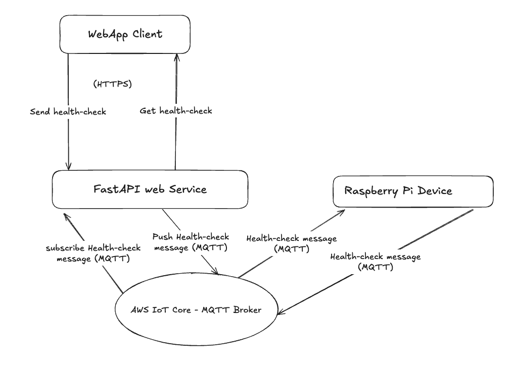

# Raspberry pi - Health Check to get your device health

I have been working with my raspberry pi devices for some time now, and it come the time for ensuring basic reliability of my software. If you are like building devices such as pi, you are probably going to use them for some business application purposes. In my case, I do [video recording](https://www.viktorvasylkovskyi.com/posts/real-time-streaming-with-picamera2-raspberry-pi). However, doing video recording is only half of the job. Often my device is offline, or running out of battery and I have no way to check that. 

So in this notes, we are going to dive into the basic health-check APIs that our app needs when working with devices. We are going to implement classes in python that will allow us to query our device to know whether it is online and operational. So let's dive in. 

## Overview




## Setting up MQTT to communicate with a device

Devices such as raspberry pi may be on the edge in the field, and they often do not have public network address, so the way to communicate with them is by using MQTT. I won't dive into MQTT here, but if you are new to the concept, feel free to go through my MQTT series. They explain how to achieve setup as above where the client can talk to raspberry pi via web service: 

- [Provisioning AWS IoT Core Certificates for Ec-2 instance - MQTT Subscriber with Terraform](https://www.viktorvasylkovskyi.com/posts/provisioning-aws-iot-core-for-ec-2)
- [Provisioning AWS IoT Core Certificates for Raspberry Pi for MQTT Broker with Terraform](https://www.viktorvasylkovskyi.com/posts/provisioning-aws-iot-core-for-raspberry-pi)
- [AWS IoT Core - Implementing Publisher and Subscriber for MQTT in Python](https://www.viktorvasylkovskyi.com/posts/provisioning-aws-iot-core-python-implementation)


## Adding Device Abstraction

Once the communication is achieved, we need to send the actual device data. Let's begin collecting it in raspberry pi using device class: 

We are going to add `psutil` to collect device metrics. In Poetry you can add like follows:

```sh
[tool.poetry.dependencies]
psutil        = "7.0.0"
```

```python
import psutil
import time

class DeviceHealthChecker:
    
    def __init__(self, device_id=None):
        if not hasattr(self, 'device_id'):
            self.device_id = device_id or "raspberry-pi" 
    
    def collect_metrics(self):
        cpu_percent = psutil.cpu_percent(interval=1)
        mem = psutil.virtual_memory()
        disk = psutil.disk_usage('/')
        metrics = {
            'device_id': self.device_id,
            'cpu_percent': cpu_percent,
            'memory_percent': mem.percent,
            'disk_percent': disk.percent,
            'uptime_seconds': time.time() - psutil.boot_time(),
        }
        # Log the collected metrics
        self.logger.info(f"Collected health metrics: {metrics}")
        return metrics
```

And now we can call it as follows: 


```python
from device.device import DeviceHealthChecker

device_health_checker = DeviceHealthChecker()
device_health_checker.collect_metrics()
```

This will print all the basics of the device as follows: 

```sh
2025-07-31 14:08:44 [INFO][Device] Collected health metrics: {'device_id': 'raspberry-pi', 'cpu_percent': 3.0, 'memory_percent': 42.5, 'disk_percent': 5.9, 'uptime_seconds': 1600.7612733840942}
```

## Conclusion

And that is it. Of course, you are going to need to wrap this data into MQTT message request/response and handle the way you communicate it to the client, but this already provides a great information from your device. 