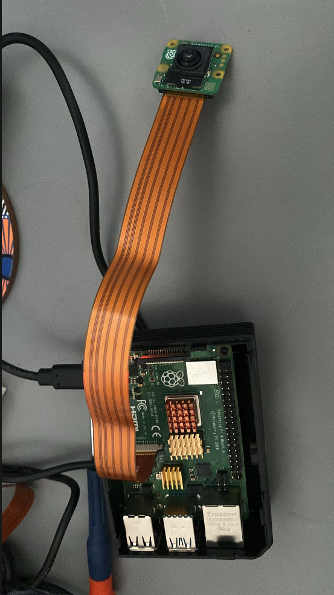

# Live Camera Streaming from Raspberry Pi with Camera Module and Picamera2 - the easy way



In this notes, we’ll walk through setting up a live camera feed view on a Raspberry Pi using the [Picamera2 module](https://github.com/raspberrypi/picamera2/tree/main), specifically designed to work with the [Sony IMX500 AI Camera](https://www.raspberrypi.com/documentation/accessories/ai-camera.html). The goal is to serve a continuous video stream via HTTP and display it directly in a frontend web application using only a native `` tag.

This setup focuses on a proof-of-concept workflow, where simplicity and fast iteration matter more than production-grade video quality or audio support. We'll also note which system packages must be installed directly on the Raspberry Pi and how to enable your virtual environment to access them.

## Github Code

Full code available on https://github.com/viktorvasylkovskyi/rpi-camera. 

## Installing the system-wide packages 

Note there are some packages that can only exist on device, we need to be aware that this code will only run on the device with system packages. 

So far we have `python3-picamera2` that is not available on `PyPI`. So we have installed this package using ansible: 

```sh
apt install -y python3-picamera2
```

Further, enable python virtual environment to access system packages we will run with `python -m venv` with `--system-site-packages`

```sh
.PHONY: new-venv
new-venv:
	@echo "Creating virtual environment with access to system packages"
	@$(PYTHON) -m venv --system-site-packages "$(VENV_PATH)"
```

## Camera streaming with Picamera2

`Picamera2` is the module responsible for streaming of the video content. To stream video, as a simple approach we are using Multipart streaming with MJPEG where we essentially expose the `/video` endpoint serving the `StreamingResponse`, which is essentially a way of using HTTP request/response. The server keeps streaming the response and never closes the connection, effectivelly leaving the HTTP request without ending. We could have used some streaming protocols which are more complex but provide better video quality and audio support, but for the sake of this proof of concept, we are good. 

### Starting the Picamera

The Picamera initializes with the `encoder` and `output`. The camera once started, will generate the frames, which in turn need encoder so that the camera knows in which format to generate frames. The `encoder` is essentially a type of file format that the camera has to convert frame into (in our case JPEG). Further, the `output` works as a threading condition, wherein the condition thread waits for the frame, and once the frame is available, the condition is released via `notify_all`. Then we have a frame, and the frame is of format `image/jpeg`. Finally we set all this to `30 FPS`, a standard for most of the cameras and most situations. All this can be achieved with little code: 

```python

from picamera2 import Picamera2
from picamera2.devices.imx500 import IMX500
from threading import Condition
from picamera2.encoders import JpegEncoder
from picamera2.outputs import Output

class StreamingOutput(Output):
    def __init__(self):
        super().__init__()
        self.frame = None
        self.condition = Condition()

    def outputframe(self, frame, keyframe=True, timestamp=None, packet=None, audio=None):
        with self.condition:
            self.frame = frame
            self.condition.notify_all()

imx500 = IMX500(model)
picam2 = Picamera2()
output = StreamingOutput()
encoder = JpegEncoder()

picam2.configure(picam2.create_video_configuration(main={"size": (640, 480)}))
picam2.start()
picam2.start_encoder(encoder, output)

def generate_frames():
    while True:
        with output.condition:
            output.condition.wait()
            frame = output.frame

        yield (
            b"--frame\r\n"
            b"Content-Type: image/jpeg\r\n\r\n" + frame + b"\r\n"
        )
        time.sleep(1 / 30)  # 30 FPS

@app.get("/video")
def video():
    return StreamingResponse(
        generate_frames(),
        media_type="multipart/x-mixed-replace; boundary=frame"
    )
```

### Receiving Video Stream on Frontend web app 

This type of streaming can be handled using native web `` element. Since we are streaming multiple JPEG files, we will just instantiate the img while our server will be updating the frames binaries on the backend side: 


```typescript
export default async function CameraRpi() {
    const streamUrl = "http://raspberry-4b.local:8080/video";

    return (
        <div style={{ display: "flex", alignItems: "center", justifyContent: "center", height: "50vh" }}>
            
        </div>
    );
}
```

## Final Thoughts

With this simple but effective setup, we now have a live video feed being streamed from a Raspberry Pi using the IMX500 AI Camera and Picamera2, served via an HTTP endpoint and rendered in the frontend using standard web primitives. This is a great foundation for more advanced use cases such as applying real-time AI-based analysis, edge processing, or integrating with robotics.

As always, this is just a starting point. For production use, consider exploring more robust streaming protocols, authentication layers, and hardware-accelerated encoders. But for prototyping AI camera solutions with Raspberry Pi, this setup is fast, minimal, and developer-friendly.


