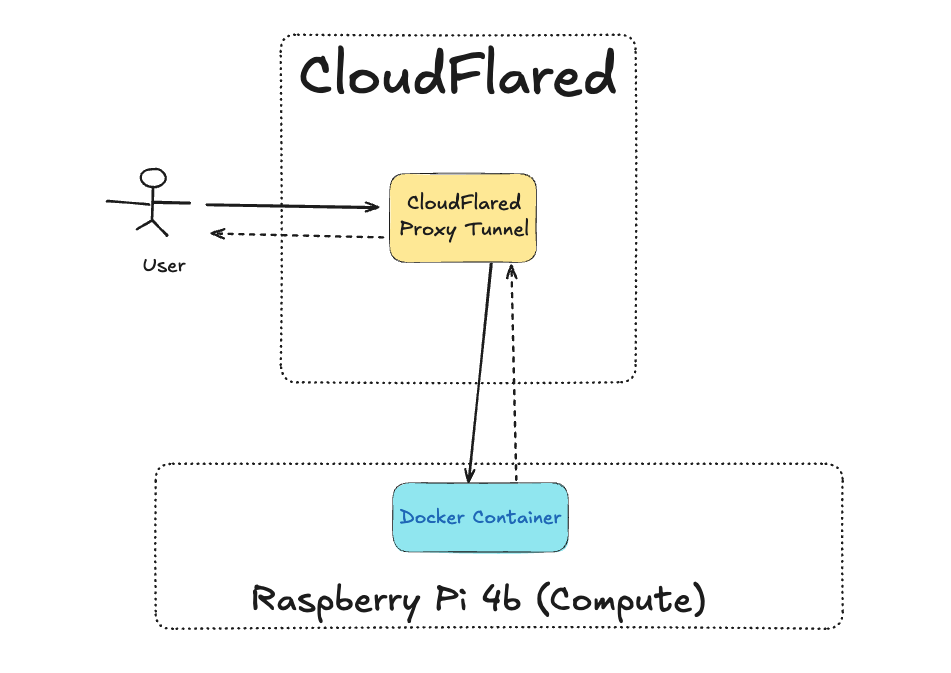
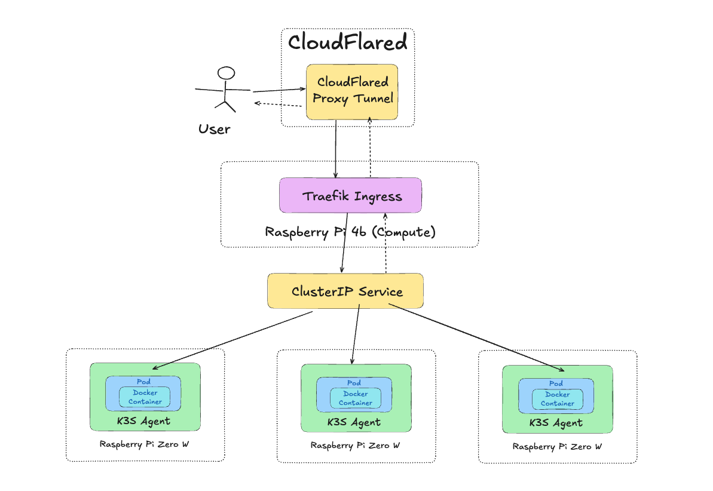
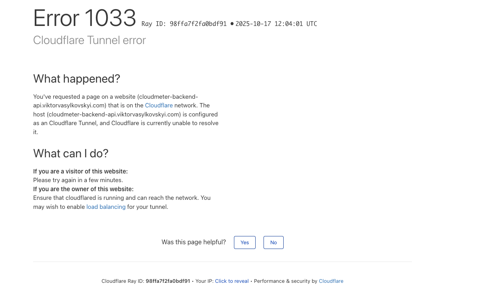
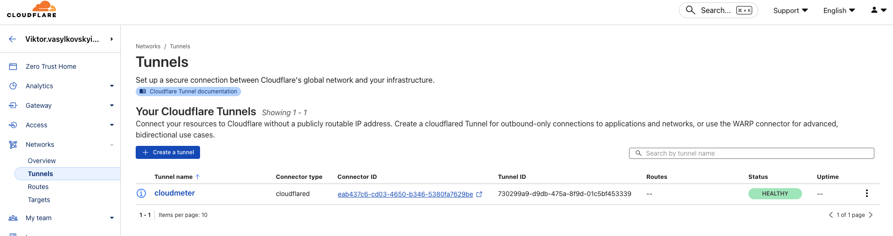
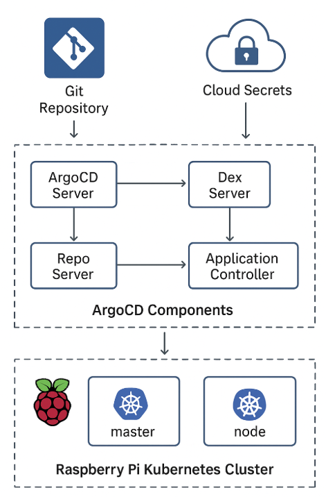
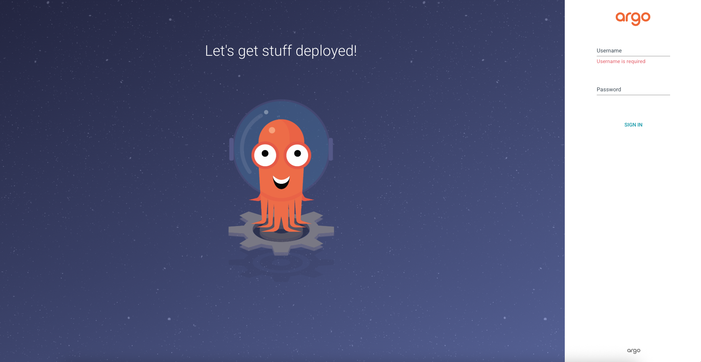
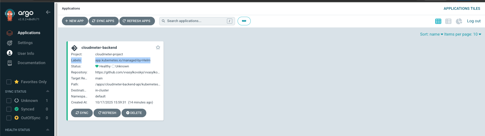
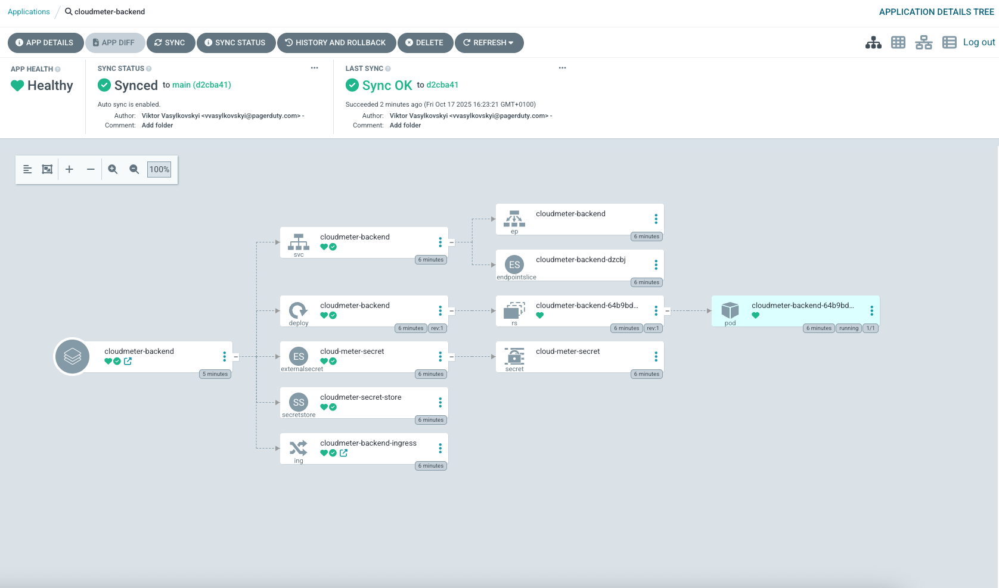

# Raspberry pi - building a k3s cluster

Today I begin the journey into cluster building. I have been playing with my Raspberry pi 4b for some time now, and I am quite comfortable with Linux, Docker and continuous deployment with Github Actions. I recently promoted my Raspberry pi 4b into the host of my web server, and moved away from AWS to save some $ on my personal projects.

The natural next step in this DevOps journey is to start scaling my server. Kubernetes is one of the well known architectures for distributed computing, however, it is known to be too heavy for small raspberry pi devices. So for that reason we will be using a k3s - https://k3s.io/, which is an architecture similar to k8s but better suited for resource constrained raspberry pi.

## Hardware

For this little project, we are going to use the following hardware

- One Raspberry pi 4B to act as k3s Server, and k3s Agent at the same time. Raspberry pi 4B is strong enough for managing the kubernetes control plane, and running compute. My Raspberry pi 4B specs are 64-bit quad-core (4 CPUs ~ 1.5GHz) and 4 GB RAM.
- Four Raspberry pi zero W to act as k3s Agents. They will solely run compute. Their specs are 1 CPU Core and RAM with 512MB.
- All the SD cards for the devices (5 SD cards)
- Optionally, for style, I got a [cluster HAT](https://clusterhat.com/) to group all my devices together [here](https://thepihut.com/products/cluster-hat-v2-0?srsltid=AfmBOoqSU198uOflaekNyBQQ83fBvN0iRJu8nN6O55EoAL6-jFsBQTBg)
- A cluster case to protect the cluster from physical damage - [available here](https://thepihut.com/products/cluster-hat-case)

## OS Installation

We will be running Raspberry pi OS Lite on each of the devices. Refer to [OS Installation Guide](...provide-os-url).

## Adding Required OS configurations

Since we are dealing with Raspberry pi OS Debian, we should set the [`cgroups`](https://docs.k3s.io/installation/requirements?os=pi#cgroups) (Control Groups) which are required for k3s to start the `systemd` service. K3s uses `systemd` to manage its main process `k3s.service`. Essentially `systemd` will start k3s automatically on boot, autorestart on crash and handle logs and other dependencies. K3s needs to manage system resources, and `cgroups` are linux kernel to control the system CPU, Memory and IO a process can use. Using this priviledges, it can assign RAM and CPU to Pods.

We will add the following to `/boot/firmware/cmdline.txt` as per docs of k3s.

```sh
cgroup_memory=1 cgroup_enable=memory
```

Then reboot. Note, the command below is the recommendation of k3s, but it didn't work for me in the sense that the `cgroups` changes above where not persisted. So alternatively you can power off/on your device.

```sh
sudo reboot
```

Verify the `cgroups` by running

```sh
cat /proc/cgroups
```

### Troubleshoot

If it doesn't appear there yet, then run `cat /proc/cmdline` to double check if the boot was updated. There maybe an output of type:

```sh
cgroup_disable=memory ... cgroup_memory=1 cgroup_enable=memory
```

That might be due to the newest Raspberry Pi OS 64-bit (Bookworm/Bookworm+kernel 6.x) does not have the `cgroup_memory` module built as a separate loadable module, and they are built directly into kernel. So updating the `cgroups` in boot file won't make a difference. You can check your kernel version by running

## Installing k3s with install script

To install k3s lets run the installation script

```sh
curl -sfL https://get.k3s.io | sh -
```

We can verify the kube config at `sudo cat /etc/rancher/k3s/k3s.yaml` note it contains the server url:

```yml
apiVersion: v1
clusters:
  - cluster:
    name: default
    server: https://127.0.0.1:6443
```

Also `kubectl` is installed.

### Confirm that the cluster is available

```sh
sudo k3s kubectl get pods --all-namespaces
NAMESPACE     NAME                                      READY   STATUS              RESTARTS   AGE
kube-system   coredns-64fd4b4794-6r6pq                  1/1     Running             0          83s
kube-system   helm-install-traefik-crd-vgtgk            0/1     Completed           0          83s
kube-system   helm-install-traefik-p49d4                0/1     Completed           1          83s
kube-system   local-path-provisioner-774c6665dc-5lxfr   1/1     Running             0          83s
kube-system   metrics-server-7bfffcd44-7p8lm            1/1     Running             0          83s
kube-system   svclb-traefik-6327e32b-wqkjn              0/2     ContainerCreating   0          3s
kube-system   traefik-c98fdf6fb-drrs8                   0/1     ContainerCreating   0          4s

```

### Verify that cluster is healthy

Run the following

```sh
sudo k3s kubectl get nodes -o wide
NAME           STATUS   ROLES                  AGE     VERSION        INTERNAL-IP     EXTERNAL-IP   OS-IMAGE                         KERNEL-VERSION   CONTAINER-RUNTIME
raspberry-4b   Ready    control-plane,master   3m52s   v1.33.5+k3s1   192.168.2.120   <none>        Debian GNU/Linux 12 (bookworm)   6.12.51-v8+      containerd://2.1.4-k3s1

```

The `Status: Ready` means that the cluster is healthy.

## Deploy our app to the cluster

Now it is the exciting part. The Cluster is healthy, so the next step is to deploy the application into pods and configure the deployment and all the other pieces to start operating our cluster at scale. So how to make this cluster useful?

### Moving from Single Server to Cluster

Previously I had a setup where my raspberry pi device runs a single server. This server was exposed to the network via reverse proxy cloudflared. All easy. Below is the image:



Now we are going to move to have our web server replicated across the Raspberry pi zero W, in the image below there are three devices (could be `n` devices), and each of them is running `k3s agent`. While the Raspberry pi 4B is the forth device, and is a master.



### K3S Architecture

#### Pods

In Kubernetes (and so k3s) architecture, the containers run inside the PODs. The Pod itself is an abstraction that represents some resources allocated from the node (physical device). We will talk soon how much resources are allocated to the pod at the configuration stage. The idea of the Pod is to be effemeral. The application can crash by running out of resources or by application error, and the pod becames unhealthy and ought to be replaced by the new one.

#### Ingress

For that reason, exposing Pod directly to the network is inherently unstable. Hence, the main Raspberry pi 4B - the master node in kubernetes, runs the ingress pod, which acts as a gateway of cluster. It receives the external requests and routes traffic to the appropriate pod via service resource.

#### Service

The service is a logical abstraction. It is not a pod and hence it doesn't run on any of the devices. Instead it is a result of kube-proxy and networking layer communication. The job os service resource is to provide a stable endpoint that can route traffic to one or more pods.

### Configuring out K3s Cluster Resources

So now that we understand the architecture, let's start writing kubernetes manifests yaml files to actually turn this idea into practice.

As you may have understood from the architecture above, we are going to define three resources: deployment (pods), service and ingress

#### Deployment

```yaml
# cloudmeter-deployment.yaml

apiVersion: apps/v1
kind: Deployment
metadata:
  name: cloud-meter-backend
  labels:
    app: cloud-meter-backend
spec:
  replicas: 1 # single pod for now; can scale later
  selector:
    matchLabels:
      app: cloud-meter-backend
  template:
    metadata:
      labels:
        app: cloud-meter-backend
    spec:
      containers:
        - name: backend
          image: <YOUR_DOCKER_USERNAME>/vvasylkovskyi-cloud-meter-backend-api:latest
          ports:
            - containerPort: 4000
```

#### Service

```yaml
# cloudmeter-service.yaml

apiVersion: v1
kind: Service
metadata:
  name: cloud-meter-backend
spec:
  selector:
    app: cloud-meter-backend
  ports:
    - protocol: TCP
      port: 80 # external port exposed to ingress
      targetPort: 4000 # container port inside pod
  type: ClusterIP # internal-only, routing will be handled by ingress
```

### Ingress

```yaml
# cloudmeter-ingress.yaml

apiVersion: networking.k8s.io/v1
kind: Ingress
metadata:
  name: cloud-meter-backend-ingress
  annotations:
    kubernetes.io/ingress.class: traefik
spec:
  rules:
    - host: cloudmeter.local # local hostname or your domain
      http:
        paths:
          - path: /
            pathType: Prefix
            backend:
              service:
                name: cloud-meter-backend
                port:
                  number: 80
```

we can apply these manifests manually, by running

```sh
kubectl apply -f cloudmeter-deployment.yaml

# Apply Service
kubectl apply -f cloudmeter-service.yaml

# Apply Ingress
kubectl apply -f cloudmeter-ingress.yaml
```

### Package resources into Helm Chart

Helm chart is a way to package the kubernetes resources together. It allows us to build the manifests and not worry about that the resources have to run on another one.

So let's create a helm chart. Let's begin by creating empty helm chart

#### Create Helm Chart

```sh
helm create cloudmeter
```

This creates the following folder structure

```sh
cloudmeter/
├── Chart.yaml          # metadata about the chart
├── values.yaml         # default configuration values
├── charts/             # subcharts (optional dependencies)
└── templates/          # Kubernetes YAML templates
    ├── deployment.yaml
    ├── service.yaml
    ├── ingress.yaml
```

We can replaces some values to make the code more DRY, and take advantage of templating in helm. For instance, the `values.yaml` can look like that

```yaml
replicaCount: 1
image:
  repository: <YOUR_DOCKER_USERNAME>/<YOUR_DOCKER_IMAGE>
  tag: latest
service:
  type: ClusterIP
  port: 80
ingress:
  enabled: true
  host: cloudmeter.local
  path: /
```

Then your manifests would become

```yaml
# cloudmeter-deployment.yaml
apiVersion: apps/v1
kind: Deployment
metadata:
  name: {{ .Chart.Name }}
spec:
  replicas: {{ .Values.replicaCount }}
  selector:
    matchLabels:
      app: {{ .Chart.Name }}
  template:
    metadata:
      labels:
        app: {{ .Chart.Name }}
    spec:
      containers:
      - name: backend
        image: "{{ .Values.image.repository }}:{{ .Values.image.tag }}"
        ports:
        - containerPort: 4000

# cloudmeter-service.yaml
apiVersion: v1
kind: Service
metadata:
  name: {{ .Chart.Name }}
spec:
  selector:
    app: {{ .Chart.Name }}
  ports:
    - protocol: TCP
      port: {{ .Values.service.port }}
      targetPort: 4000
  type: {{ .Values.service.type }}

# cloudmeter-ingress.yaml
{{- if .Values.ingress.enabled }}
apiVersion: networking.k8s.io/v1
kind: Ingress
metadata:
  name: {{ .Chart.Name }}-ingress
  annotations:
    kubernetes.io/ingress.class: traefik
spec:
  rules:
  - host: {{ .Values.ingress.host }}
    http:
      paths:
      - path: {{ .Values.ingress.path }}
        pathType: Prefix
        backend:
          service:
            name: {{ .Chart.Name }}
            port:
              number: {{ .Values.service.port }}
{{- end }}
```

#### Package Helm Chart

Now, let's package the helm chart

```sh
helm package cloudmeter-backend
```

That will produce a `.tgz` file (e.g., `cloudmeter-backend-0.1.0.tgz`).

#### Copy helm chart to Raspberry pi 4b

The easiest way to deploy it manually is to copy the file into the device via ssh and then install it:

We can easily copy it via ssh into master node:

```sh
scp -o StrictHostKeyChecking=no -o UserKnownHostsFile=/dev/null cloudmeter-backend-0.1.0.tgz user@remote-pi:/home/pi/
```

#### Ensure that kubeconfig is available

By default Helm (like kubectl) looks for `~/.kube/config`. But on k3s, this files lives at `/etc/rancher/k3s/k3s.yaml` and belongs to the root user. So we need to ensure kube config is available in the home before installing helm chart. We can do it via copying the file or via exporting the kubeconfig as an env variable:

```sh
export KUBECONFIG=/etc/rancher/k3s/k3s.yaml
```

The best practice though, is to make a user accessible copy.

```sh
sudo mkdir -p ~/.kube
sudo cp /etc/rancher/k3s/k3s.yaml ~/.kube/config
sudo chown $(id -u):$(id -g) ~/.kube/config

### Make sure this is the config that is picked up
export KUBECONFIG=~/.kube/config
```

#### Ensure that helm is installed on the device

To install helm chart, we are going to run the following ansible script:

```yaml
---
- name: Install Helm on target hosts
  hosts: all
  become: yes
  tasks:
    - name: Ensure curl and tar are installed
      apt:
        name:
          - curl
          - tar
        state: present
        update_cache: yes

    - name: Get Helm latest version number
      ansible.builtin.uri:
        url: https://api.github.com/repos/helm/helm/releases/latest
        return_content: yes
      register: helm_release

    - name: Set Helm version fact
      set_fact:
        helm_version: "{{ helm_release.json.tag_name | regex_replace('^v', '') }}"

    - name: Download Helm binary
      ansible.builtin.get_url:
        url: 'https://get.helm.sh/helm-v{{ helm_version }}-linux-arm64.tar.gz'
        dest: /tmp/helm.tar.gz
        mode: '0644'

    - name: Extract Helm binary
      ansible.builtin.unarchive:
        src: /tmp/helm.tar.gz
        dest: /tmp/
        remote_src: yes

    - name: Move Helm to /usr/local/bin
      ansible.builtin.command:
        cmd: mv /tmp/linux-arm64/helm /usr/local/bin/helm
      args:
        creates: /usr/local/bin/helm

    - name: Ensure Helm binary is executable
      ansible.builtin.file:
        path: /usr/local/bin/helm
        mode: '0755'
        owner: root
        group: root

    - name: Verify Helm installation
      ansible.builtin.command: helm version
      register: helm_version_output
      changed_when: false

    - name: Show Helm version
      ansible.builtin.debug:
        msg: 'Helm installed: {{ helm_version_output.stdout }}'
```

#### Ensure that docker credentials is setup on the device

The device is going to need to download docker image from private registry or private hub. So we need to provide the docker and credentials to the device.

We will write an ansible config to ensure docker is installed and with the right credentials

```yaml
# === Install Docker on Raspberry Pi ===

- name: Install dependencies
  apt:
    name:
      - ca-certificates
      - curl
      - gnupg
      - lsb-release
    state: present
    update_cache: yes

- name: Install Docker using official convenience script
  shell: curl -fsSL https://get.docker.com | sh
  args:
    creates: /usr/bin/docker

- name: Enable Docker service
  systemd:
    name: docker
    enabled: true
    state: started

- name: Add current user to docker group
  user:
    name: "{{ ansible_user | default('pi') }}"
    groups: docker
    append: yes

- name: Ensure Docker config directory exists
  file:
    path: "/home/{{ ansible_user | default('pi') }}/.docker"
    state: directory
    mode: '0700'
    owner: "{{ ansible_user | default('pi') }}"
    group: "{{ ansible_user | default('pi') }}"

- name: Log in to Docker Hub
  become: yes
  become_user: "{{ ansible_user | default('pi') }}"
  environment:
    DOCKER_CONFIG: "/home/{{ ansible_user | default('pi') }}/.docker"
  shell: |
    echo "{{ docker_password }}" | docker login -u "{{ docker_username }}" --password-stdin
  no_log: true # hides your password in output
  when:
    - docker_username is defined
    - docker_password is defined

- name: Show Docker version
  command: docker --version
  register: docker_version

- name: Show Docker Compose version (v2 plugin)
  command: docker compose version
  register: docker_compose_version

- name: Display Docker version
  debug:
    var: docker_version.stdout

- name: Display Docker Compose version
  debug:
    var: docker_compose_version.stdout
```

#### Install Helm Chart

And then install it on the master node. Note, the installation of the kubernetes resources need to happen on the master node. Then the master node will decide where to deploy the pods based on the resources specifications. This is where the kuberentes shines: centralizes orchestration and decentralized execution. So let's install the chart:

```sh
helm install cloudmeter-backend ./cloudmeter-backend-0.1.0.tgz
# or upgrade if already installed
helm upgrade cloudmeter-backend- ./cloudmeter-backend-0.1.0.tgz
```

You should see output like

```sh
NAME: cloudmeter-backend
LAST DEPLOYED: Fri Oct 10 15:00:34 2025
NAMESPACE: default
STATUS: deployed
REVISION: 1
TEST SUITE: None
```

You can verify nodes and pods

```sh
NAME           STATUS   ROLES                  AGE    VERSION
raspberry-4b   Ready    control-plane,master   4h9m   v1.33.5+k3s1
vvasylkovskyi@raspberry-4b:~ $ kubectl get pods
NAME                                  READY   STATUS             RESTARTS   AGE
cloudmeter-backend-5b477fc558-6w5pw   0/1     ContainerCreating   0          49s
```

After a while your status have to become `Running`

```sh
NAME                                  READY   STATUS    RESTARTS   AGE
cloudmeter-backend-6dc5f7855b-7r2hv   1/1     Running   0          86s
```

Yay! Your cluster has one pod and it is running! Inspect the logs:

```sh
kubectl logs cloudmeter-backend-6dc5f7855b-7r2hv
CRITICAL:     cloudmeter_agent.py:24    - Fatal Error: The 'OPENAI_API_KEY' environment variable is missing.
```

Ah ha! My server logs say that the environment variable is missing. Which is expected since we haven't set them. Setting environment variables in docker container was easy, but how to do it in kubernetes cluster?

## Adding Secrets to our Pods

There are many ways to inject secrets into pods. Potentially the most used one is by using [ExternalSecrets](https://external-secrets.io/latest/introduction/getting-started/). The ExternalSecrets take care about fetching the secrets from a remote location (like AWS Secrets Manager), and setting them as kubernetes secret, hence making them available to your pod and container.

In this section we will walk through all that is needed to install the ExternalSecrets.

1. Fetch the secret from AWS Secrets Manager
2. Create a Kubernetes Secret.

### Setting up credentials for AWS

ExternalSecrets will need to access to AWS to retrieve secrets, so we need to provide it with API keys. Let's do it securely via kubernetes secret:

```sh
echo -n 'KEYID' > ./access-key
echo -n 'SECRETKEY' > ./secret-access-key
kubectl create secret generic awssm-secret --from-file=./access-key --from-file=./secret-access-key
```

If you don't have AWS credentials, please refer to this notes first section to see how to get some [Deploying EC2 instance on AWS with Terraform](https://www.viktorvasylkovskyi.com/posts/provisioning-ec2-on-aws-with-terraform).

Note there is also a full notes about how to manage secrets in AWS in [Provision AWS Secret Manager and Store Secrets Securely](https://www.viktorvasylkovskyi.com/posts/provisioning-aws-secret-manager-and-securing-secrets).

### Adding Secrets to the Helm Chart

In our `values.yaml` we will add this

```yaml
secrets:
  aws_path: cloudmeter/app/credentials
  secret_name: cloud-meter-secret
```

The `cloud-meter-secret` is the name of the secret resource that we will create. This secret will need to be references by the container, in the deployment resource:

```yaml
apiVersion: apps/v1
kind: Deployment
# ... Rest of the deployment
      containers:
        - name: backend
          image: "{{ .Values.image.repository }}:{{ .Values.image.tag }}"
          ports:
            - containerPort: 4000
          envFrom:
            - secretRef:
                name: {{ .Values.secrets.secret_name }}
```

Note the `envFrom` means that we want to create environment variables from kubernetes secret `secretRef`.

#### Defining External Secret Resources

So far looks simple, now we need to do the heavy part, which is defining our external secrets resources. Let's begin by adding a new folder: `external-secrets`:

```sh
cloudmeter/
├── Chart.yaml
├── values.yaml
├── charts/
└── templates/
    ├── external-secrets/
        ├── secret-store.yaml
        ├── external-secret.yaml
    ├── deployment.yaml
    ├── service.yaml
    ├── ingress.yaml
```

The external secret operator requires two resources, the `secret-store.yaml` to setup the connection to the secret store, in our case it is AWS Secret Manager. And the `external-secret.yaml` to create kubernetes secret from the secret from secret store. Note both are CRDs (Custom Resource Definition) in kubernetes, meaning that we need to install them before we can use them. Let's do that in the following steps:

```sh
# from https://external-secrets.io/latest/introduction/getting-started/

helm repo add external-secrets https://charts.external-secrets.io

helm install external-secrets \
   external-secrets/external-secrets \
    -n external-secrets \
    --create-namespace
```

The above helm will install the external-secrets CRD. We can verify the installation by checking for the CRDs:

```sh
kubectl get crds | grep external

externalsecrets.external-secrets.io
secretstores.external-secrets.io
```

There will be many more, but these two are the ones we need. Once installed, we can move onto defining the resources:

```yaml
# secret-store.yaml

apiVersion: external-secrets.io/v1
kind: SecretStore
metadata:
  name: cloudmeter-secret-store
spec:
  provider:
    aws:
      service: SecretsManager
      region: us-east-1
      auth:
        secretRef:
          accessKeyIDSecretRef:
            name: awssm-secret
            key: access-key
          secretAccessKeySecretRef:
            name: awssm-secret
            key: secret-access-key
```

So far, this resource only serves as a gateway into aws secrets via the access keys. Now let's define the `external-secret.yaml`

```yaml
# external-secret.yaml

apiVersion: external-secrets.io/v1
kind: ExternalSecret
metadata:
  name: { { .Values.secrets.secret_name } }
spec:
  refreshInterval: 1h
  secretStoreRef:
    name: cloudmeter-secret-store
    kind: SecretStore
  target:
    name: { { .Values.secrets.secret_name } }
    creationPolicy: Owner
  dataFrom:
    - extract:
        key: { { .Values.secrets.aws_path } }
```

Note we are using our variables: `secret_name` and `aws_path` defined above.

The `target` says to create a kubernetes secret called `secret_name`. The value of the secret is going to be the contents of the JSON secret of `aws_path`.

#### Verify secrets

To verify if the secret exists and has the values that we expect, we can run the following:

```sh
kubectl get secret cloud-meter-secret -o jsonpath="{.data}" | jq
```

Note that the above will return the secrets in base64. However, just looking at the keys is already good enough to understand that everything is hooked up well.

#### Testing our app

Now we can create the helm package and move it back to the raspberry pi. Run our script

```sh
### on your host
helm package cloudmeter-backend
scp -o StrictHostKeyChecking=no -o UserKnownHostsFile=/dev/null cloudmeter-backend-0.1.0.tgz user@remote-pi:/home/pi/

### On raspberry pi
helm install cloudmeter-backend ./cloudmeter-backend-0.1.0.tgz
```

#### Check the logs

You can see now, that `kubectl get pod` will show READY status with two items, meaning 2 containers

```sh
kubectl get pods

NAME                                  READY   STATUS    RESTARTS   AGE
cloudmeter-backend-79c5dff8cb-mxhhq   1/1     Running   0          14m
```

So our secrets sidecar seem to have worked well.

## Configuring Budget for the devices

Now it is time to realistically access how much memory/cpu our kubernetes setup can consume given our deices spec. Let's walk one by one:

### Rasberrypi 4B Control Plane

This is a strong device with 4 x 1.5GHz cores and 4GB of RAM. However, running a `k3s` control plane will consume on average 600-900MB of RAM. The OS + Kubelet might consume more 200-300MB. Hence the usable capacity we should consider is 3GB of RAM.

### Raspberry pi Zero Agents

Each has 1 CPU Core (ARMv6 - quite weak). 512MB of RAM. Running OS + kubelet migh consume ~ 120-150MB RAM. So the usable capacity is roughly 350 MB RAM, 0.8 CPU per agent. We have 4 agents, so there are the stats.

| Type      | Count | Usable CPUs   | Usable RAM      |
| --------- | ----- | ------------- | --------------- |
| Pi 4B     | 1     | ~3.5          | ~3 GB           |
| Pi Zero W | 4     | ~3.2          | ~1.4 GB         |
| **Total** | 5     | **~6.7 CPUs** | **~4.4 GB RAM** |

All equivalent to roughly a small single node cloud VM.

### Resource strategy

Given our cluster size, we should:

- Avoid overcommiting memory - since it kills pods
- Allow slight CPU overcommit - because throttling is safer
- Keep small services very lightweight

Example of resources tiers we can use:

| Workload type                                    | CPU Request | CPU Limit | Mem Request | Mem Limit | Notes                                        |
| ------------------------------------------------ | ----------- | --------- | ----------- | --------- | -------------------------------------------- |
| Tiny service / helper                            | 25m         | 100m      | 64Mi        | 128Mi     | Good for sidecars or simple scripts          |
| Small backend (e.g. Node.js, Go API, Python API) | 100m        | 300m      | 128Mi       | 256Mi     | Best baseline for most apps                  |
| Medium backend (database, worker, heavy API)     | 250m        | 500m      | 256Mi       | 512Mi     | Avoid deploying many of these simultaneously |
| Heavy process (builds, ML, etc.)                 | 500m+       | 1         | 512Mi+      | 1Gi       | Run one at a time only                       |

### Applying resources in deployment

In Kubernetes `deployment.yaml` here is how this is defined:

```yaml
resources:
  requests:
    # Allow guaranteed resource allocation to the pod
    cpu: '100m' # <-- millicores (1/1000 of a CPU core)
    memory: '128Mi' # <-- Mebibyte (2^128 ~ 134MB)
  limits:
    # Limit of the pod resources at peak
    # Kubernetes kills pods if they exceed their memory limit (OOMKilled)
    cpu: '300m'
    memory: '256Mi'
```

We can define this as `.values.yaml` and then specify it in `deployment.yaml` as follows:

```yaml
apiVersion: apps/v1
kind: Deployment
metadata:
  name: { { .Chart.Name } }
spec:
  replicas: { { .Values.replicaCount } }
  selector:
    matchLabels:
      app: { { .Chart.Name } }
  template:
    metadata:
      labels:
        app: { { .Chart.Name } }
    spec:
      containers:
        - name: backend
          image: '{{ .Values.image.repository }}:{{ .Values.image.tag }}'
          ports:
            - containerPort: 4000
          envFrom:
            - secretRef:
                name: { { .Values.secrets.secret_name } }
          resources: { { - toYaml .Values.resources | nindent 12 } }
```

### Looking at the resource consumptio in real time

Now that we deployed the above, we can start looking at the resource consumption. We can run the following

```sh
vvasylkovskyi@raspberry-4b:~ $ kubectl top pods
NAME                                  CPU(cores)   MEMORY(bytes)
cloudmeter-backend-64b9bd9665-x5x2g   4m           112Mi


vvasylkovskyi@raspberry-4b:~ $ kubectl top nodes
NAME           CPU(cores)   CPU(%)   MEMORY(bytes)   MEMORY(%)
raspberry-4b   158m         3%       1860Mi          49%
```

The pods is useful to see how much pods are consuming, and then we have the `nodes` to see how much device resources are consumed overall. As we are looking at raspberry pi 4b, we can see that it has consumed only 3% of CPU total. Since 158m is 158/1000 of a CPU, and there are 4 of them so 158/4000 ~3%. Running the kubernetes + OS + our one small pod takes roughly 50% of the memory almost 2GB.

## Disallowing master to become worker

I don't want to get into a situation where my master node starts to run too many apps. I want it to run only the big things, like infrastructure and kubernetes, database, etc. To ensure that thethe worker nodes don't stay idle, we should ensure that the deployment of pod is allocated to the worker nodes, i.e., Raspberry pi Zeros. So how to manage that?

### Assign label to the worker nodes

Once all of the Raspberry pi Zeros are connected to the kubernetes, we can assign them labels, let's say `role=worker` as follows:

```sh
kubectl label node pi-zero-1 role=worker
kubectl label node pi-zero-2 role=worker
kubectl label node pi-zero-3 role=worker
kubectl label node pi-zero-4 role=worker
```

Then, check that it worked:

```sh
kubectl get nodes --show-labels
```

### Adding nodeSelector

Now that we have nodes with special labels, we have to modify the deployment so that it declared only the nodes with label `role=worker` should have the deployment. This is done via `nodeSelector`. Modify our deployment:

```yaml
apiVersion: apps/v1
kind: Deployment
# ...

spec::
  # ...
  template:
    # ...
    spec:
      # ...
      nodeSelector:
      role: worker
# ... rest
```

And that is it! Let's verify this worked. Create new helm chart and install it to the kubernetes.

### Test

Now, I do not have any Raspberry pi Zero yet, as they have not arrived, but I can validate by checking that the pod was not deployed on my main node. After installing my helm chart, I can check the `kubectl get pods`:

```sh
NAME                                  READY   STATUS    RESTARTS   AGE
cloudmeter-backend-85f84b5dd4-fdlpp   0/1     Pending   0          10s
```

As you can see the `STATUS: Pending` means that the Pod was not created, as it does not have a node to go to according to the deployment strategy. All it good then! I will remove it for now, since I want to do some more tests later. Let's move on to the next part in Kubernetes journey.

### Ingress, making our app available to the internet

Now that we know that our Kubernetes cluster is working well, and internally we can see app logs thus proving its operationality, it is time to bridge from kubernetes to the world. We are going to do it as simple and cheap as possible.

#### Setting Cloudflared Reverse Proxy Tunnel

The raspberry pi can be exposed to the internet as a reverse proxy of cloudflared. So we are going to set this proxy. To continue refer to this [Hybdrid Infrastructure - Cloud on AWS on Compute on Premisses with Raspberry pi](blog-content/ready/hybrid-infrastructure-aws-cloud-and-premisses-rpi.md).

After completing this tutorial you should have the following:

- Your DNS working and an app running at https://cloudmeter-backend-api.viktorvasylkovskyi.com
- That URL points to port 80 at Raspberry pi

#### Configuring the Kubernetes Ingress

Now we can access to our raspberry pi on port 80. The last step is to hook our kubernetes app into that port. This is done via ingress. Essentially the idea is:

1. The https://cloudmeter-backend-api.viktorvasylkovskyi.com -> navigates to RaspberryPi:80
2. At port 80, the Traefik Ingress will receive the connection. It will further decide where to forward the request, which should be into our kubernetes service at port 4000
3. The Service Port 4000 proxies request to Deployment at port 4000, which is a port our app is running inside the container.

So let's ensure the above. First step first, For simplicity, I will open https://cloudmeter-backend-api.viktorvasylkovskyi.com and we should see the following screen



This means that the DNS is working, but the tunnel is not receiving the response. So the problem is in our kubernetes.

#### Understanding Ingress

We should have the following `values.yaml`

```yaml
# values.yaml
service:
  type: ClusterIP
  port: 80
ingress:
  enabled: true
  host: cloudmeter-backend-api.viktorvasylkovskyi.com
  path: /
```

The way the Ingress works is, the ingres traefik is running at port 80, and according to the ingress rules, the following should stand:

```yaml
# ingress.yaml
apiVersion: networking.k8s.io/v1
kind: Ingress
metadata:
  name: cloud-meter-ingress
  annotations:
    kubernetes.io/ingress.class: traefik
spec:
  rules:
    - host: cloudmeter-backend-api.viktorvasylkovskyi.com
      http:
        paths:
          - path: /
            pathType: Prefix
            backend:
              service:
                name: cloudmeter
                port:
                  number: 4000
```

The `host` means that only requests with header: `Host: cloudmeter-backend-api.viktorvasylkovskyi.com` will be routed. And the Kubernetes service to route traffic to is:

- `name: cloudmeter` - service object in kbernetes
- `port.number: 4000` - The port on the service to send traffic to

Lets test it from backwards, on raspberry pi do the following:

```sh
curl http://localhost:80/

> 404 page not found
```

The above means, that hitting port 80 will hit `traefik` hence the default 404 message. This is expected since we did not provide the host header. Let's add it.

```sh
curl -H "Host: cloudmeter-backend-api.viktorvasylkovskyi.com" http://localhost:80/

> {"detail":"Not Found"}

curl -H "Host: cloudmeter-backend-api.viktorvasylkovskyi.com" http://localhost:80/v1/health-check/

> {"success":true,"data":{"status":"OK"},"error":null}
```

So adding the host header actually makes the ingress work well, and the traffic flows into the service and pod and hence into our cluster.

#### Connecting Ingress with Cloudflared tunnel

Now the last piece is to ensure that when user opens https://cloudmeter-backend-api.viktorvasylkovskyi.com, this will actually hit the port 80 on the raspberry pi. Since we have established that Traefik and the Service are working correctly. The error is outside of Kubernetes.

Make sure that the tunnel was created and running correctly. Let's run

```sh
cat /home/vvasylkovskyi/.cloudflared/config.yml

tunnel: cloudmeter
credentials-file: /home/vvasylkovskyi/.cloudflared/3ed8db65-90d3-4703-9b58-40f5a68e8e67.json

ingress:
    - hostname: cloudmeter-backend-api.viktorvasylkovskyi.com
      service: http://localhost:80
    - service: http_status:404
```

This shows the tunnel configuration. Let's ensure that this `credentials-file` ID matches the ID of the tunnel:

```sh
cloudflared tunnel list
You can obtain more detailed information for each tunnel with `cloudflared tunnel info <name/uuid>`
ID                                   NAME       CREATED              CONNECTIONS
3ed8db65-90d3-4703-9b58-40f5a68e8e67 cloudmeter 2025-10-17T13:18:19Z
```

The IDs must match.

Check the tunnel process:

```sh
sudo systemctl status cloudflared -l

● cloudflared.service - Cloudflare Tunnel Service
     Loaded: loaded (/etc/systemd/system/cloudflared.service; enabled; preset: enabled)
     Active: active (running) since Fri 2025-10-17 14:56:02 WEST; 16s ago
   Main PID: 60676 (cloudflared)
      Tasks: 9 (limit: 3921)
     Memory: 11.2M
        CPU: 1.066s
     CGroup: /system.slice/cloudflared.service
             └─60676 /usr/local/bin/cloudflared --config /home/vvasylkovskyi/.cloudflared/config.yml tunnel run cloudmeter

Oct 17 14:56:03 raspberry-4b cloudflared[60676]: 2025-10-17T13:56:03Z INF Starting metrics server on 127.0.0.1:20241/metrics
Oct 17 14:56:03 raspberry-4b cloudflared[60676]: 2025-10-17T13:56:03Z INF Tunnel connection curve preferences: [X25519MLKEM768 CurveP2>
Oct 17 14:56:03 raspberry-4b cloudflared[60676]: 2025/10/17 14:56:03 failed to sufficiently increase receive buffer size (was: 208 kiB>
Oct 17 14:56:03 raspberry-4b cloudflared[60676]: 2025-10-17T13:56:03Z INF Registered tunnel connection connIndex=0 connection=f3c38e27>
Oct 17 14:56:03 raspberry-4b cloudflared[60676]: 2025-10-17T13:56:03Z INF Tunnel connection curve preferences: [X25519MLKEM768 CurveP2>
Oct 17 14:56:04 raspberry-4b cloudflared[60676]: 2025-10-17T13:56:04Z INF Registered tunnel connection connIndex=1 connection=da71bd5d>
Oct 17 14:56:04 raspberry-4b cloudflared[60676]: 2025-10-17T13:56:04Z INF Tunnel connection curve preferences: [X25519MLKEM768 CurveP2>
Oct 17 14:56:05 raspberry-4b cloudflared[60676]: 2025-10-17T13:56:05Z INF Registered tunnel connection connIndex=2 connection=a9e0fcd7>
Oct 17 14:56:05 raspberry-4b cloudflared[60676]: 2025-10-17T13:56:05Z INF Tunnel connection curve preferences: [X25519MLKEM768 CurveP2>
Oct 17 14:56:06 raspberry-4b cloudflared[60676]: 2025-10-17T13:56:06Z INF Registered tunnel connection connIndex=3 connection=d29ae52a>
```

Make sure it is healthy on web:



If it healthy then great, otherwise you need to troubleshoot what went wrong.

Last check is to see if the DNS created is proxying to the right tunnel, with the ID that matches the ID of your tunnel credentials. If DNS is not aligned, try to add it manually:

1. Delete DNS from the Cloudflared UI
2. run

```sh
cloudflared tunnel route dns cloudmeter cloudmeter-backend-api.viktorvasylkovskyi.com
```

## Continuous deployment with ArgoCD

So now we have reached the point where our app is running in the kubernetes cluster. The other thing developers really like is to update the app. They write code every day, and push new changes all the time. We can create a new docker image, but having to manually update the image hash, package helm, copy it to node, and install it to kubernetes are alot of steps to do. This can be automated, with ArgoCD.

Argo is a declarative GitOps continuous delivery tools for Kubernetes. Its main goal is

- Track Git repository (Usually containing Helm Charts)
- Continuously ensure that Kubernetes resources match what's in Git
- Automatically deploy updates when Git changes.

ArgoCD is a project that takes kubernetes and provides a declarative way to ensure deployment with git ops. It can hook into the git repository where the helm charts are stored, detect changes in files, and take action - deploy new version of out app into kubernetes cluster. So let's continue building our infrastructure and add ArgoCD.

### ArgoCD Architecture



It has several key components:

#### ArgoCD Server

Handles API, UI, CLI, authentication authorization, exposes RestAPI and talks to Application Controller to sync apps.

#### Repo Server

Reads manifests from Git repositories, parses helm charts, and serves manifests to the application controller.

#### Application Controller

This one is a core reconciler. It continuously checks the desired state in Git and the current state in Kubernetes cluster. Then it can also perform sync operations:

- `kubectl apply` of our manifests,
- Create/update/delete resources to match Git
- Run auto-sync or manual sync per app

### Argo deployment overview

So now that we know what argo does, here is how we are going to stat using it:

1. We are going to deploy the ArgoCD helm chart into our master node (Raspberry pi 4B), since it is quite heavy for the small nodes to run
2. Create ArgoCD Application - a logical concept that defines the git repository where to get manifests from and syncs our app.

### Deploy ArgoCD

Let's install ArgoCD with helm. Let's start building our new helm chart:

```sh
helm create argocd
```

Ensure that your folder looks like this

```sh
argocd/
├── Chart.yaml
├── values.yaml
└── charts/
└── templates/
```

The only two files that we need to define to create an argocd is `Chart.yaml` and `values.yaml`

```yaml
# Chart.yaml

apiVersion: v2
name: argocd
description: A Helm chart for ArgoCD on Raspberry Pi
version: 0.1.0

dependencies:
  - name: argo-cd
    version: '5.45.0' # use latest compatible
    repository: 'https://argoproj.github.io/argo-helm'
```

Note, above we are declaring that this helm chart depends on the https://argoproj.github.io/argo-helm. As a result, most of manifests can imported from a dependency.

Now let's write the `values.yaml`

```yaml
# values.yaml
argo-cd:
  server:
    resources:
      requests:
        cpu: '100m'
        memory: '256Mi'
      limits:
        cpu: '250m'
        memory: '512Mi'
    ingress:
      enabled: true
      ingressClassName: traefik
      hosts:
        - argocd.local
      annotations:
        kubernetes.io/ingress.class: traefik
      tls: []
  repoServer:
    resources:
      requests:
        cpu: '50m'
        memory: '128Mi'
      limits:
        cpu: '150m'
        memory: '256Mi'
  applicationController:
    resources:
      requests:
        cpu: '50m'
        memory: '128Mi'
      limits:
        cpu: '200m'
        memory: '256Mi'
  dex:
    enabled: false
```

Matching the architecture above, in the values.yaml we define how much resources the main argoCD servers should have. Note the `argo-cd` on top is the key from the dependency. We can now package the helm chart and apply this helm in our cluster.

```sh
helm dependency update argocd/
```

This will automatically download the `argo-cd` helm chart into `charts/`. Now we can package our full helm

```sh
helm package argocd
```

As we already learned, this produces a package. Now we can copy it to our raspberry pi and install the chart there.

```sh
helm install argocd argocd-0.1.0.tgz
NAME: argocd
LAST DEPLOYED: Fri Oct 17 10:57:44 2025
NAMESPACE: default
STATUS: deployed
REVISION: 1
TEST SUITE: None
```

Let's check the pods:

```sh
kubectl get pods -n argocd # important to pass the namespace

NAME                                                READY   STATUS    RESTARTS   AGE
argocd-application-controller-0                     1/1     Running   0          110s
argocd-applicationset-controller-86c5cbc5c6-z98hx   1/1     Running   0          110s
argocd-notifications-controller-868778d764-m2p8n    1/1     Running   0          110s
argocd-redis-596d86655b-bwx4g                       1/1     Running   0          110s
argocd-repo-server-568f86db98-hwvfl                 1/1     Running   0          110s
argocd-server-6899f4fccf-ssdzh                      1/1     Running   0          110s
```

That is alot of argocd pods! And they seem to be running.

### Accessing ArgoCD UI

Our ArgoCD is running in the Raspberry pi so to access it from our computer, we have some networking to do, and expose the argocd via ingress. Let's get started:

### Adding ArgoCD Ingress Service

We can easily extend our `values.yaml` of the chart by adding the Ingress:

```yaml
argo-cd:
  server:
    ### This is new ###
    extraArgs:
      - --insecure
    ingress:
      enabled: true
      ingressClassName: traefik
      hosts:
        - argocd.viktorvasylkovskyi.com
      tls: []
    ### End New ###
    resources:
      requests:
        cpu: '100m'
        memory: '256Mi'
      limits:
        cpu: '250m'
        memory: '512Mi'
```

Let's apply that helm and redeploy. We can verify that the deployment was successful

```sh
vvasylkovskyi@raspberry-4b:~ $ kubectl get ingress -n argocd
NAME            CLASS     HOSTS          ADDRESS         PORTS   AGE
argocd-server   traefik   argocd.local   192.168.2.120   80      38s
```

### Adding Cloudflared DNS for ArgoCD

We have learned about how to proxy requests from Cloudflared into our Raspberry pi via tunnel and DNS. This time we only have to add a new DNS to our Cloudflared:

```sh
cloudflared tunnel route dns cloudmeter argocd.viktorvasylkovskyi.com
```

Now we can navigate to https://argocd.viktorvasylkovskyi.com/

You should see the login screen



### Login into argoCD

The default credentials of argoCD are

- username: `admin`
- password: can be extracted from inital admin secret

we can get the credentials by running the following

```sh
NAMESPACE=${1:-argocd} && \
echo "Username: admin" && \
echo -n "Password: " && \
kubectl -n $NAMESPACE get secret argocd-initial-admin-secret \
  -o jsonpath="{.data.password}" | base64 --decode && echo
```

This should be good for you to login into ArgoCD!

### Adding Project and Application to ArgoCD

For now our ArgoCD server is empty, there is no project. So we are going to write a manifest that will add a project to our ArgoCD so that it can do its continuous deployment thing.

The project can be added by adding new manifest file into our argocd helm:

```yaml
# argocd-project.yaml
apiVersion: argoproj.io/v1alpha1
kind: AppProject
metadata:
  name: cloudmeter-project
  namespace: argocd
spec:
  description: 'Project for deploying CloudMeter backend'
  destinations:
    - namespace: default
      server: https://kubernetes.default.svc
  sourceRepos:
    - 'https://github.com/YOUR_USERNAME/YOUR_HELM_REPO.git'
  clusterResourceWhitelist:
    - group: '*'
      kind: '*'
```

Now, let's also add an application:

```yaml
# argocd-app.yaml
apiVersion: argoproj.io/v1alpha1
kind: Application
metadata:
  name: cloudmeter-backend
  namespace: argocd
spec:
  project: cloudmeter-project
  source:
    repoURL: 'https://github.com/vvasylkovskyi/vvasylkovskyi-infra.git'
    targetRevision: main # or the branch you want to track
    path: apps/cloudmeter-backend-api/kubernetes/cloudmeter-backend # folder where your Helm chart lives
    helm:
      valueFiles:
        - values.yaml
  destination:
    server: 'https://kubernetes.default.svc'
    namespace: default
  syncPolicy:
    automated:
      prune: true # automatically deletes resources no longer in Git
      selfHeal: true # automatically correct drift
    syncOptions:
      - CreateNamespace=true
```

Note, add both to the `/templates` of the `argocd` helm chart. Apply the helm chart on Pi, and check if the project exists

```sh
kubectl get appprojects -n argocd
NAME                 AGE
cloudmeter-project   13m
default              4h49m

kubectl get application -n argocd
NAME                 SYNC STATUS   HEALTH STATUS
cloudmeter-backend   Synced        Healthy
```

Note the health status and sync status are yet unknown. That is ok for now. Let's go look into our ArgoCD UI:



We can see the project is there, and when you open you should see the following UI

<!-- 18lFyjZY5GSCTudGT8APcGuUOG2gkD6S -->



Finally, make a commit to your helm chart repo, change the image sha, and see sync working. Congratulations! You have ArgoCD !!!
