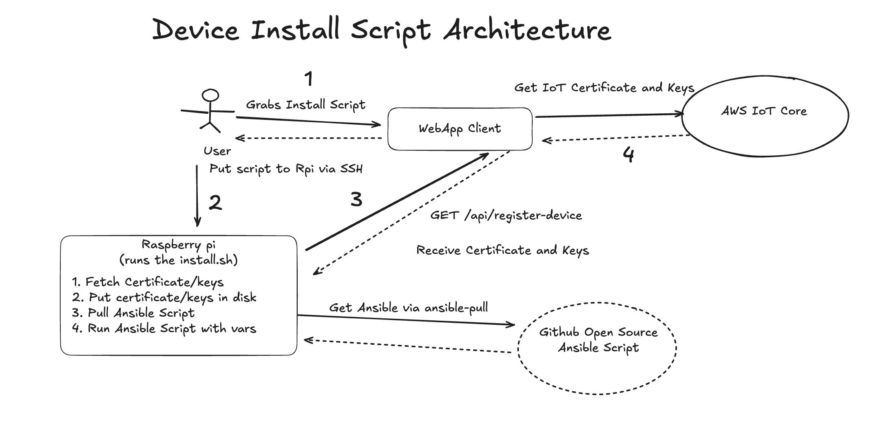

# Registering IoT Device to AWS Cloud with One Install script

Edge devices such as raspberry pi (e.g. a camera device) commonly require cloud connection. Having device available on the cloud is what makes it become an "Internet" thing. While this is common, there are often alot of steps required to move device to the cloud. I have had similar problem, where I had one of my devices already in the cloud, but then to enable the next device, alot of manual scripts had to be run, ranging from terraform to provision cloud certificates, to ansible configurations to setup the device itself. It is fine for me to run those scripts, although time consuming and error prone, but when sharing new devices with friends things become slower.

Motivated by the above manual process, I decided to create an install script that would perform the following:

- Register new device in my database
- Provisiong AWS IoT Core Certificates and install them on the device to enable MQTT communication
- Install all the required software on the device using `ansible-pull`. In my case those are python software, custom raspberry pi software for battery and camera functionality
- Install my app on the device to make it operational for my hobby (business) needs.

In this note we will describe step-by-step on how to build such an install script.

## Architecture



From Architecture above, we assume that the user can grab install script from a web app and access to the device via ssh to run the script. Since then, script will run the following:

1. Contact the Web App client and ask it to register device
2. WebApp will get new certificates and keys for AWS IoT Core. This, once set onto the raspberry pi will enable the device to be available via MQTT
3. The device receives the certificate and keys and installs them locally
4. Finally, device retrieves ansible configuration from github and runs the script

In the end, the device is expected to be fully operational and accessible via our APIs. Note, we assume that web client in this process will register the device ID and this way can talk to it using MQTT. Moreover, the WebApp server is also an "IOT thing" within the same MQTT Broker hence it can communicate effectively with the device.

## Shell Script

Now, lets write down the shell script that will do just that:

```sh
# #!/bin/bash
# set -euo pipefail

API_URL="https://your-web-app-url/api/register-iot-device"

response=$(curl -s -X GET "$API_URL" \
    -H "Content-Type: application/json")

# # Parse JSON using jq
DEVICE_ID=$(echo "$response" | jq -r '.data.deviceId')
CERTS_DIR="$HOME/aws_iot_ssl_credentials_$DEVICE_ID"
mkdir -p "$CERTS_DIR"

# Decode Base64 JSON to temporary file
echo "$response" | jq -r '.data' | base64 --decode > /tmp/creds.json

# Extract PEMs/keys
jq -r '.certificatePem' /tmp/creds.json > "$CERTS_DIR/device.pem.crt"
jq -r '.privateKey' /tmp/creds.json > "$CERTS_DIR/private.pem.key"

echo "Downloading AmazonRootCA1.pem..."
curl -sS https://www.amazontrust.com/repository/AmazonRootCA1.pem -o "$CERTS_DIR/AmazonRootCA1.pem"

chmod 600 "$CERTS_DIR/private.pem.key"
chmod 644 "$CERTS_DIR/"*.pem*

AWS_IOT_CORE_ENDPOINT=$(echo "$response" | jq -r '.data.endpoint')
# echo "Certificates stored in $CERTS_DIR"

if ! command -v ansible-pull &>/dev/null; then
    sudo apt update
    sudo apt install -y ansible git
fi

ansible-pull -U https://github.com/my-ansible-scripts.git -i localhost install-all.yml \
--extra-vars "certs_dir=$CERTS_DIR aws_iot_core_endpoint=$AWS_IOT_CORE_ENDPOINT device_id=$DEVICE_ID"
```

The script is pretty straigtforward and achieves exactly what is described in the architecture diagram. Note, we assume that the API will talk with AWS and provision the certificate and keys. We could use `terraform` to provision IoT thing, but using python felt better suited for the `install.sh` script. An example of a script that does just that can be written in python like follows:

```python
import json
import os
import base64
import boto3

iot = boto3.client("iot")
iot.create_thing(thingName=device_id) # Generated perhaps with uuid

# 2. Create Policy (idempotent - check if exists)
policy_name = f"{device_id}-policy"
policy_document = {
    "Version": "2012-10-17",
    "Statement": [
        {
            "Effect": "Allow",
            "Action": [
                "iot:Connect",
                "iot:Publish",
                "iot:Subscribe",
                "iot:Receive",
            ],
            "Resource": "*",
        }
    ],
}

iot.create_policy(policyName=policy_name, policyDocument=json.dumps(policy_document))
# 3. Create certificate + keys
cert = iot.create_keys_and_certificate(setAsActive=True)
# 4. Attach policy to certificate
iot.attach_policy(policyName=policy_name, target=cert["certificateArn"])
# 5. Attach certificate to Thing
iot.attach_thing_principal(thingName=device_id, principal=cert["certificateArn"])
# 6. Get IoT endpoint (data ATS)
endpoint = iot.describe_endpoint(endpointType="iot:Data-ATS")["endpointAddress"]

return {
    "deviceId": device_id,
    "certificatePem": base64.b64encode(
        cert["certificatePem"].encode("utf-8")
    ).decode("utf-8"),
    "privateKey": base64.b64encode(
        cert["keyPair"]["PrivateKey"].encode("utf-8")
    ).decode("utf-8"),
    "certificateArn": cert["certificateArn"],
    "endpoint": endpoint,
    "policyName": policy_name,
}
```

Note in the script we provision a thing, create certificate/keys pair, attach cloud policy about what this device can do - in this case it can publish and subscribe to AWS IoT Core MQTT broker events. Finally we have the endpoint of this dedicated broker, and return everything back to the device in the API.

## Security

Note the above example is lacking API Keys that you may want to ensure the device has before allowing it to generate the cloud resources. To secure your HTTP API endpoint a good option is to setup a Json Web Token (JWT) and Api Keys. If this is something you need to do I recommend reading my notes:

- [Full-stack JWT Authentication with Clerk, NextJS, FastAPI and Terraform](https://www.viktorvasylkovskyi.com/posts/securing-your-app-with-auth)
- [API keys - Generating Long-lived tokens for backend access](https://www.viktorvasylkovskyi.com/posts/securing-your-app-with-auth-api-keys)

Additionally, you may want to store in the database the registry to ensure that same device doesn't get registered multiple times.

## Conclusion

With the approach above you can have a secure, production-grade way to enable users to install your software on their raspberry pi devices. Let me know if you are running into any issues while setting this up in the comments below. Happy coding!
