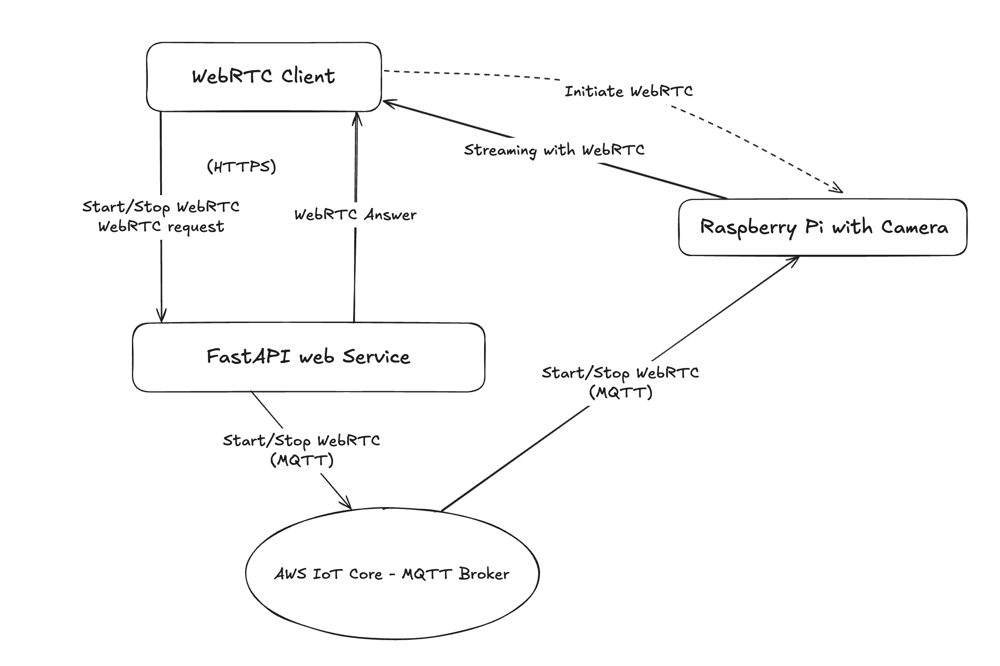

# WebRTC - Zero latency streaming with Raspberry pi streaming with Picamera2

My goal was simple: create a live camera stream from a Raspberry Pi that I could use for security or robotics projects — something actually real-time. I had previously tried a solution that used HLS streaming: [Live Camera Streaming from Raspberry Pi with Camera Module and Picamera2 - the easy way](https://www.viktorvasylkovskyi.com/posts/raspberry-pi-live-camera-streaming). But while it worked, the 5–10 seconds of delay made it a poor fit for anything requiring responsiveness.

In these notes, we’ll take things a step further by building a low-latency live camera feed using WebRTC — the same tech that powers Zoom, Google Meet, and other real-time video tools. The result is a Raspberry Pi camera that streams directly to your browser with near-zero latency. I'll walk you through everything: from how [WebRTC](https://developer.mozilla.org/en-US/docs/Web/API/WebRTC_API) works under the hood, to configuring the Pi camera, to setting up the client. Full working code is included, so you can follow along or adapt it to your own use case.

## Github Code

Full code available on https://github.com/viktorvasylkovskyi/rpi-camera. 

## Real Time Streaming with WebRTC



The architecture required is similar to what we have done before in [Live Camera Streaming from Raspberry Pi with Camera Module and Picamera2 - the easy way](https://www.viktorvasylkovskyi.com/posts/raspberry-pi-live-camera-streaming) except for HLS which is replaced by WebRTC. What we need it: 

- A Web Client, Web Server, Raspberry Pi, and MQTT Broker
- A Web Client initiates WebRTC protocol and propagates it down to the Web Server
- A Web server proxies the WebRTC `sdp` message to the Raspberry Pi through MQTT Broker messages
- Raspberry pi generates `sdp` answer for the client and attaches media handler to stream frames on demand
- Finally, web server returns the answer to the client and the client can initiate the communication from the browser using `video` element. 

## How WebRTC Works (A Quick Theory Primer)

Feel free to skip this section if you just want the working code. But if you're curious how WebRTC actually pulls off low-latency magic, here’s a quick overview. We build-up on [the excellent explanation about WebRTC by Metered](https://www.metered.ca/tools/openrelay/). 

WebRTC (Web Real-Time Communication) enables direct peer-to-peer communication between two devices, usually over UDP — a transport protocol known for its speed. The beauty of WebRTC lies in its ability to bypass traditional server relays and establish direct connections, significantly reducing latency.

However, direct connections aren't always easy. Devices don’t usually know their own public IPs, and firewalls or NAT (Network Address Translation) often block inbound connections. WebRTC tackles these issues using a few smart components:

 - Discovering Peer IPs: The Role of STUN Servers
 - Bypassing Firewalls: The Role of TURN Servers

### Discovering Peer IPs: The Role of STUN Servers

Most devices are hidden behind routers and don’t know their public IP address. That’s where STUN (Session Traversal Utilities for NAT) servers come in. STUN allows each device to discover its public-facing IP by pinging a known server on the internet and asking, “Hey, what’s my IP?”

Once both peers have this info, they can try to connect directly — but this only works if their firewalls and NAT configurations allow it. Which brings us to...

### Bypassing corporate or home router firewalls - TURN Servers

In many networks (especially corporate or home setups), firewalls prevent unsolicited traffic from reaching internal devices. Even if both peers know each other’s IP addresses, the connection might still get blocked.

Enter TURN (Traversal Using Relays around NAT) servers. TURN acts as a fallback: when direct peer-to-peer connections fail, all data is relayed through a centralized server. This isn't as fast as a direct connection, but it ensures reliability when NAT traversal fails.

TL;DR: STUN helps discover your public IP. TURN relays your traffic when direct connection isn’t possible. WebRTC uses both as connection “candidates” and negotiates the best option through a process called ICE (Interactive Connectivity Establishment).

### Exchanging SDP: How WebRTC Peers Communicate

Before any data flows, peers must agree on how they’ll communicate — what codecs to use, what candidates they support, etc. This is done using SDP (Session Description Protocol) messages.

Your browser (the client) generates an SDP offer, which is sent to the Raspberry Pi (the peer). The Pi responds with an answer, completing the negotiation. Once that handshake is complete, media streaming begins — efficiently and (if all goes well) peer-to-peer.

For a deep dive, I recommend [Metered’s WebRTC guide](https://www.metered.ca/tools/openrelay/), which I’ve heavily leaned on throughout this project.

### Exchanging WebRTC sdp between client browser and raspberry pi

For simplicity, I will omit the messages and API exchange between HTTP and MQTT. If you are interested in details on how to do it, you can read about it here [ive Streaming - Raspberry pi streaming with Picamera2](https://www.viktorvasylkovskyi.com/posts/live-streaming-with-picamera2-raspberry-pi).


## Preparing Raspberry pi with camera streaming

So here we are going to implement WebRTC on raspberry pi:  

```python
from picamera2 import Picamera2
self.camera = Picamera2()
configuration = self.camera.create_video_configuration(
    main={"size": (640, 480)}
)
self.camera.configure(configuration)

class WebRTCOffer(BaseModel):
    type: str
    sdp: str

class PicameraVideoTrack(VideoStreamTrack):
    def __init__(self, picam):
        super().__init__()
        self.picam = picam
        self.start_time = time.time()
    
    async def recv(self):
        await asyncio.sleep(1 / 30)  # Simulate 30fps pacing
        frame = self.picam.capture_array()
        video_frame = av.VideoFrame.from_ndarray(frame, format="rgb24")
        video_frame.pts = int((time.time() - self.start_time) * 90000)  # 90kHz clock for video
        video_frame.time_base = fractions.Fraction(1, 90000)
        return video_frame

class WebRTCStreamer:
    def __init__(self):
        self.pc = None

    async def start(self, offer_sdp, video_track):
        self.pc = RTCPeerConnection()
        self.pc.addTrack(video_track)
        await self.pc.setRemoteDescription(RTCSessionDescription(sdp=offer_sdp, type="offer"))
        answer = await self.pc.createAnswer()
        await self.pc.setLocalDescription(answer)
        return self.pc.localDescription.sdp

    async def stop(self):
        if self.pc:
            await self.pc.close()
            self.pc = None

async def _start_webrtc_stream(self, webrtc_offer: WebRTCOffer):
    encoder = H264Encoder(bitrate=2_000_000)
    self.camera.start_recording(encoder, self.output)
    self.webrtc_streamer = WebRTCStreamer()
    picamera_video_track = PicameraVideoTrack(self.camera)
    answer_sdp = await self.webrtc_streamer.start(webrtc_offer.sdp, picamera_video_track)
    return answer_sdp
```

Let's talk about code step by step:

1. Once the WebRTC offer arives to the raspberry pi, we start the `Picamera2` and configure it to start streaming. It will be streaming a `VideoStreamTrack` to the web client using our custom implementation `PicameraVideoTrack`. Essentially this part of the code explains how to stream frames. Note that these frames streaming is initiated by the web browser client, contrary to the HLS, where the camera is the one who starts streaming. 
2. The WebRTC offer needs to be answered by raspberry pi which is done in `WebRTCStreamer`. In `WebRTCStreamer.start` the answer to the client is generated, and the WebRTC attaches the `picamera_video_track` which basically tells how to stream, defined in the step 1.
3. The `answer_sdp` is sent back to the client using HTTP + MQTT. 

**Note:** In `PicameraVideoTrack` sometimes `recv()` is very fast and doesn't simulate framerate with `sleep()`, sometimes the media track ends up buffering or stalling. That is why we are adding `asyncio.sleep()` to simulate 30 fps. This is common in camera-fed streams when no proper timestamp/framerate pacing is enforced. Without this my stream didn't work.


## WebRTC Client Implementation

Client-side implementation is best explained in official [WebRTC](https://developer.mozilla.org/en-US/docs/Web/API/WebRTC_API) docs. I will share here my implementation of it: 

```typescript
    const pcRef = useRef<RTCPeerConnection | null>(null);

    const sendOffer = async (offer: RTCSessionDescriptionInit) => {
        // You should implement this function to send offer SDP to Pi via MQTT or your signaling channel
        setState(s => ({ ...s, isStreaming: true, isLoading: false }));
        const response = await fetch('/api/start-webrtc', {
            method: 'POST',
            headers: {
                'Content-Type': 'application/json',
            },
            body: JSON.stringify(offer),
        });

        const data: WebRtcAnswer = await response.json();
        handleAnswer({ sdp: data.webrtc_answer, type: "answer" } as RTCSessionDescriptionInit);
    };

    const handleAnswer = async (answer: RTCSessionDescriptionInit) => {
        if (pcRef.current) {
            await pcRef.current.setRemoteDescription(new RTCSessionDescription(answer));
        }
    };

    const startWebRTC = async () => {
        setState({ isLoading: true, isStreaming: false });

        const pc = new RTCPeerConnection({
            iceServers: [{ urls: 'stun:stun.l.google.com:19302' }],
        });

        pcRef.current = pc;

        pc.onicecandidate = (event) => {
            if (event.candidate) {
                // Optionally send ICE candidates to Pi if needed via MQTT
                console.log('>>> New ICE candidate:', event.candidate.candidate);
            }
        };

        pc.ontrack = (event) => {
            const [stream] = event.streams;
            if (videoRef.current && videoRef.current.srcObject !== stream) {
                videoRef.current.srcObject = stream;
                // If you want to play the video automatically, you can uncomment the line below
                // Required for mobile browsers (e.g., iOS) to play video automatically
                navigator.mediaDevices.getUserMedia({ video: true, audio: true })
                videoRef.current.play();
            }
        };

        // Add transceiver for video, receive-only mode
        pc.addTransceiver('video', { direction: 'recvonly' });

        // Create SDP offer
        const offer = await pc.createOffer();
        await pc.setLocalDescription(offer);

        // Send offer SDP to Pi
        await sendOffer(pc.localDescription!);
    };

```

Let's break it down: 

 1. There is alot of boilerplate code for `sendOffer` which is fully generated by the client. This offer is send to the web server that will make it reach the raspberry pi camera somehow, in my case it is MQTT messaging. 
 2. The HTTP awaits for the raspberry pi to return the `sdp` answer in `handleAnswer`. The sdp offer/answer look like something like this - lot of gibrish.

```sh
v=0\\r\\no=- 3962438243 3962438243 IN IP4 0.0.0.0\\r\\ns=-\\r\\nt=0 0\\r\\na=group:BUNDLE 0\\r\\na=msid-semantic:WMS *\\r\\nm=video 32848 UDP/TLS/RTP/SAVPF 96 97 103 104 109 114\\r\\nc=IN IP4 192.168.2.121\\r\\na=sendonly\\r\\na=extmap:2 http://www.webrtc.org/experiments/rtp-hdrext/abs-send-time\\r\\na=extmap:9 urn:ietf:params:rtp-hdrext:sdes:mid\\r\\na=mid:0\\r\\na=msid:27deda98-ad08-41b6-b3c2-4ccccf648da2 54da9b29-3f67-4439-9e7f-c28a124cdd81\\r\\na=rtcp:9 IN IP4 0.0.0.0\\r\\na=rtcp-mux\\r\\na=ssrc-group:FID 2466844985 2984972159\\r\\na=ssrc:2466844985 cname:567307e8-257f-4b6f-a404-063bb5ce487c\\r\\na=ssrc:2984972159 cname:567307e8-257f-4b6f-a404-063bb5ce487c\\r\\na=rtpmap:96 VP8/90000\\r\\na=rtcp-fb:96 nack\\r\\na=rtcp-fb:96 nack pli\\r\\na=rtcp-fb:96 goog-remb\\r\\na=rtpmap:97 rtx/90000\\r\\na=fmtp:97 apt=96\\r\\na=rtpmap:103 H264/90000\\r\\na=rtcp-fb:103 nack\\r\\na=rtcp-fb:103 nack pli\\r\\na=rtcp-fb:103 goog-remb\\r\\na=fmtp:103 level-asymmetry-allowed=1;packetization-mode=1;profile-level-id=42001f\\r\\na=rtpmap:104 rtx/90000\\r\\na=fmtp:104 apt=103\\r\\na=rtpmap:109 H264/90000\\r\\na=rtcp-fb:109 nack\\r\\na=rtcp-fb:109 nack pli\\r\\na=rtcp-fb:109 goog-remb\\r\\na=fmtp:109 level-asymmetry-allowed=1;packetization-mode=1;profile-level-id=42e01f\\r\\na=rtpmap:114 rtx/90000\\r\\na=fmtp:114 apt=109\\r\\na=candidate:274a8690a1ab621e92bd97a1abc6ea21 1 udp 2130706431 192.168.2.121 32848 typ host\\r\\na=candidate:73b6fc9eff30d771a6039ebe60cbe14a 1 udp 2130706431 fdfa:ce41:7423::94a 54723 typ host\\r\\na=candidate:d937fbb57a3d03a657a35eb3120f1452 1 udp 2130706431 fdfa:ce41:7423:0:fbf0:7642:d1d5:2138 43698 typ host\\r\\na=candidate:4823626fc8c989e49e96fbce9d5fd53f 1 udp 1694498815 79.168.107.25 32848 typ srflx raddr 192.168.2.121 rport 32848\\r\\na=end-of-candidates\\r\\na=ice-ufrag:NnKF\\r\\na=ice-pwd:cwZi4RhGefib6mEdLFpRZA\\r\\na=fingerprint:sha-256 FB:36:14:92:CB:66:41:D5:E4:24:27:D8:0B:E1:6C:C0:56:41:3A:E3:A9:2C:5F:9C:B2:5A:2C:99:58:F0:0D:66\\r\\na=fingerprint:sha-384 DD:3F:13:1A:06:F1:7B:16:7D:12:CC:4C:86:AF:62:BC:D1:28:11:0D:CC:91:57:E7:ED:61:50:85:10:9B:77:DA:FC:54:F4:B1:47:13:54:95:36:C0:0E:8D:F0:49:F9:09\\r\\na=fingerprint:sha-512 63:11:89:28:26:16:D7:FC:9E:01:74:27:8C:62:34:9E:07:1F:D5:37:15:94:FF:7D:19:DA:0A:B4:24:64:8C:4F:21:69:17:68:EA:D5:C8:F2:82:6C:4F:E5:BB:8F:38:6A:39:13:29:E2:DA:7B:92:78:FA:CC:CC:9B:57:B0:24:E7\\r\\na=setup:active\\r\\n
```

3. Once the answer is set to the browser, browser knows where is raspberry pi, and starts to request stream of it. This is where WebRTC provides a stream using 

```javascript
 pc.ontrack = (event) => {
            const [stream] = event.streams;
            if (videoRef.current && videoRef.current.srcObject !== stream) {
                videoRef.current.srcObject = stream;
                videoRef.current.play();
            }
        };
```

Remember the `PicameraVideoTrack` ? This is the `event.streams[0]` from the code above. We will add this stream onto video element `srcObject`. 

So far it will all play for desktop browsers

### Adding TURN Server

The above works just fine as long as the devices are on the same network. If they are not, then we need to provide the TURN servers. I have created an account on [Open Relay](https://www.metered.ca/tools/openrelay/) because I found them on the web and they offer free TURN servers up to 20GB. The only difference with the TURN server is that we need to update a WebRTC ICE servers like follows: 


```javascript
    const startWebRTC = async () => {
        const response = await fetch("/api/turn-credentials");
        const turnCredentials = await response.json();
        const pc = new RTCPeerConnection({
            iceServers: turnCredentials,
        });
        ...
```

Note our TURN credentials are a list of servers that can be provided on demand using API. I am using my BFF backend service to fetch the `turn-credentials` using the Metered API Key like this:
 
```javascript
// /api/turn-credentials

export const getIceServers = async (): Promise<VideoResponse> => {
    try {
        const response = await fetch(`https://your-domain.metered.live/api/v1/turn/credentials?apiKey=${process.env.METERED_API_KEY_TURN_CREDENTIALS}`);
        return response.json();
    } catch (e) {
        throw new Error(`Error While Fetching Video: ${e}`);
    }
};
```

This API returns a list of ICE servers including TURN and STUN servers with credentials as follows: 

```json
[
    {
        "urls": "stun:stun.relay.metered.ca:80"
    },
    {
        "urls": "turn:standard.relay.metered.ca:80",
        "username": "username",
        "credential": "password"
    },
    {
        "urls": "turn:standard.relay.metered.ca:80?transport=tcp",
        "username": "username",
        "credential": "password"
    },
    {
        "urls": "turn:standard.relay.metered.ca:443",
        "username": "username",
        "credential": "password"
    },
    {
        "urls": "turns:standard.relay.metered.ca:443?transport=tcp",
        "username": "username",
        "credential": "password"
    }
]
```

Note, we need to fetch this as well on the device camera because both devices need to know the addresses of both TURN and STUN to relay data.

### Sharing ICE Candidates with Peer

Now that we have a list of possible peer to peer connections (STUN or TURN), we have to share the candidates with the peer. This can be done either by waiting for all candidates to be collected and send them in bulk to the peer, or by sending candidates one by one. The only way I managed to make it work is by sending them in bulk, [thankfully there is a comment on github of how to do it on browser](https://github.com/aiortc/aiortc/issues/1084#issuecomment-2106171488). 

I am going to share the process here for completeness. Essentially, we need to wait for collecting of all the ICE candidates before sending the offer. Once we collect them all, we will append them to the offer. Note, the ICE candidates collection is trigerred by the `setLocalDescription`.  

```typescript
    const response = await fetch("/api/turn-credentials");
    const turnCredentials = await response.json();
    const peerConnection = new RTCPeerConnection({
        iceServers: turnCredentials,
    });

    pcRef.current = peerConnection;
    
    // initialize candidates
    const iceCandidates: RTCIceCandidateInit[] = [];

    // Start promise, to await for the collection to be completed
    const iceGatheringComplete = new Promise((resolve) => {
        peerConnection!.onicegatheringstatechange = (event) => {

            if (peerConnection!.iceGatheringState === 'complete') {
                resolve(null);
            }
        };
    });

    // On the discovery of a candidate, add them to the list
    peerConnection.onicecandidate = async (event: RTCPeerConnectionIceEvent) => {
        if (event.candidate) {
            iceCandidates.push(event.candidate.toJSON());
        }
    };

    // ... rest of the offer initialization and media code ...

    const offer = await peerConnection.createOffer();
    
    await peerConnection.setLocalDescription(offer); 

    // Note, peerConnection.setLocalDescription - is what is going to trigger the "gathering" of ICE candidates
    // So, we will await for the candidates collection here
    await iceGatheringComplete;

    // Here we already have all the candidates, so we will append them to the offer
    offer.sdp += iceCandidates.map((candidate) => `a=${candidate.candidate}`).join('\r\n') + '\r\n';
    
    // Finally, send offer SDP to Pi
    await sendOffer(peerConnection.localDescription!);
```

**Note:** It is crucial to collect the candidates before sending the offer. This is essentially the process that allows remote peer to know what is the best connection to use to establish data tranfer.

### WebRTC Samples 

I found some samples from where you can learn how to use WebRTC effectively. Feel free to dive in - https://webrtc.github.io/samples/. Also, Metered offers free TURN and a very good explanation here https://www.metered.ca/tools/openrelay/.


### Adding MQTT for managing Raspberry Pi Turn on and off the streaming

Our `/start-webrtc` and `/start-webrtc` will simple send messages via MQTT to the MQTT broker. We will assume that raspberry pi is subscribed to these messages and will be able to call `start_recording` and `stop_recording` on the `Picamera2`. 

I will not dive deep into this in this article, but if you are curious feel free to visit my series on setting up MQTT for raspberry pi: 

- [Provisioning AWS IoT Core Certificates for Ec-2 instance - MQTT Subscriber with Terraform](https://www.viktorvasylkovskyi.com/posts/provisioning-aws-iot-core-for-ec-2)
- [Provisioning AWS IoT Core Certificates for Raspberry Pi for MQTT Broker with Terraform](https://www.viktorvasylkovskyi.com/posts/provisioning-aws-iot-core-for-raspberry-pi)
- [AWS IoT Core - Implementing Publisher and Subscriber for MQTT in Python](https://www.viktorvasylkovskyi.com/posts/provisioning-aws-iot-core-python-implementation)

## Conclusion

And there you go — a real-time camera stream from Raspberry Pi to your browser using WebRTC. It’s fast, it’s lightweight, and it opens up a ton of possibilities for remote robotics, surveillance, or even DIY video chat setups.

I won’t lie — getting this working wasn’t entirely straightforward. I wrestled with latency issues, ICE candidate timing, TURN server configuration, and plenty of other edge cases. But it was all worth it the moment I saw that buttery-smooth, zero-lag video feed in the browser.

Big shoutout to [Metered Open Relay](https://www.metered.ca/tools/openrelay) for their excellent free TURN service and documentation — without it, I might still be stuck refreshing Firefox in frustration.

If you manage to get it working or have any questions, feel free to leave a comment — happy to help or learn from your setup!
