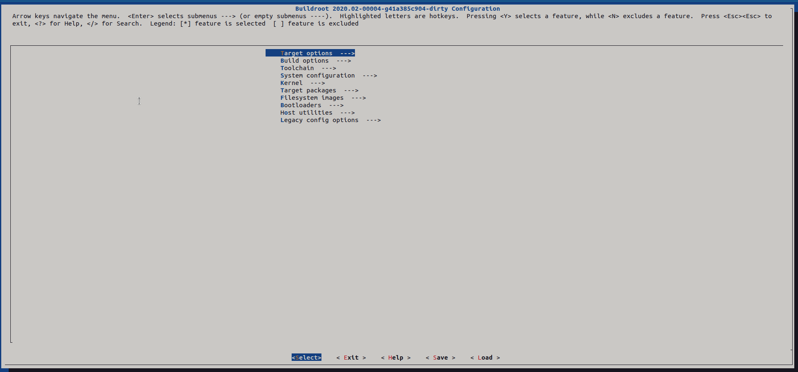
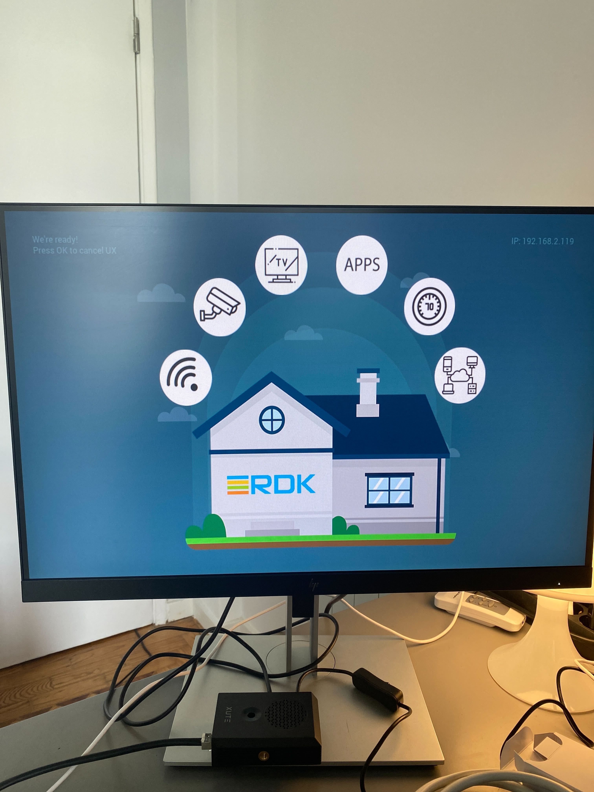
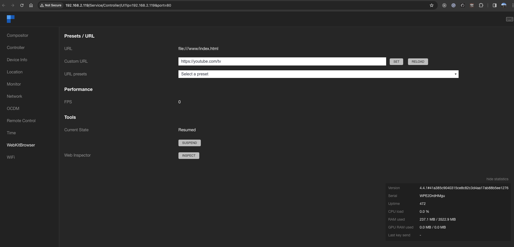
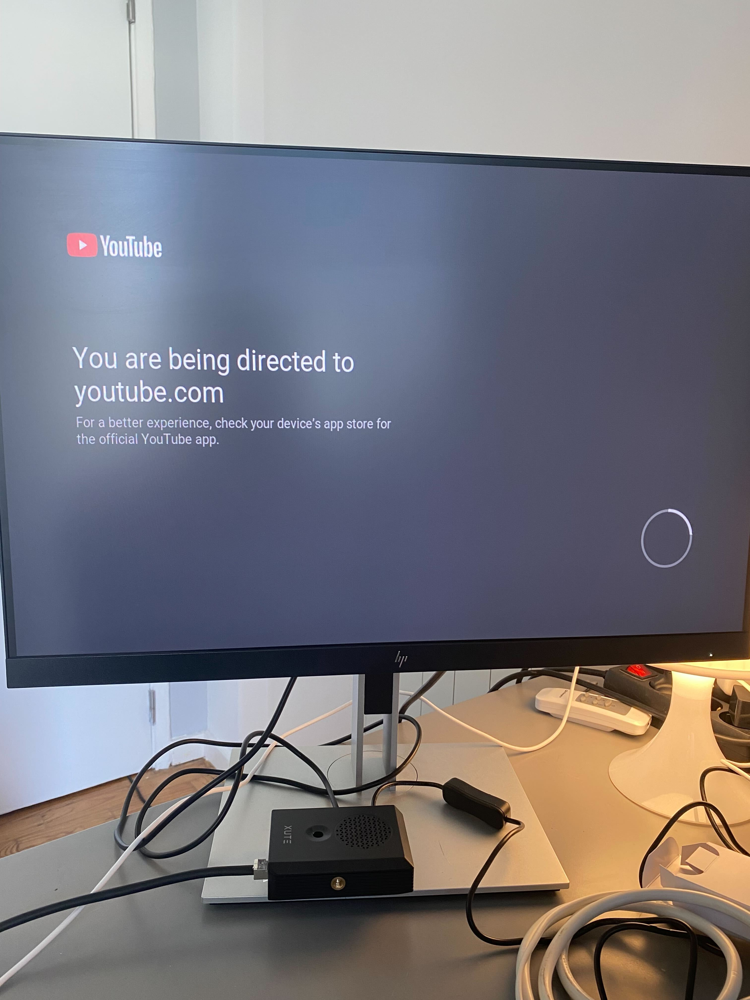
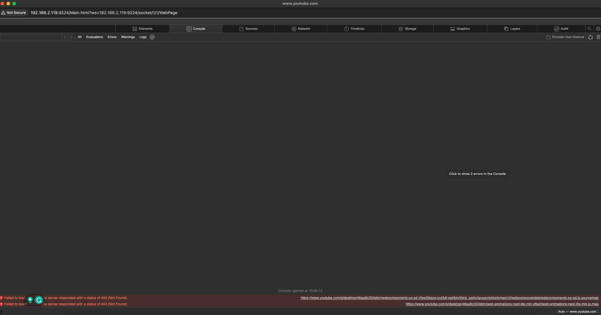
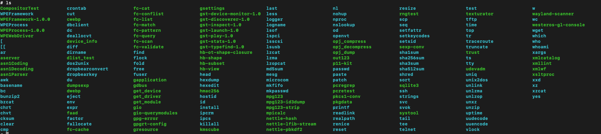

# Building a WPE and RDK Image for Raspberry Pi 4B Using Buildroot

The integration of diverse technologies like Web Platform for Embedded (WPE), Reference Design Kit (RDK), Buildroot, and Raspberry Pi 4B opens up exciting possibilities in the field of embedded systems and IoT. In this guide, we'll explore how these technologies synergize to create powerful, efficient, and highly customizable embedded devices.

- **WPE and RDK**: WPE is a fully-featured browser engine specifically designed for embedded systems. It's lean, fast, and customizable, making it ideal for running web-based applications on devices with limited resources. RDK, on the other hand, is a software platform for set-top boxes, smart TVs, and other broadband devices, providing a common framework for powering customer-premises equipment. When combined, these technologies offer a robust foundation for developing advanced, web-enabled embedded devices.
- **Raspberry Pi 4B**: Raspberry Pi 4B, known for its versatility and performance, is a popular choice for embedded projects. Its ample processing power, memory, and connectivity options make it an excellent platform for hosting WPE and RDK, offering developers a flexible and powerful environment for their embedded applications.

- **Buildroot**: A key tool in this process is Buildroot, a simple, efficient, and flexible build system. Buildroot streamlines the process of creating a complete embedded Linux system. Unlike Yocto, another popular build system, Buildroot is known for its simplicity and speed, making it ideal for quickly setting up and prototyping embedded systems.

### Building with Buildroot

Buildroot is a powerful tool for building embedded Linux systems. It's simpler and faster compared to Yocto, focusing on simplicity and ease of use. You can learn more about Buildroot through [this comprehensive guide](https://docs.google.com/viewerng/viewer?url=http://bootlin.com/doc/training/buildroot/buildroot-slides.pdf).

### Setting Up a Virtual Machine

Our development environment will be based on Ubuntu 20.04 LTS, hosted on a MacOS X system using UTM, a versatile virtual machine manager for MacOS. The setup process is straightforward:

1. **Install UTM**: Download UTM from [here](https://mac.getutm.app/) and install it on your MacOS X.
2. **Download Ubuntu 20.04 LTS**: Acquire the UTM compatible image from the [UTM Gallery](https://mac.getutm.app/gallery/ubuntu-20-04) and follow the instructions to set up your virtual machine.

#### Minimum Requirements for Ubuntu 20.04 LTS Virtual Machine

Ensure your virtual machine meets these minimum requirements for smooth operation:

- **RAM**: 12GB or more
- **CPU Cores**: At least 6, preferably on a powerful Mac M1
- **Storage**: 100GB minimum, 150GB recommended (considering the OS takes around 16GB)

#### Expanding the Ubuntu Partition

After allocating storage to your VM, follow these steps to expand the Ubuntu partition:

1. Identify the partition using `df -H`.
2. Locate your disk using `sudo parted -l`.
3. Check available space with `sudo vgdisplay`.
4. Extend the logical volume using `sudo lvextend -L +20G <partition-name>`.
5. Resize the filesystem: `sudo resize2fs <partition-name>`.

Confirm the expansion by rerunning `df -H`.

### Cross-Compiling with Buildroot

With the hardware and software prerequisites in place, we're ready to start cross-compiling. This involves installing dependencies, cloning the Buildroot repository, configuring the build, and finally generating the OS image.

#### Installing Software Dependencies

Follow the instructions on [RDK Central](https://rdktools.rdkcentral.com/tools__certification/raspberry_pi/index.html) to install essential packages:

```sh
# essential packages installation
# super user mode is required

# major essential packages
sudo apt-get install gawk wget git-core diffstat unzip texinfo gcc-multilib g++-multilib build-essential chrpath socat bison curl cpio python3 python3-pip python3-pexpect xz-utils debianutils iputils-ping python3-git python3-jinja2 libegl1-mesa libsdl1.2-dev pylint3 xterm
```

#### Cloning and Configuring Buildroot

Clone the Buildroot repository from the [WebPlatformForEmbedded organization](https://github.com/WebPlatformForEmbedded/buildroot) and checkout the appropriate branch for our build:

```sh
git clone https://github.com/WebPlatformForEmbedded/buildroot.git
cd buildroot
git checkout R4_4
```

Configure Buildroot for the Raspberry Pi 4B by editing the `raspberrypi4_64_wpe_ml_defconfig` file in the `/configs` directory. Add necessary configurations, then use `make menuconfig` to access additional configuration options.

As part of configuring Buildroot, it's crucial to ensure that our build includes all necessary components. Through my experimentation, I found that the build process requires certain additional configurations to succeed. Let's modify the `raspberrypi4_64_wpe_ml_defconfig` file to incorporate these configurations:

```sh
sudo nano ./configs/raspberrypi4_64_wpe_ml_defconfig
```

**WPE ML (Media Layer):** This configuration focused on optimizing WebKit for Embedded (WPE) for media playback. It might include specific settings for better handling of multimedia content, optimizations for video and audio codecs, and possibly some machine learning enhancements for media processing.

Within this configuration file, add the following lines:

```sh
BR2_PACKAGE_WPEWEBKIT2_38=y
BR2_PACKAGE_WPEFRAMEWORK_MESSAGING=y
```

These lines are pivotal for the build process. The `BR2_PACKAGE_WPEWEBKIT2_38` directive instructs Buildroot to include the WPE Webkit source code, specifically from the GitHub branch tagged `2_38`. This version is selected for its stability and compatibility with our target system.

Similarly, `BR2_PACKAGE_WPEFRAMEWORK_MESSAGING` refers to a necessary package from RDK Thunder, which, if omitted, results in an incomplete build. Including this package ensures that all required components of the RDK framework are present, facilitating a successful build process.

By integrating these configurations, we address potential gaps in the default setup and pave the way for a smooth and efficient build experience. If you are curious what does each configuration represents, refer to the [apendinx for breakdown of each configuration option](#appendix---buildroot-configurations-breakdown).

### Fine-Tuning the Configuration with menuconfig

After incorporating the essential configurations, we need to delve deeper and adjust additional settings via the Buildroot configuration interface. This step is vital for tailoring the build to our specific requirements. Begin by executing the following command in the root folder of Buildroot:

```sh
make menuconfig
```

This command launches a user interface that allows for an interactive configuration experience. You'll be presented with a menu-driven interface as shown below:



In this interface, you'll navigate through various options and make selections that align with our project's requirements. The process is iterative, and it's crucial to carefully enable or disable specific configurations as per your needs. The following table, inspired by a [discussion in the WPEWebKit GitHub repository](https://github.com/WebPlatformForEmbedded/WPEWebKit/issues/500#issuecomment-435590466), outlines the key configurations to adjust:

| Operation in menuconfig |                     Location                      |                                             Value |
| ----------------------- | :-----------------------------------------------: | ------------------------------------------------: |
| ENABLE                  | Target packages -> Filesystem and flash utilities |                                        dosfstools |
| ENABLE                  | Target packages -> Filesystem and flash utilities |                                            mtools |
| ENABLE                  |                 Filesystem images                 |                          ext2/3/4 root filesystem |
| ENABLE                  |                 Filesystem images                 |                          ext2/3/4 root filesystem |
| SET VALUE               |                 Filesystem images                 | ext2/3/4 root filesystem -> ext2/3/4 variant ext4 |
| DISABLE                 |                 Filesystem images                 |   initial RAM filesystem linked into linux kernel |
| ENABLE                  |            Host utilities -> genimage             |   initial RAM filesystem linked into linux kernel |

Each configuration option serves a specific purpose:

- **dosfstools and mtools**: These utilities are essential for file system management, particularly for FAT file systems, which are commonly used in embedded systems.
- **ext2/3/4 root filesystem**: Enabling support for ext2, ext3, and ext4 file systems ensures compatibility and flexibility in managing the root filesystem of the embedded Linux.
- **ext4 variant**: Setting the ext2/3/4 root filesystem to use the ext4 variant offers a balance of performance and reliability, making it a preferred choice for many embedded applications.
- **Initial RAM filesystem**: Disabling the initial RAM filesystem linked into the Linux kernel can help optimize boot time and system resources, especially in resource-constrained environments.

By meticulously adjusting these settings, you ensure that the Buildroot environment is optimally configured for building a robust and efficient WPE and RDK image for the Raspberry Pi 4B.

---

#### Cross-Compiling the Image

Start the cross-compiling process with `make`. This may take some time, as building a Buildroot image is resource-intensive.

### Troubleshooting and Patching During Build

The build process can occasionally encounter issues, such as missing dependencies, configuration errors, or problems in the source code. Efficiently addressing these challenges involves a systematic approach that includes iterative troubleshooting, applying patches, or making direct modifications in the build folder. Here’s how to navigate these challenges:

1. **Identify and Resolve the Issue**: First, pinpoint the problem and implement a solution.
2. **Clean the Previous Output**: Use `rm -rf output` or `make clean` to clear any previous, potentially corrupted build outputs.
3. **Rebuild the System**: Run `make` to start the build process again.

This process is cyclical; if a new issue arises, repeat these steps until the build succeeds.

#### Strategies for Fixing Issues

Different types of build problems require different strategies:

- **Missing Dependencies**: If an error indicates a missing file or library, the solution often involves installing the missing dependency. For example, the error message `fatal error: gmp.h: No such file or directory` suggests that the `libgmp-dev` package is missing and can be installed using `sudo apt-get install libgmp-dev`.

- **Changing Configuration**: Sometimes, the issue may stem from an incomplete or incorrect configuration. An example of this was our earlier modification to the `raspberrypi4_64_wpe_ml_defconfig`, where we added `BR2_PACKAGE_WPEWEBKIT2_38=y` and `BR2_PACKAGE_WPEFRAMEWORK_MESSAGING=y` to address specific build requirements.

- **Applying a Patch to the Source Code**: When a specific package fails during the build, applying a patch can be effective. This involves identifying the problematic package, applying the necessary patch, and then rebuilding. Patches can be created using `git` and are well-documented in the [Buildroot training materials](https://docs.google.com/viewerng/viewer?url=http://bootlin.com/doc/training/buildroot/buildroot-slides.pdf). For instance, a known issue with a Python package missing `_ctypes` can be resolved with a specific [patch](https://bugs.busybox.net/attachment.cgi?id=9006&action=edit) as detailed in [this bug report](https://bugs.busybox.net/show_bug.cgi?id=13661).

- **Direct Modifications in the Build Folder**: In some cases, directly editing the code in the `/output/build` folder may be the quickest solution. This approach, however, is temporary as any changes will be lost if the build folder is cleaned.

#### Resolving Specific Build Issues

During the build, I encountered and resolved several issues. For instance:

- **Patches for WPE/WPEWEBKIT**:

  1. Navigate to `/output/build/linux-custom/scripts/dtc/dtc-lexer.lex.c`.
  2. Modify the line `YYLTYPE yylloc` to `extern YYLTYPE yylloc`.

- **Patches for WPE/WPEFRAMEWORK-rdk-services**:
  1. Go to `/output/build/wpe/wpeframework-rdkservices*(version)/CMakeLists.txt`.
  2. Comment out the following lines:

```sh
...
#if(PLUGIN_MONITOR)
#    add_subdirectory(Monitor)
#endif()
...
# if(PLUGIN_TRACECONTROL)
#    add_subdirectory(PLUGIN_TRACECONTROL)
# endif()
...
```

- **Fix for WPE/WPEFRAMEWORK**:
  1. Add the `BR2_PACKAGE_WPEFRAMEWORK_MESSAGING=y` to configuration.

These modifications addressed specific issues I encountered, facilitating a successful build process.

### Applying Patches to Packages in Buildroot

This section is dedicated to elucidating the process of applying patches to a package within the Buildroot environment. The steps below outline this process using the example of patching the **WPE/WPEFRAMEWORK-rdk-services** package.

1. **Identify the Package**: First, pinpoint the package requiring a patch. For demonstration purposes, we're focusing on `packages/wpe/wpeframework-rdkservices`.

2. **Locate the Source Code**: The source code for the package is typically specified in the package's `.mk` file. In our case, the relevant repository is `ThunderNanoServicesRDK`, accessible at `https://github.com/WebPlatformForEmbedded/ThunderNanoServicesRDK`.

3. **Check Out the Correct Commit**: The specific commit to work from can also be found in the `.mk` file. For this example, it's `R4.4.1`.

4. **Modify the Code**: Proceed to make the necessary changes to the code. In this example, we are commenting out specific lines in the `CMakeLists.txt` file:

   ```sh
   ...
   #if(PLUGIN_MONITOR)
   #    add_subdirectory(Monitor)
   #endif()
   ...
   # if(PLUGIN_TRACECONTROL)
   #    add_subdirectory(PLUGIN_TRACECONTROL)
   # endif()
   ...
   ```

5. **Commit the Changes**: Use Git to commit your changes with the following command:

   ```sh
   git add . & git commit -m "Patching Trace Control and Monitor" -n
   ```

6. **Generate the Patch**: Next, create a patch file using the command `git format-patch R4.4.1`. This will produce a patch file resembling the following:

   ```patch
   From 44d5a101483a705ac2d072ed73b318bf575f4639 Mon Sep 17 00:00:00 2001
   ...
   Date: Fri, 12 Jan 2024 13:33:48 +0000
   Subject: [PATCH] Patching trace control and monitor

   ---
   CMakeLists.txt | 12 ++++++------
   1 file changed, 6 insertions(+), 6 deletions(-)

   diff --git a/CMakeLists.txt b/CMakeLists.txt
   index d72a453..c5a366b 100644
   --- a/CMakeLists.txt
   +++ b/CMakeLists.txt
   @@ -59,9 +59,9 @@ if(PLUGIN_MESSENGER)
       add_subdirectory(Messenger)
   endif()

   -if(PLUGIN_MONITOR)
   -    add_subdirectory(Monitor)
   -endif()
   +# if(PLUGIN_MONITOR)
   +#     add_subdirectory(Monitor)
   +# endif()

   if(PLUGIN_OPENCDMI)
       add_subdirectory(OpenCDMi)
   @@ -83,9 +83,9 @@ if(PLUGIN_SECURITYAGENT)
       add_subdirectory(SecurityAgent)
   endif()

   -if(PLUGIN_TRACECONTROL)
   -    add_subdirectory(TraceControl)
   -endif()
   +# if(PLUGIN_TRACECONTROL)
   +#     add_subdirectory(TraceControl)
   +# endif()

   if(PLUGIN_WEBKITBROWSER)
       add_subdirectory(WebKitBrowser)
   --
   2.42.1
   ```

7. **Place the Patch in the Package Directory**: Finally, move the newly created patch file to the `packages/wpe/wpeframework-rdkservices` directory, alongside the `.mk` file. The patch will be applied automatically before the execution of the `.mk` file.

Through these steps, we've successfully applied a custom patch to a specific package within Buildroot, showcasing the flexibility and control developers have over their build configurations and package customizations.

### Output Image

Upon successful compilation, locate the `sdcard.img` file in the `/output` folder. This is the WPE RDK image for your Raspberry Pi.

### Flashing the Image onto Raspberry Pi

Transfer the image from the Ubuntu VM to your host machine using SCP, then flash it onto an SD card using a tool like Balena Etcher. Insert the SD card into your Raspberry Pi 4B, power it up, and you should see the RDK Central home screen.

### Troubleshooting Post-Installation Issues

If you encounter issues like incompatible `start4.elf` files, updating the firmware on the Raspberry Pi's SD card with files from the [official Raspberry Pi firmware repository](https://github.com/raspberrypi/firmware) may resolve them.

## Navigating to ThunderUI

With your device operational, ThunderUI offers a streamlined interface for managing and controlling your RDK environment.



### Opening a Browser URL via Metrologic UI

First, identify the IP address of the Raspberry Pi displayed in the top right corner. Ensure your computer is connected to the same network as the Raspberry Pi, and navigate to the IP address in your browser. For example, in this scenario, it would be `http://192.168.2.119`.

Upon accessing this address, you'll be greeted with the following user interface:



Here, you can insert any desired URL and click "SET" to direct the Raspberry Pi to open that page in the WPE browser.

For instance, setting it to YouTube, you'll see it successfully launch on your device:



### Opening Web Inspector

To delve deeper, the browser's web inspector can be accessed by selecting "Inspect" in the Metrologic UI. This feature allows for in-depth analysis and debugging of web content displayed on the Raspberry Pi.



### Hardware Acceleration Demo

As a Demo we can try running a hardware acceleration to run some WebGL animations. We can try and open the [Jellyfish demo](https://akirodic.com/p/jellyfish/)

### Device Logs

Access to the device via ssh. For WPEFramework, we must use the logging of RDK. This can be accomplished by running:

```sh
WPEFramework-1.0.0
```

This is just a binary that exists in our raspberry pi image. You can find more binaries by navigating to the binaries folder.

1. Find the binaries location. This is usually indicated in the `$PATH` environment variable.

```sh
echo $PATH

... Output ...

/bin:/sbin:/usr/bin:/usr/sbin
```

2. Navigate to the binaries location from path. By looking at the code snippet above, it is in `/usr/bin`

3. Observe the binaries



### Enabling GStreamer Logs

You can tail the logs by enabling WPEFramework-1.0.0. However, it will not show all the logs. We can expand those. For instance to increase verbosity of gStreamer logs run the following:

```sh
export GST_DEBUG=3
```

## Conclusion

In this guide, we have successfully navigated the complexities of building a WPE and RDK image for the Raspberry Pi 4B using Buildroot. From setting up a virtual machine to configuring and cross-compiling with Buildroot, each step was meticulously detailed to ensure a smooth process. The culmination of our efforts is the operational RDK environment on the Raspberry Pi, demonstrated through the use of ThunderUI and the Metrologic UI. This achievement not only showcases our technical prowess but also opens avenues for innovative applications in embedded systems. With these tools and knowledge, we are now well-equipped to explore and create in the exciting world of embedded technology.

## Appendix - Buildroot Configurations Breakdown

The `raspberrypi4_64_wpe_ml_defconfig` file in Buildroot is a configuration file that sets up a build environment tailored for the Raspberry Pi 4 with a focus on Web Platform for Embedded (WPE) and multimedia layer (ML). Let's break down what each of these configurations means:

- **BR2_aarch64=y:** Sets the target architecture to AArch64 (64-bit ARM architecture).
- **BR2_cortex_a72=y:** Optimizes the build for the Cortex-A72 CPU, which is used in the Raspberry Pi 4.
- **BR2_ARM_FPU_VFPV4=y:** Enables support for the ARM VFPv4 floating-point unit, which is part of the Cortex-A72.
- **BR2_CCACHE=y:** Enables ccache to speed up recompilation by caching previous compilations.
- **BR2_OPTIMIZE_2=y:** Sets optimization level to -O2 for a good balance between performance and compilation time.
- **BR2_TOOLCHAIN_BUILDROOT_GLIBC=y:** Uses the GNU C Library (glibc) in the Buildroot toolchain.
- **BR2_TOOLCHAIN_BUILDROOT_CXX=y:** Includes C++ support in the toolchain.
- **BR2_ROOTFS_DEVICE_CREATION_DYNAMIC_EUDEV=y:** Uses dynamic device node creation with eudev.
- **BR2_TARGET_GENERIC_ROOT_PASSWD="root":** Sets the default root password to "root".
- **BR2_ROOTFS_POST_BUILD_SCRIPT and BR2_ROOTFS_POST_IMAGE_SCRIPT:** Specifies custom scripts to be executed post-build and post-image creation.
- **BR2_ROOTFS_POST_SCRIPT_ARGS:** Additional arguments for the post-build/image scripts.
- **BR2_LINUX_KERNEL=y:** Includes the Linux kernel in the build.
- **BR2_LINUX_KERNEL_CUSTOM_TARBALL=y:** Uses a custom Linux kernel tarball.
- **BR2_LINUX_KERNEL_CUSTOM_TARBALL_LOCATION:** Location of the custom Linux kernel tarball.
- **BR2_LINUX_KERNEL_DEFCONFIG="bcm2711":** Uses the bcm2711 default kernel configuration, suitable for the Raspberry Pi 4.
- **BR2_LINUX_KERNEL_DTS_SUPPORT=y:** Enables Device Tree support in the kernel.
- **BR2_LINUX_KERNEL_INTREE_DTS_NAME:** Specifies the Device Tree Blob (DTB) for the Raspberry Pi 4.
- **BR2_LINUX_KERNEL_DTB_OVERLAY_SUPPORT=y:** Enables support for Device Tree overlays.
- **BR2_LINUX_KERNEL_NEEDS_HOST_OPENSSL=y:** Indicates that the kernel build requires OpenSSL on the host system.
- **The BR2*PACKAGE_GST1_PLUGINS*\* lines**: Include various GStreamer 1.x plugins for multimedia handling.
- **BR2_PACKAGE_BITSTREAM_VERA=y:** Includes the Bitstream Vera font.
- **BR2_PACKAGE_KMSCUBE=y:** Includes kmscube, a sample app to demonstrate DRM/KMS capabilities.
- **BR2_PACKAGE_MESA3D and related lines:** Includes Mesa 3D graphics library and specific drivers.
- **BR2_PACKAGE_RPI** lines:\*\* Include various Raspberry Pi-specific packages like firmware and Wi-Fi support.
- **BR2_PACKAGE_CA_CERTIFICATES=y:** Includes CA certificates.
- **BR2_PACKAGE_WPEFRAMEWORK and related plugins:** Include the WPE Framework and various plugins for functionality like compositor, Wi-Fi control, web server, etc.
- **BR2_PACKAGE_WPEWEBKIT2_22=y:** Includes version 2.22 of the WPE WebKit browser engine.
- **BR2_PACKAGE_ORC=y:** Includes the Orc library, used for compiling and optimizing code.
- **BR2_PACKAGE_SHARED_MIME_INFO=y:** Includes shared MIME database.
- **BR2_PACKAGE_DROPBEAR=y:** Includes the Dropbear SSH server and client.
- **BR2_PACKAGE_RDKSPLASHSCREEN and related lines:** Include the RDK splash screen.
- **BR2_PACKAGE_HOST_DOSFSTOOLS, BR2_PACKAGE_HOST_GENIMAGE, BR2_PACKAGE_HOST_MTOOLS:** Includes various host utilities for filesystem image generation.

### Buildroot configurations specifically related to the WPE Framework and its components.

- **BR2_PACKAGE_WPEFRAMEWORK=y**: Includes the WPE Framework, a collection of libraries and tools for developing and running applications on embedded devices, especially focused on web-based applications.
- **BR2_PACKAGE_WPEFRAMEWORK_CDMI_CLEARKEY=y**: Includes support for the ClearKey Content Decryption Module (CDM) within WPE Framework. This is used for handling DRM (Digital Rights Management) for media content.
- **BR2_PACKAGE_WPEFRAMEWORK_COMPOSITOR=y**: Includes the compositor plugin for WPE Framework, which manages the graphical output, handling windowing and rendering of graphics.
- **BR2_PACKAGE_WPEFRAMEWORK_DHCPSERVER=y**: Adds a DHCP server capability to the WPE Framework, enabling it to assign IP addresses to devices in a network.
- **BR2_PACKAGE_WPEFRAMEWORK_LOCATIONSYNC=y**: Includes the LocationSync plugin, which provides location services and geolocation functionalities.
- **BR2_PACKAGE_WPEFRAMEWORK_LOCATIONSYNC_URI**: Sets the URI for the LocationSync service, in this case, using Metrological's JSON IP service.
- **BR2_PACKAGE_WPEFRAMEWORK_MONITOR=y**: Includes the Monitor plugin, which is used for monitoring the performance and resource usage of applications running within the WPE Framework.
- **BR2_PACKAGE_WPEFRAMEWORK_REMOTECONTROL=y**: Adds support for remote control functionalities, enabling control of the device through external inputs.
- **BR2_PACKAGE_WPEFRAMEWORK_REMOTECONTROL_DEVINPUT=y**: Enables device input handling for the remote control feature, allowing the use of various input devices.
- **BR2_PACKAGE_WPEFRAMEWORK_TIMESYNC=y**: Includes the TimeSync plugin, which ensures the device maintains accurate time, often critical for networked applications.
- **BR2_PACKAGE_WPEFRAMEWORK_TRACECONTROL=y**: Adds TraceControl, a tool for tracing and debugging applications within the WPE Framework.
- **BR2_PACKAGE_WPEFRAMEWORK_WEBKITBROWSER=y**: Includes the WebKitBrowser plugin, providing a web browser based on the WebKit engine within the WPE Framework.
- **BR2_PACKAGE_WPEFRAMEWORK_WEBKITBROWSER_STARTURL**: Sets the default start URL for the WebKitBrowser.
- **BR2_PACKAGE_WPEFRAMEWORK_WEBKITBROWSER_MEMORYPRESSURE**: Configures memory usage limits for various processes within the WebKitBrowser to optimize performance.
- **BR2_PACKAGE_WPEFRAMEWORK_WEBKITBROWSER_DISKCACHE**: Sets the size of the disk cache used by the WebKitBrowser.
- **BR2_PACKAGE_WPEFRAMEWORK_WEBKITBROWSER_XHRCACHE=y**: Enables caching for XMLHttpRequests in the WebKitBrowser, improving performance for web applications making frequent AJAX calls.
- **BR2_PACKAGE_WPEFRAMEWORK_YOUTUBE=y**: Includes support for a YouTube application or plugin within the WPE Framework.
- **BR2_PACKAGE_WPEFRAMEWORK_UX=y**: Adds User Experience (UX) improvements or features to the WPE Framework, potentially including UI elements, animations, and other user interface enhancements.
- **BR2_PACKAGE_WPEFRAMEWORK_WEBKITBROWSER_THREADEDPAINTING**: Configures the WebKitBrowser to use threaded painting, which can improve rendering performance by using multiple CPU cores.
- **BR2_PACKAGE_WPEFRAMEWORK_WEBSERVER=y**: Includes a web server component within the WPE Framework, enabling the device to host web content or services.
- **BR2_PACKAGE_WPEFRAMEWORK_WIFICONTROL=y**: Adds Wi-Fi control capabilities to the WPE Framework, allowing the management of Wi-Fi connections.
