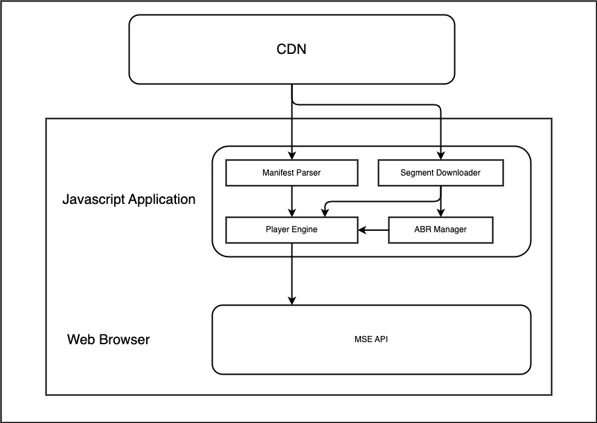

# Enhancing Video Streaming with Adaptive Bitrate (ABR) Algorithms



In the ever-evolving world of video streaming, ensuring an optimal viewer experience is paramount. One critical technology that addresses this need is Adaptive Bitrate (ABR) streaming. ABR dynamically adjusts the video quality according to the user's bandwidth and device capabilities, aiming to deliver the best possible viewing experience without buffering.

Among various ABR algorithms, BOLA (Buffer Occupancy based ABR) stands out. BOLA, a buffer-based algorithm, dynamically selects the optimal bitrate by analyzing the video player's buffer status. Its primary objectives are to maintain a steady buffer size, avoid rebuffering, and select the highest feasible bitrate under current network conditions.

## Setting the Stage for ABR Integration

To begin integrating ABR into your video streaming project, start by exploring the provided [multi-rendition repository](link-to-multi-renditions) and comprehending [MSE playback with multiple renditions](link-to-multi-renditions-blog). This foundational knowledge will guide you in preparing media and manifest files to make multiple video renditions accessible for the ABR algorithm.

## Bandwidth Selection Strategy

When a manifest is parsed, we may observe that the video can be played in four renditions, from worse quality: `267875bps`, i.e. around 270kbps to highest quality: `1701860bps` ~ 1.7 mbps. Selecting a high-quality stream like the 1.7 Mbps one necessitates a robust network capable of consistent high-speed downloads.

Let's begin by writing some code to decide which bandwidth the player should download. We are going to deal with the decision in two phases: when the video starts, and during the video.

When the video starts, we have no information yet about the network conditions, and so we have to select the best bitrate based on our assumption. For the sake of the demonstration, we will assume that the network is poor, and begin with the lowest available bitrate.

```typescript
// Assume the worst-case scenario initially
let selectedVariant = variants[bandwidths[0]]; // Start with the lowest bitrate
const initializationSegment = selectedVariant.segments[0];
const codecs = selectedVariant.codecs;
let segments = selectedVariant.segments;
```

To ensure adaptive playback, we must select the appropriate segment for download at every point in time:

```typescript
sourceBuffer.addEventListener("updateend", async function () {
  if (!sourceBuffer.updating && i !== segments.length) {
    segments = getSegments(); // <-- Get Segments using ABR
    const nextSegmentUri = segments[i];
    const nextSegment = await getMp4Data(nextSegmentUri); // Next segments
    sourceBuffer.appendBuffer(nextSegment);
    i++;
  }
});
```

## BOLA Algorithm Implementation

The BOLA algorithm makes decisions based on the video element's buffer occupancy. By inspecting `videoElement.buffered`, we can determine the buffer's state and thus the optimal variant to select:

```typescript
function getSegments() {
  const optimalVariant = checkBufferAndSelectVariant();
  return optimalVariant.segments;
}
```

Now, let's define the `checkBufferAndSelectVariant`. As the function name suggests, there are two steps: `checkBuffer` and `selectVariant`:

```typescript
function checkBufferAndSelectVariant() {
  // Calculate the current buffer level
  const bufferLevel = calculateBufferLevel();

  // Select the optimal variant based on BOLA
  const optimalVariant = selectBOLAvariant(bufferLevel);

  return optimalVariant;
}
```

The buffer size is calculated from the `sourceBuffer.buffered` - `TimeRanges` object, which provides the start and end times of buffered content:

```typescript
function calculateBufferInfo(buffered: TimeRanges) {
  const ret = [];
  for (let i = 0; i < buffered.length; i++) {
    ret.push({ start: buffered.start(i), end: buffered.end(i) });
  }
  return ret;
}

function calculateBufferLevel(buffered: TimeRanges) {
  // bufferInfo returns an object simillar to [{ start: 0, end: 4.166666 }];
  const bufferInfo = calculateBufferInfo(buffered);
  const currentTime = video.currentTime;

  if (!bufferInfo.length) {
    return 0;
  }

  let bufferLevel = 0;
  const { end, start } = bufferInfo[bufferInfo.length - 1];
  if (currentTime < end && currentTime >= start) {
    bufferLevel = end - currentTime;
  }

  return bufferLevel;
}
```

We get the buffer level, by looking at how much time there is left in the buffer in the future, in other words, after `video.currentTime`.

## Implementing BOLA Algorithm

Having our variable `bufferSize` we should be able to decide whether conditions are good or bad and if we should start fetching better quality segments. How do we decide that?

BOLA specifies some variables: `reservoir` and `cushion`. Some implementations also call those **buffer target** and **guard parameter**. This is also know as a utility-based decision-making process. BOLA optimizes the quality selection based on a utility function, which in turn is based on the buffer occupancy. The utility function balances the trade-off between high quality (which requires a higher bitrate) and low rebuffering risk (which requires a larger buffer).

### Reservoir

This is the minimum amount of buffer you want to have. If the buffer level goes below this, it's like having a safety net that's too small — there's a risk you might fall through if there's a sudden issue with the internet connection. So when this happens, the player switches to the lowest quality video to make sure the buffer fills up quickly and the risk of running out of buffered video (and thus, having the video stop to load) is minimized.

### Cushion

This is extra space on top of the reservoir. It's like having an additional safety net. If you have a buffer level that's more than the reservoir plus this cushion, it means you have a comfortable buffer space, and you can afford to play the highest quality video because you're not in danger of running out of buffered content any time soon.

Configuring the reservoir and cushion values effectively is essential for the BOLA algorithm. These parameters should reflect the specific stream or application's requirements. For demonstration purposes, let's set the reservoir to 3 seconds and the cushion to 2 seconds.

```typescript
let reservoir = 3; // Minimum buffer size in seconds
let cushion = 2; // Additional buffer space

function selectBOLAvariant(bufferLevel: number, variants: Variants) {
  let quality;

  if (bufferLevel < reservoir) {
    quality = 0; // Opt for lowest quality to avoid rebuffering
  } else if (bufferLevel > reservoir + cushion) {
    quality = bandwidths.length - 1; // Safe to select the highest quality
  } else {
    // Apply utility function to determine the optimal quality
    quality = utilityBasedSelection(bufferLevel, bandwidths);
  }

  return variants[bandwidths[quality]];
}
```

According to BOLA one of the 3 situations is are relevant for a decision:

- The buffer level is bellow `reservoir` - worst case scenario
- The buffer level is above `reservoir` + `cushion` - best case scenario
- The buffer level is between `reservoir` and `reservoir` + `cushion`

Naturally for the best case scenario we will pick highest quality, and for the worst case scenario we will pick the lowest quality. These are the easiest, lets go ahead start writing the algorithm.

## Utility-based decision-making

When the buffer level lies between the reservoir and cushion, we use a utility function to make a calculated decision. The function prioritizes the variant offering the best balance between video quality and buffer safety.

Here, we're in a situation where the buffer is neither too low nor too high — it's in between the minimum and maximum levels we're comfortable with. So, we do some calculations to determine the best quality to play:

The goal is to pick the quality with the highest utility — that is, the best balance between quality and buffer safety. If the buffer level is closer to just the reservoir, we lean towards a safer, lower quality to avoid running out of buffer. If the buffer level is closer to the cushion, we can go for a higher quality because we have a buffer "cushion" to fall back on.

```typescript
function utilityBasedSelection(bufferLevel: number, bandwidths: number[]) {
  let highestUtility = -Infinity;
  // Utility-based quality selection
  for (let i = 0; i < bandwidths.length; i++) {
    // Calculate utility for each variant
    let utility =
      (bandwidths[i] - bandwidths[0]) / bandwidths[0] +
      (bufferLevel - reservoir) / cushion;
    if (utility > highestUtility) {
      highestUtility = utility;
      quality = i;
    }
  }
  return quality;
}
```

Breakdown of the code:

1. Iterating through each quality level (`for` loop): The loop for `(let i = 0; i < bandwidths.length; i++)` We go through each available video quality level (from lowest to highest bitrate), and see which is the highest utility. So we are going to keep the max value: `highestUtility`.
2. For each quality, we calculate a "utility" value. This value is a measure of how valuable this quality level is, considering both the desire for high quality and the need to maintain a safe buffer level.
   - `(bandwidths[i] - bandwidths[0]) / bandwidths[0]` is looking at how much better this quality (bitrate) is relative to the lowest quality.
   - `((bufferLevel - reservoir) / cushion)` measures how our current buffer compares to the ideal buffer size (the cushion). It's saying, "how comfortable am I with my buffer size?" The closer the buffer level is to the cushion, the higher this part of the utility score will be.
3. Finding the highest utility `(if (utility > highestUtility) ...)`: As we calculate the utility for each quality, we compare it to the highest utility score we've seen so far. If the current utility is higher, we take note of it and mark this quality as our current best choice.

After the loop finishes, then we have made our choice, and the best quality can be picked.

## Switching Variant

Finally we have our algorithm that selects the best next variant. Last piece of work is to **switch** the variant. Source buffer must know the metadata of the `.mp4` file while it is going to play it. The initial data is held inside the initialization segment, so in the first segment of the variant. So when switching the bitrate quality, we must ensure that the initialization segment is appended before trying to play the next segment, and ensure smooth video playback.

Let's conclude our `getSegments` method with this:

```typescript
async function switchVariant(newVariant: Variant, sourceBuffer: SourceBuffer) {
  selectedVariant = newVariant;
  const initSegment = newVariant.segments[0];

  if (!sourceBuffer.updating) {
    const firstSegment = await getMp4Data(initSegment); // First segment is here
    sourceBuffer.appendBuffer(firstSegment);
  }
}

async function getSegments(sourceBuffer: SourceBuffer) {
  const optimalVariant = checkBufferAndSelectVariant(sourceBuffer.buffered);

  // Only switch variant if it is different from the current one
  if (optimalVariant.segments[0] !== selectedVariant.segments[0]) {
    await switchVariant(optimalVariant, sourceBuffer);
  }

  return optimalVariant.segments;
}
```

## Bringing it all together and testing

By monitoring the network requests, we witness the algorithm's decision-making process as it adapts to varying conditions, demonstrating its responsiveness and intelligence.

```sh
/segments/320x180_500k/BigBuckBunny_0.mp4
/segments/320x180_500k/BigBuckBunny_0.mp4
/segments/320x180_500k/BigBuckBunny_1.mp4
/segments/1280x720_1500k/BigBuckBunny_0.mp4
/segments/1280x720_1500k/BigBuckBunny_2.mp4
/segments/640x360_750k/BigBuckBunny_0.mp4
/segments/640x360_750k/BigBuckBunny_3.mp4
```

As you can see, our ABR started from the lowest, 320x180 and quickly ramped up to 1280x720. Immediately after the decision was made to 640x360.

## Conclusion

We have delved into the intricacies of BOLA, a sophisticated ABR algorithm that significantly enhances the video streaming experience. Its utility-based approach to managing video quality in response to buffer levels exemplifies the power of adaptive streaming.

For those keen to explore further, the [complete code](https://github.com/vvasylkovskyi/mse-abr-bola) and [live demo](https://vvasylkovskyi.github.io/mse-abr-bola/) are available for review and experimentation. Happy coding, and may your streams flow without a hitch!

## References

- [ABR BOLA](https://arxiv.org/pdf/1601.06748.pdf)
