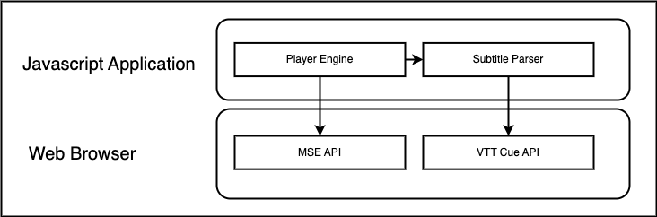
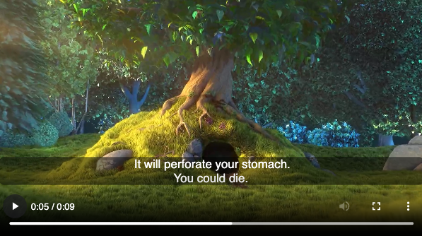

# Integrating WebVTT Subtitles with Media Source Extensions



Subtitles are a key feature of modern video playback, serving not just non-native language speakers but also providing essential accessibility for the deaf and hard of hearing. WebVTT (Web Video Text Tracks) is a standard format for displaying timed text tracks (like subtitles or captions) during video playback. It's a text-based format, which is both easy to create and to process, and can be styled and positioned to ensure a good user experience.

To manually incorporate WebVTT subtitles into video playback with the HTML5 `<video>` element using Media Source Extensions (MSE), one needs to undertake a series of technical steps. This can be more complex than using a pre-built player that handles such processes internally.

This article offers a clear, step-by-step guide on how to manually integrate WebVTT subtitles into your video streams using the MSE API, ensuring a customizable and inclusive viewing experience.

## Setting Up the Video Element

First, set up the video element in HTML:

```html
<video id="videoElement" controls></video>
```

## Initializing MediaSource and SourceBuffers

In your JavaScript, initialize the MediaSource object and create SourceBuffers for the video tracks:

```javascript
const videoElement = document.getElementById("videoElement");
const mediaSource = new MediaSource();
videoElement.src = URL.createObjectURL(mediaSource);
```

The media segments must be fetched and buffered appropriately, which requires additional function development for handling the video and audio streams.

## Preparing the Subtitles

Creating a `.vtt` file is the starting point for subtitle integration:

```css
WEBVTT

NOTE
This is a sample subtitle file.

00:00:00.000 --> 00:00:02.000
Never drink liquid nitrogen.

00:00:02.000 --> 00:00:10.000
It will perforate your stomach.
You could die.
```

This file should be placed within the `media` folder to be properly packaged with your application.

Following this, you'll need to create a function to fetch the `.vtt` subtitles:

## Fetching the WebVTT File

Fetching the WebVTT is done using a simple fetch request in JavaScript:

```javascript
const fetchSubtitles = async (subtitlesURL) => {
  const subtitlesResponse = await fetch(subtitlesURL);
  return subtitlesResponse.text();
};

const subtitles = await fetchSubtitles("./media/subtitles.vtt");
```

This will load the subtitle data into a variable for further processing.

## Parsing the WebVTT Data

Parsing the WebVTT data involves reading the file, understanding the timestamps, and creating JavaScript cue objects that will represent the subtitles:

```javascript
function parseWebVTT(vttString) {
  let lines = vttString.split("\n");
  const cuePattern =
    /(\d{2}:\d{2}:\d{2}\.\d{3}) --> (\d{2}:\d{2}:\d{2}\.\d{3})/;
  let cues = [];
  let currentCue = null;

  lines.forEach((line) => {
    let cueMatch = line.match(cuePattern);
    if (cueMatch) {
      currentCue = {
        start: cueMatch[1],
        end: cueMatch[2],
        text: "",
      };
      cues.push(currentCue);
    } else if (currentCue && line.trim()) {
      currentCue.text += line.trim() + "\n";
    }
  });

  return cues;
}
```

This code produces an array of cue objects that hold the subtitle information. The final result should look like follows:

```javascript
const cues = [
  {
    start: "00:00:00.000",
    end: "00:00:02.000",
    text: "Never drink liquid nitrogen.\n",
  },
  {
    start: "00:00:02.000",
    end: "00:00:10.000",
    text: "It will perforate your stomach.\nYou could die.\n",
  },
];
```

## Displaying the Subtitles

Finally, to display the subtitles, we need to create a `TextTrack` on the video element and add the cues to it.

### Adding TextTrack to Video Element

You add a `TextTrack` using the video element’s API:

```javascript
const video = document.getElementById("myVideo");
const track = video.addTextTrack("subtitles", "English", "en");
track.mode = "showing";
```

### Converting and Adding Cues

We convert our cue timings to seconds and then create a `VTTCue` for each one. The WebVTT timestamp is in the format of `HH:MM:SS.mmm`, where **HH** is hours, **MM** is minutes, **SS** is seconds, and **mmm** is milliseconds. We must convert the `start` and `end` properties first:

```javascript
function convertVttTimeToSeconds(vttTime) {
  let splitTime = vttTime.split(":");
  let hours = parseInt(splitTime[0]);
  let minutes = parseInt(splitTime[1]);
  let secondsAndMilliseconds = splitTime[2].split(".");
  let seconds = parseInt(secondsAndMilliseconds[0]);
  let milliseconds = parseInt(secondsAndMilliseconds[1]);
  return hours * 3600 + minutes * 60 + seconds + milliseconds / 1000;
}
```

And Finally, let's add each cue into the track:

```javascript
cues.forEach((cue) => {
  const startSeconds = convertVttTimeToSeconds(cue.start);
  const endSeconds = convertVttTimeToSeconds(cue.end);
  const vttCue = new VTTCue(startSeconds, endSeconds, cue.text);
  track.addCue(vttCue);
});
```

Final Result, cues overlaying on the video at the right time.



## Conclusion

The manual integration of WebVTT with Media Source Extensions is undoubtedly more complex than using a ready-made video player. However, it affords a high degree of customization that can significantly enhance the user experience. By following the steps outlined in this guide, developers can effectively overlay subtitles onto video content, ensuring accessibility and meeting diverse user needs.

Through meticulous implementation of the subtitles, and adherence to best practices, the end result is a seamless viewing experience that makes video content inclusive for all audiences. Remember to validate your subtitle display across different devices and platforms, keeping accessibility at the forefront of your integration strategy.

Refer to the MDN documentation on VTTCue and the WebVTT API for more detailed information on leveraging these technologies to create an accessible and engaging video experience.

As usual with my blogs, you can [check out the full code here in my github repository](https://github.com/vvasylkovskyi/mse-with-web-vtt), or [watch the demo](https://vvasylkovskyi.github.io/mse-with-web-vtt/). Happy coding!

## References

- [VTTCue](https://developer.mozilla.org/en-US/docs/Web/API/VTTCue)
- [WebVTT API](https://developer.mozilla.org/en-US/docs/Web/API/WebVTT_API)
- [WebVTT: The Web Video Text Tracks Format](https://www.w3.org/TR/webvtt1/)
