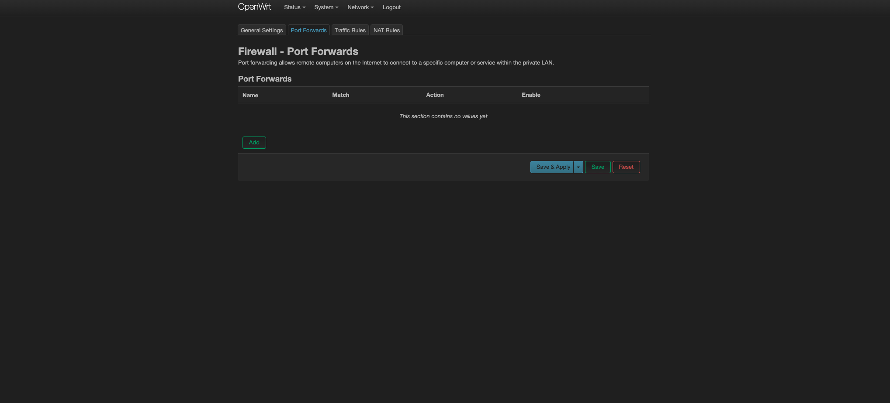

# Enabling Port Forwarding on Your Local Machine

In this comprehensive guide, we will delve into the benefits of port forwarding, potential security vulnerabilities, and the methodical process of enabling port forwarding, specifically on OpenWRT—an open-source firmware that allows advanced customization of router functionalities.

## Enabling Port Forwarding on OpenWRT

OpenWRT serves as a powerful tool for router customization, and port forwarding is a key feature. Follow these steps for a secure and efficient port forwarding setup:

### Changing Firewall Rules

1. **Accessing OpenWrt Web Interface:**

   - Open a web browser and enter the IP address of your OpenWrt router; commonly, this is set to 192.168.1.1.
   - Log in using your OpenWrt credentials.

2. **Navigating to Firewall Settings:**

   - Once logged in, proceed to the "Network" section and select "Firewall." You should be on the screen like follows:

3. **Port Forwarding Configuration:**

   - Locate the "Port Forwards" or "Port Forwarding" tab.

4. **Adding a New Port Forwarding Rule:**

   - Click on "Add" or "New Forwarding Rule" to establish a new port forwarding rule.

5. **Configuring Port Forwarding Rule:**

   Specify the following information:

   - **Name/Description:** Provide a descriptive name for the rule, such as "Public Access HTTPS."
   - **Protocol:** Choose the protocol corresponding to your website (typically TCP for HTTP, TCP/UDP for other services).
   - **External Zone:** Select "wan" as the external zone.
   - **External Port:** Set the external port, representing the port you wish to open on your router (e.g., a random port number like 3000).
   - **Internal Zone:** Choose "lan" as the internal zone.
   - **Internal IP:** Enter the local IP address of the device hosting your website.
   - **Internal Port:** Set the internal port (usually the same as the external port for simplicity, e.g., HTTPS port - 443).

Here is an example:

6. **Save and Apply Changes:**

### Verifying Port Forwarding

To confirm the effectiveness of the port forwarding setup, follow these steps:

1. Determine your public IP address by visiting [https://www.whatismyip.com/](https://www.whatismyip.com/).
2. Navigate to your public IP followed by the external port (in the example above, it is 3000).

## Security Implications and Secure Access

While port forwarding facilitates external access to your local machine, it introduces security concerns. Transmitting data over unsecured channels may expose sensitive information to potential threats. To mitigate these risks, consider implementing secure access protocols.

One effective method is to use SSL/TLS certificates for encrypted communication. Follow these steps:

1. **Acquire an SSL/TLS Certificate:**
   Obtain a valid SSL/TLS certificate from a trusted certificate authority (CA).

2. **Install the Certificate:**
   Install the acquired certificate on your web server to enable HTTPS.

3. **Update Port Forwarding Rule:**
   Modify your port forwarding rule to redirect external traffic to the secure HTTPS port (e.g., 443).

By implementing SSL/TLS certificates, you ensure that data exchanged between users and your server remains confidential. This step significantly enhances the security of your public access setup.

## Conclusion

In conclusion, while port forwarding opens opportunities for external access, incorporating security measures, such as SSL/TLS certificates, is imperative. By taking these precautions, you not only optimize accessibility but also prioritize the protection of sensitive information during data transmission. Explore additional security features within OpenWRT to further fortify your network defenses.
